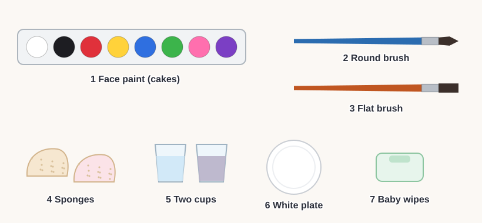
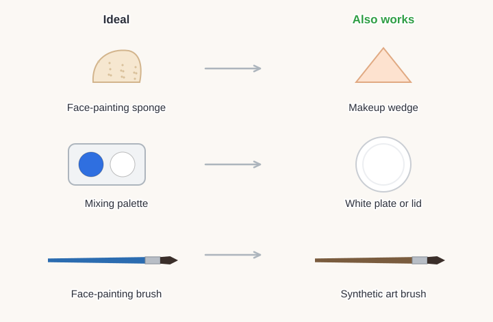
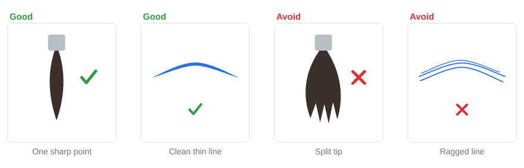

# 01.1 · Your face painting kit

Beginner · 25 minutes. You don't need an expensive kit to start. In this lesson you will put
together a small beginner kit from what you can buy cheaply or already have at home, and test each
item so you know it will work.

## Materials

> [!WARNING]
> Only products **sold as face paint or body paint** go on skin. Craft paint, acrylics, poster paint
> and markers are not made with colors approved for skin and can cause rashes. "Non-toxic" on a
> craft product means safe for art use, not safe for your face.

You need only these seven things. The full list, with more substitutes, is in
[Materials and substitutes](../../references/materials.md).

| Item | What it does | Ideal | Cheaper or easier to find | The substitute must… |
|---|---|---|---|---|
| Face paint | The color | Water-activated face paint cakes with white and black | A kids' face paint palette from a toy shop, pharmacy or supermarket | Be sold as face paint, wash off with soap and water |
| Round brush | Lines, teardrops, dots | Synthetic face-painting round brush, size 2-4 | Synthetic watercolor brush from an art or craft shop | Spring back to one sharp point when wet |
| Flat brush | Filling shapes, petals | Synthetic flat or filbert, about 1-1.5 cm | A small concealer makeup brush | Make a clean, straight edge |
| Sponges | Base color, blends | High-density face-painting sponges | Makeup wedge sponges | Be soft and fine-pored, new |
| Two cups | Rinse water and clean water | Two water pots | Any two glasses or jars | Stand firmly; hold clean water |
| Palette | Mixing, testing wetness | White mixing palette | A white plate, saucer or plastic lid | Be white and smooth |
| Wipes | Fixing mistakes, removal | Fragrance-free baby wipes | A soft damp cloth | Be gentle and fragrance-free |

Also: paper for practice and the swatch card from the module download
([labs/module-01](../../labs/module-01/)), or any sheet of paper.

## How it works

Face painting needs only three jobs done well: **color** (the paint), **control** (brushes for lines
and shapes, sponges for big soft areas) and **cleaning** (water and wipes). Every item in the kit
does one of those jobs.

That's why substitutes work: a tool doesn't need the right name, it needs to do the job. A cheap art
brush that springs back to a sharp point will paint the same line as an expensive face-painting
brush. A makeup wedge does the same job as a face-painting sponge.

The one job you can't substitute is the paint itself. Paint for skin is made only with colors
approved for skin, so that is the one thing you buy as face paint and nothing else.

## Demonstration

This is the whole beginner kit. Notice the palette has **white and black**: you will use them in
almost every design for highlights and outlines.

Each substitute on the right does the same job as the ideal item on the left.

A brush with one sharp point paints one clean line. A split tip paints several thin lines at once.

## Step by step

1. **Gather what you have.** Put everything from the table above on a table. Tick off what you
   already have.
2. **Pick a substitute** for anything missing, using the "must…" column. Write it down.
3. **Check the paint.** Read the pack or the seller's page: does it say face paint or body paint (a
   cosmetic)? Is there an ingredient list? If not, don't use it on skin.
4. **Test the round brush.** Dip it in water, flick off the water and look at the tip. One sharp
   point: good. Several points or a fluffy tip: use it for filling, not lines.
5. **Test the sponge.** Wet it, squeeze it almost dry and press it on the back of your hand. It should
   feel soft and leave no scratchy marks.
6. **Set up your space** like the kit picture: paint and palette in front of you, brushes and sponges
   to the side of your painting hand, cups behind, wipes within reach.

## Practice exercise

Test all your paint colors and brushes on paper (15 minutes).

1. Wet each paint cake with a few drops of water. Wait about 20 seconds.
2. With the round brush, paint one short line of each color on the swatch card or plain paper.
3. Rinse the brush in the first cup between colors, then touch it to the clean water cup.
4. With the flat brush, paint one small square of white and one of black.

Stop when every color has a line. If a line is pale or streaky, note "needs less water" or "needs
two layers" next to it. You will fix this in [lesson 01.4](../module-01/lesson-04.md).

## Mini-project

Make your **kit card**: a small sheet (or a page in a notebook) that lists your seven items, the
substitute you chose for any missing item, and one sentence on why each substitute works.

You're done when:

- [ ] Every item in the table has either the real thing or a substitute next to it.
- [ ] Every substitute meets its "must…" line.
- [ ] Your paint is sold as face or body paint.
- [ ] Your round brush passed the point test (or you have a plan to replace it).

## Common beginner mistakes

| What happens | Why | Fix |
|---|---|---|
| Using craft or acrylic paint because it's cheaper | It looks like the same thing | Only face or body paint on skin; craft paint stays on paper |
| Lines are fuzzy or doubled | The round brush tip is split | Use that brush for filling; get a brush that springs to one point |
| Buying a big professional set before trying | Wanting the best results straight away | Start with a small set with white and black; upgrade the colors you use most |
| Only one cup of water | Seems enough | Use two: one to rinse, one kept clean for wetting paint |

## Optional challenge

Make a "travel kit" that fits in a pencil case or a zip bag: three colors plus white and black, one
round brush, one flat brush, two sponges and a few wipes. Can you paint a simple flower on your hand
using only what's in the bag?
