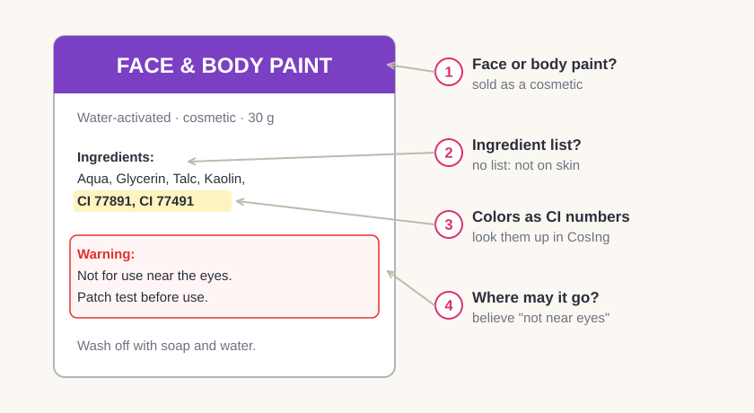
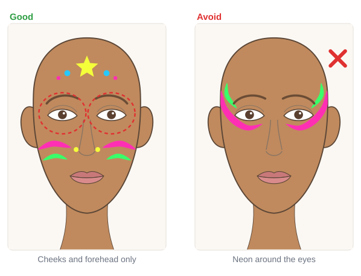

# 01.2 · Skin-safe or not? Reading the label

Beginner · 30 minutes. A label tells you more than the picture on the front. In this lesson you will
learn the three questions that tell you whether a product can go on skin, around the eyes, or
nowhere near a face, and you will sort the products you already have at home.

## Materials

> [!WARNING]
> In this lesson you only **read** labels. Don't put anything on your skin yet. If a product is not
> sold as face paint, body paint or another cosmetic, it does not go on skin, however cheap or
> "non-toxic" it is. If you are not sure, leave it out.

| Item | What it does here | Ideal | Cheaper or easier to find | It must… |
|---|---|---|---|---|
| Products from home | Things to sort | Your face paint plus any craft paint, markers, glitter or glue you own | Whatever you have; even two or three products work | Have a pack or a label you can read |
| Label check sheet | Your sorting record | `label-sort` from the module download ([labs/module-01](../../labs/module-01/)) | A sheet of paper with three columns: Skin, Eye area, Not for skin | Have room for one row per product |
| Phone or computer | Look up CI numbers and the seller's page | Any device with a browser | A library computer | Open a web page |
| Phone camera or magnifier | Read tiny print | Phone camera zoom | A magnifying glass | Make small text readable |

More about each kit item is in [Materials and substitutes](../../references/materials.md).

## How it works

Every label answers three questions. Ask them in this order:

1. **Is it sold for skin?** The words "face paint", "body paint", "cosmetic" or "makeup" must be on the
   pack or the seller's page. Paint for skin is made only with colors approved for skin. A color that
   is fine on nails, hair or paper may not be allowed on skin (US FDA). "Non-toxic" on a craft
   product means safe for art use as intended, not tested for your face.
2. **Is there an ingredient list?** Cosmetics list their ingredients. Colors appear as **CI numbers**
   (Colour Index numbers, for example CI 77891 is titanium dioxide, a white) or, in the US, by names
   like "titanium dioxide" or "FD&C Blue No. 1". No list: not on skin.
3. **Where may it go?** In the US and EU, each color is approved for certain uses. Some are **not
   allowed in eye products**. So a paint can be fine on the cheek and not allowed on the eyelid.
   Believe a warning like "not for use near the eyes", even if the photo shows it near the eyes.

### Four labels that need extra care

- **Neon or fluorescent colors** (they glow under a UV "black light"): none of them are allowed near
  the eyes (US FDA). Use them on cheeks, forehead and body only.
- **Glow-in-the-dark paint:** only one glow color is approved in the US (luminescent zinc sulfide),
  only in face makeup for occasional use such as Halloween, and the label must say "Do not use in
  the area of the eye."
- **"Black henna":** real henna is reddish-brown and is approved in the US only as a hair dye.
  "Black henna" often contains PPD, which can cause blisters, scars and a lifelong allergy to hair
  dye. Never use it.
- **Kohl, kajal or surma** eyeliners: often contain a lot of lead and are illegal in the US. Children
  have been poisoned by them. Use an eye-safe pencil sold as a cosmetic instead.

Rules are not the same in every country. If a label leaves you unsure, treat the product as "not
for skin".

## Demonstration

The three groups you will sort into. Notice that neon face paint is in "Skin" but **not** in "Eye
area", and that the eye area needs the label's permission.

Read the back, not only the front. This paint passes checks 1-3, but check 4 says it must stay away
from the eyes.

The dashed rings show the eye area: brows, lids and the skin just under the eyes. Neon and glow
paint stay outside them.

## Step by step

1. **Pick up one product.** Turn it over and find the back label, or open the seller's page.
2. **Check the name.** Look for "face paint", "body paint", "cosmetic" or "makeup". Not there: it goes
   in **Not for skin**. Stop here.
3. **Find the ingredient list.** No list anywhere: **Not for skin**.
4. **Find the colors.** Look for CI numbers or color names in the list. Write one down.
5. **Read every warning.** "Not for use near the eyes", "do not use in the area of the eye", or a
   neon or glow product: it goes in **Skin** only.
6. **Look for eye permission.** Only if the label says it is suitable for the eye area (or it is an
   eye product like an eye pencil), tick **Eye area** too.
7. **Look up one CI number.** Open CosIng (link in the sources), type the number, for example
   `CI 77491`, and open the result. Note the name and any condition such as "Not to be used in eye
   products".

## Practice exercise

Sort what you have at home (15 minutes).

1. Collect up to ten products: face paints, craft paints, markers, glitter, glue, any makeup.
2. For each one, follow steps 1-6 and fill one row of the label check sheet.
3. Put the products in three piles on the table: Skin, Eye area, Not for skin.

Stop when every product has one tick. Any "not sure" goes in Not for skin.

Hint

Kids' face paint palettes usually say "face paint" on the front and list ingredients on the back
or the inside of the lid. If the print is tiny, take a photo and zoom in.

## Mini-project

Make your **safe shelf**: a box or bag that holds only your skin-safe products. Put a small sticker or
a dot of tape with an eye drawn on it on anything whose label allows the eye area. Move everything
"Not for skin" to a different place (a craft drawer), so you never pick it up by mistake.

You're done when:

- [ ] Every product you own has a row on the label check sheet.
- [ ] Your safe shelf holds only products sold for skin, each with an ingredient list.
- [ ] Only products whose label allows the eye area have an eye sticker.
- [ ] Any neon or glow-in-the-dark paint is marked "not near eyes".

## Common beginner mistakes

| What happens | Why | Fix |
|---|---|---|
| Using a "non-toxic" marker or craft paint on skin | "Non-toxic" sounds safe | Non-toxic means safe for art use, not tested for skin; use face paint |
| Painting neon colors around the eyes | The front photo shows a neon eye design | Believe the label, not the photo; neon stays on cheeks, forehead and body |
| Trusting a product with no ingredient list | It's sold next to face paints | No list, no skin |
| Buying "black henna" for a quick tattoo look | It looks like real henna | Never use it; paint the design with black face paint instead |

## Optional challenge

Look up **every** CI number in your main face paint in CosIng. Make a short list: color, CI number,
name, and any condition. Is any color in your palette marked "Not to be used in eye products"?
