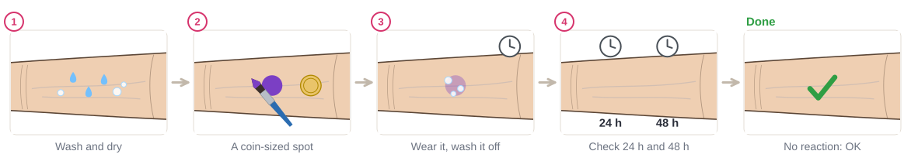
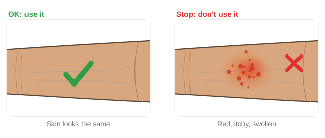
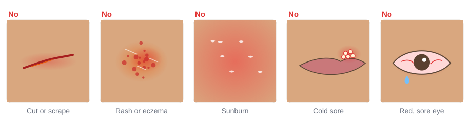
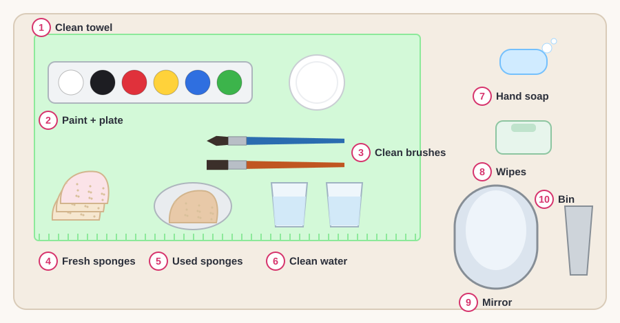

# 01.3 · Patch test and clean hands

Beginner · 30 minutes. Before any paint goes on a face, you check two things: that the skin is happy
with the product, and that your hands, tools and table are clean. In this lesson you will start a
patch test on your own arm, learn to read it, and set up a clean place to paint.

## Materials

> [!CAUTION]
> Wash the paint off straight away if the skin stings, burns, itches, swells or turns red, and don't
> use that product again. If a reaction is strong or doesn't settle, see a pharmacist or doctor. If
> anything gets into an eye and it still hurts or your sight changes after rinsing, get medical help.

| Item | What it does here | Ideal | Cheaper or easier to find | It must… |
|---|---|---|---|---|
| The products to test | What you are checking | Every new face paint, glitter gel or glue you plan to use | Start with your main palette | Be sold for skin (lesson 01.2) |
| Mild soap and water | Clean skin and hands | Fragrance-free hand soap | Any mild soap | Be gentle; rinse off fully |
| Clean brush or cotton bud | Put a spot of paint on | Your round brush, washed | A cotton bud (Q-tip) | Be clean and used only for face paint |
| Patch test log | Write down what you tested and what happened | The [patch test log](../../templates/patch-test-log.md) | A page in a notebook | Have the date and the product name |
| Clean towel and a bowl | A clean work surface and a place for used sponges | An old towel and a small bowl | A clean tea towel and a cereal bowl | Be washed before use |
| Pen and a phone timer | Labels and timing | — | — | — |

## How it works

Skin can react to a product even when most people are fine with it. A reaction can be **irritation**
(the product is too harsh for your skin) or an **allergy** (your body has learned to fight one
ingredient). Common causes in makeup are fragrance, preservatives, nickel in metal parts, PPD (in
"black henna" and hair dye) and latex (in some lash glues). A **patch test** shows a reaction on a
small spot of arm before it can happen on a whole face.

The US FDA suggests a dab on the arm a day or two before; watch it for 24-48 hours. Dermatologists
test skincare more strictly, twice a day for a week or more. Some face paint brands suggest a quick
20-minute test for sensitive skin, but the longer test is safer, especially before painting a child
or before a long day.

Clean hands and tools matter just as much. Germs travel from one face to the next on sponges,
brushes and fingers. That's why you use one sponge per person, never put a used sponge back into a
paint cake, and never paint over skin that is already broken or sore: paint and germs get in more
easily there.

## Demonstration

The spot is about the size of a coin, on the soft inside of the forearm, where skin is thinner and
shows a reaction clearly.

Any redness, itching, swelling, rash, burning or stinging means "stop", even if it is mild.

Never paint over these. Leave that area unpainted, or don't paint that day.

Fresh sponges and used sponges have separate places, so a used one never goes back into the paint.

## Step by step

### The patch test

1. **Wash and dry** a small patch on the inside of your forearm, or inside your elbow.
2. **Paint a coin-sized spot** of the new product with a clean brush or cotton bud. For a palette,
   paint a short row of small spots, one per color, and write the order in your log.
3. **Leave it on** as long as you would wear a design. Then wash it off with soap
   and water.
4. **Check the spot after 24 hours and again after 48 hours.** Write what you see in the log.
5. **Decide.** Skin looks the same: OK to use. Red, itchy, swollen, a rash, burning: don't use it.

If a reaction appears: wash the spot with mild soap and water, don't use that product again, and
cool the skin with a clean, cool, damp cloth. See a pharmacist or doctor if it is strong, spreads or
doesn't settle.

### Before you paint anyone

Ask, every time:

- Any allergies? (makeup, fragrance, latex, nickel, hair dye)
- Any sensitive skin, eczema, cuts, sores, sunburn or a cold sore today?
- Any sore, red or itchy eyes? Contact lenses?
- For a child: is a parent or guardian OK with it, and has the paint been tested on the child's arm?

A "yes" to broken skin, a rash, a cold sore or an eye infection means: don't paint there, or don't
paint today.

### The clean space

1. **Lay a clean towel** on the table. Put an old T-shirt or towel over your shoulders.
2. **Wash your hands** with soap and water.
3. **Set out the kit** like the picture: paints and plate in front, brushes to the side of your
   painting hand, fresh sponges on one side and an empty bowl for used ones on the other.
4. **Fill both cups** with clean water. One is for rinsing, one stays clean for wetting paint.
5. **Wash your hands again** when you finish, and before painting a second person.

## Practice exercise

Start a patch test on yourself today (10 minutes now, then two 1-minute checks).

1. Patch-test your main face paint: white, black and the two colors you will use most.
2. Fill one row of the patch test log for each product.
3. Set a phone reminder for 24 hours and 48 hours from now.

Stop when the log has the date, the product, where on the arm and how long you wore it. Finish the
two checks before you paint your face in later lessons.

## Mini-project

Set up your **clean painting space** at home and take a photo of it from above, like the picture.

You're done when:

- [ ] A patch test is running (or finished) for your main paint, with a log row for it.
- [ ] Your space has a clean towel, two cups of clean water and a separate place for used sponges.
- [ ] You can say the four "before you paint anyone" questions without reading them.
- [ ] Your hands were washed before you set out the kit.

## Common beginner mistakes

| What happens | Why | Fix |
|---|---|---|
| Testing on the back of the hand for 5 minutes | It seems quick and easy | Test on the inner forearm and watch it for 24-48 hours |
| Painting over a small scratch or spot | It seems too small to matter | Never paint over broken or sore skin; paint somewhere else |
| Dipping a used sponge back into the paint | Saves time | Use a fresh sponge (or a fresh corner); load paint with a clean brush |
| Ignoring a mild itch after a test | "It's only a little red" | Any reaction means don't use that product; wash it off |
| Testing a palette as one spot | Hard to tell which color caused a reaction | Paint one small spot per color and note the order |

## Optional challenge

Make a small **"before we paint" card** you can show anyone you paint later: the four questions,
plus a line saying which products you use and that they were patch-tested. Keep it in your kit.
