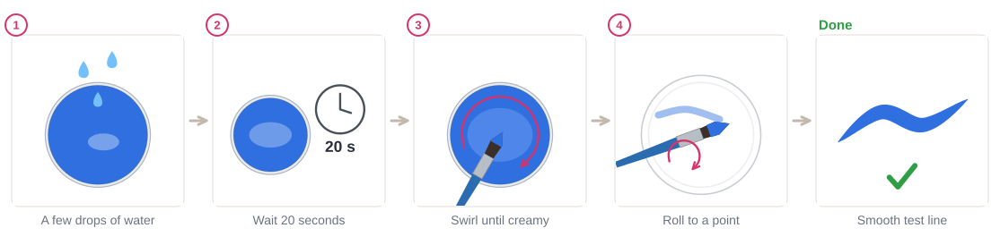
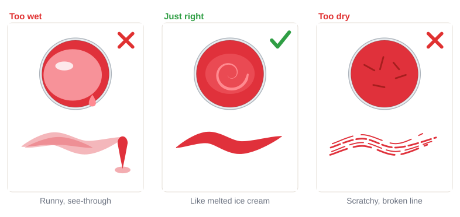
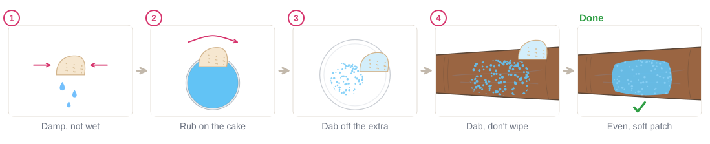
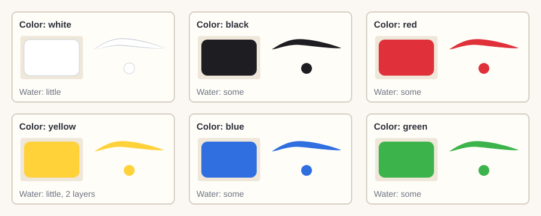

# 01.4 · Water, paint and your first swatches

Beginner · 40 minutes. Most beginner problems, like pale streaks, drips and scratchy lines, come
from too much or too little water. In this lesson you will learn to mix your paint to just the
right consistency, load a brush and a sponge, and record every color on a swatch card.

## Materials

> [!WARNING]
> Use only face paint you have patch-tested ([lesson 01.3](lesson-03.md)) for the arm part of this
> lesson. Keep the sponges you use today for yourself only, and never dip a used sponge back into a
> cake someone else will use.

| Item | What it does here | Ideal | Cheaper or easier to find | It must… |
|---|---|---|---|---|
| Face paint | The colors to test | Water-activated cakes with white and black | A kids' face paint palette | Be sold as face paint |
| Round brush | Lines and dots | Synthetic round, size 2-4 | Synthetic watercolor brush | Spring back to one sharp point |
| Flat brush | Swatches (small filled squares) | Synthetic flat, about 1-1.5 cm | Small concealer brush | Make a straight edge |
| Sponge | Soft color on the arm | High-density face-painting sponge | Makeup wedge | Be soft, fine-pored, new |
| Two cups | Clean water and rinse water | Two water pots | Two glasses or jars | Hold clean water |
| White plate | Testing the paint before it touches skin | Mixing palette | A white plate or lid | Be white and smooth |
| Paper towel | Taking extra water off the brush | Kitchen paper | A soft cloth | Soak up water fast |
| Practice sheets | Recording | `swatch-card` ([labs/common](../../labs/common/)) and `consistency-test` ([labs/module-01](../../labs/module-01/)) | Plain white paper with boxes drawn on it | Take paint without curling much |

A small spray bottle is optional: one or two mists wake up a cake faster. See
[Materials and substitutes](../../references/materials.md).

## How it works

A water-activated paint cake is dry paint. Water turns the **top layer** into creamy liquid paint.
How much water you add decides everything:

- **Too wet:** the paint is thin, see-through and runs. It drips, takes long to dry and needs many
  layers.
- **Just right:** creamy and smooth, like **melted ice cream** or thick cream. It flows off the brush
  in a solid line and dries in a minute or two.
- **Too dry:** the brush drags, the line breaks up and looks scratchy, and it pulls on skin.

Take water only from the **clean** cup and add it a little at a time: it is easy to add more water
and slow to wait for extra water to dry. Always test on the plate or paper first, never straight on
skin.

## Demonstration

Notice in step 3 that only the top of the cake becomes creamy. You don't need to dig into it.

Compare your own test lines with these three. Most beginners start too wet.

A sponge should feel damp, not wet. Dabbing (pressing and lifting) gives an even patch; wiping
drags the paint into streaks.

The finished swatch card. White is easiest to see on the cream-colored part of the box or on your arm.

## Step by step

### Brush

1. **Wet the cake.** Put a few drops of clean water on it, or one mist from the spray bottle.
2. **Wait about 20 seconds** so the water soaks into the top.
3. **Swirl the round brush** on the cake until the top looks creamy and shiny, not watery.
4. **Test on the plate.** Paint a short line. Pale and runny: wait or touch the brush to the paper
   towel. Scratchy: add one drop of water.
5. **Load to the tip.** Turn the brush as you pull it out of the paint, then roll it on the plate
   so the hairs come to a point.
6. **Paint a test line on paper.** It should be solid, smooth and dry in a minute or two.

### Sponge

1. **Wet the sponge** under the tap and squeeze it in a paper towel until it is only damp.
2. **Rub it on the cake** a few times in one place.
3. **Dab it on the plate** to spread the paint into the sponge and remove extra.
4. **Dab on the arm**: press and lift, slightly overlapping. Don't wipe.
5. **Let it dry**, then add a second thin layer if it looks patchy.

## Practice exercise

Find "just right" for every color (20 minutes).

1. On the consistency test sheet, write one color per row.
2. For each color paint three short lines: one with lots of water (**too wet**), one creamy (**just
   right**) and one with almost no water (**too dry**).
3. In the last column, write how many drops of water the "just right" line needed.

Stop when you can make a "just right" line on the first try, three colors in a row.

Hint

Lines too pale even when creamy? Some cheaper paints need two thin layers. Let the first line dry,
then paint over it once.

## Mini-project

Make your **swatch card**: one box for every color you own, each with a swatch (a small filled
square with the flat brush), a line and a dot with the round brush, and a note "little / some /
lots" of water. Then sponge one small patch (about 3 x 3 cm) of your favorite color on your
patch-tested forearm. You will take it off in [lesson 01.5](../module-01/lesson-05.md), or now with soap and water.

You're done when:

- [ ] Every color has a box with a swatch, a line and a dot.
- [ ] Every line is solid, with no drips and no scratchy gaps.
- [ ] Every box has a water note.
- [ ] Your arm patch is even, with no sponge streaks and no dotty gaps.

## Common beginner mistakes

| What happens | Why | Fix |
|---|---|---|
| Pale, see-through, streaky color | Too much water | Wait 20 seconds, blot the brush on paper towel, or add a second thin layer when dry |
| Paint drips or runs | Brush or sponge too wet | Touch the brush to a paper towel; squeeze the sponge almost dry |
| Scratchy, broken line that drags | Too little water | Add one drop of clean water and swirl again |
| Colors look muddy | Water taken from the dirty rinse cup | Rinse in one cup, wet paint only from the clean cup |
| Sponge patch is dotty or streaky | Sponge too dry, or wiping instead of dabbing | Reload the sponge, dab with light overlapping presses |

## Optional challenge

Sponge an even 5 x 5 cm square of a light color on your forearm. When it is dry, paint one thin
white or black line across it with the round brush. Can you make the line without lifting the base
color underneath?
