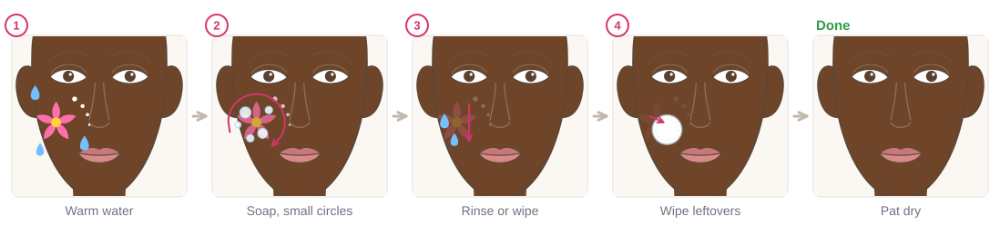
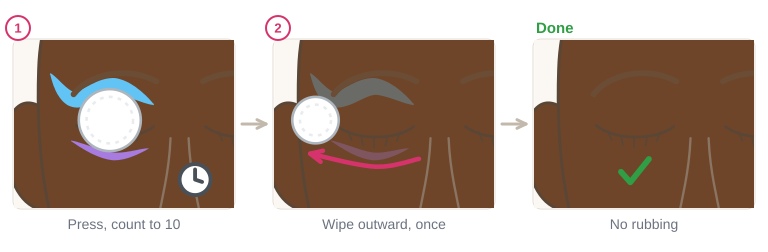
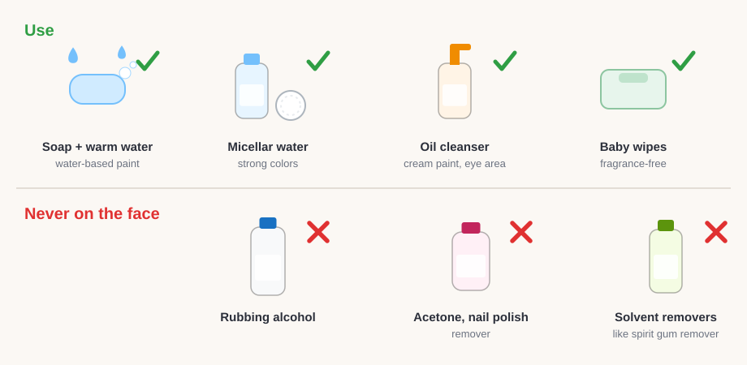
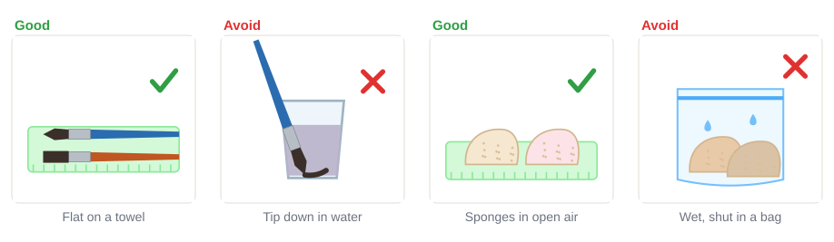

# 01.5 · Taking it off and cleaning up

Beginner · 45 minutes. A design is only finished when it is off again and your kit is clean for next
time. In this lesson you will take face paint off skin gently, learn the safe way to clean around
the eyes, wash and dry your brushes and sponges, and do the module's practical: paint, remove, clean
and record.

## Materials

> [!CAUTION]
> Never use rubbing alcohol, acetone, nail polish remover or solvent removers (such as spirit gum
> remover) to take paint off the face, and never near the eyes. Don't scrub. If paint gets into an
> eye, rinse it with clean, lukewarm water; if it still hurts or your sight changes, get medical help.

| Item | What it does here | Ideal | Cheaper or easier to find | It must… |
|---|---|---|---|---|
| Mild soap and warm water | Takes off water-activated face paint | Fragrance-free face wash | Any mild hand soap | Be gentle and rinse off fully |
| Wipes | Lift leftover color | Fragrance-free baby wipes | A soft, damp washcloth | Be soft, fragrance-free |
| Micellar water and cotton pads | Strong colors that leave a tint | A micellar water for makeup | A gentle facial cleanser | Be made for the face |
| Gentle oil cleanser | Cream paint, and the eye area | A cleansing oil or eye-safe makeup remover | Petroleum jelly on a cotton pad (eye area) | Be eye-safe if used near the eyes |
| Soap for tools | Brushes and sponges | Brush shampoo or mild soap | Dish soap or hand soap, rinsed very well | Rinse out completely |
| Towel | Drying skin and tools | A clean towel | Paper towels | Be clean |
| Clean-up record | The module practical | `clean-up-record` from [labs/module-01](../../labs/module-01/) | A notebook page | Have room for notes |

Full details: [Materials and substitutes](../../references/materials.md) and the
[safety guide](../../references/safety.md).

## How it works

Water-activated face paint is made to come off with **warm water and mild soap**. A wipe takes care of
any leftovers. Some bright colors can leave a light tint for a few
hours; it fades, so don't scrub it. **Micellar water** on a cotton pad lifts strong pigments, and a
gentle **oil cleanser** dissolves cream or oil-based paint. Always follow the paint's own label.

The skin around the eyes is thin and the eye itself is easy to scratch or irritate. So there you
**press, wait and wipe once**, outward (from the nose side toward the ear), with eyes closed. No
rubbing back and forth.

Clean tools are part of safety. Paint and skin oils left in a brush or sponge grow germs and spoil
the next design. Brushes dry flat so water doesn't soak the handle or bend the tip; sponges dry in
the open air, never shut wet in a bag. Take all paint off before you go to sleep.

## Demonstration

Small circles with your fingertips loosen the paint. You don't need to press hard.

The pad does the work while you count. One gentle wipe outward, then a fresh part of the pad.

Everything in the top row is gentle on skin. The bottom row can burn skin and must never go near
the eyes.

The same idea for both: rinse, soap, rinse until clear, then shape and dry.

A brush left in the water cup bends for good. A sponge shut away wet starts to smell.

## Step by step

### Skin

1. **Wet** the painted area with warm water.
2. **Soap** your fingertips and rub in small circles until the color loosens.
3. **Rinse** with water or wipe with a damp cloth.
4. **Leftover color:** a fragrance-free wipe, or micellar water on a cotton pad. Cream paint: oil
   cleanser first, then wash.
5. **Pat dry** with a clean towel. Don't rub.

### Around the eyes

1. **Close the eye.** Soak a cotton pad in an eye-safe remover or a gentle oil cleanser.
2. **Press** it on the closed eye and count to ten.
3. **Wipe once, outward**, from the nose side toward the ear. Turn the pad and repeat if needed.
4. **Rinse** the skin with water and pat dry.

### Brushes

1. **Rinse** in the rinse cup.
2. **Swirl** the tip gently on a little soap in your palm.
3. **Rinse under the tap** until the water runs clear. Point the tip down so water doesn't run into
   the metal part (the ferrule).
4. **Squeeze** out water with a towel and **shape the tip** back to a point (or a straight edge).
5. **Dry flat** on a towel. Store them upright, tip up, only when fully dry.

### Sponges

1. **Rinse**, then **soap and squeeze** several times.
2. **Rinse** until the water runs clear.
3. **Squeeze** in a towel and leave it to **air-dry** in the open.

Finally wipe the plate, cups and table, let wet paint cakes dry with the lid open, then close them.

## Practice exercise

Compare three ways to take paint off (15 minutes).

1. On your patch-tested forearm, paint three small squares of the same strong color (pink, red or
   blue) about 3 cm apart. Let them dry.
2. Take off square 1 with soap and warm water, square 2 with a fragrance-free wipe, and square 3
   with micellar water or an oil cleanser (whatever you have).
3. Note which one left the least tint and which felt gentlest.
4. Rehearse the eye method with **plain water only**: eyes closed, press a damp pad for ten
   seconds, wipe once outward.

Stop when all three squares are gone and you know which method you'll use first next time.

## Mini-project

**Module 1 practical: paint, remove, clean, record.** This uses everything from the module.

1. Set up your clean space ([lesson 01.3](lesson-03.md)) with patch-tested paint only.
2. Mix your paint to "just right" ([lesson 01.4](lesson-04.md)) and sponge a patch about 5 x 5 cm on
   your forearm. When dry, paint three lines and five dots on top with the round brush.
3. Wear it for 30 minutes. Notice whether it cracks, smudges or itches.
4. Take it off with the gentlest method that works.
5. Clean and dry every tool you used, and wipe the space.
6. Fill in the clean-up record.

You're done when:

- [ ] The patch had an even base and solid lines and dots on top.
- [ ] Your arm is clean, with no color left (or only a light tint that fades), and the skin feels normal.
- [ ] Brushes are drying flat with pointed tips; sponges are drying in the open air.
- [ ] The clean-up record is filled in, including what you'll do differently.

## Common beginner mistakes

| What happens | Why | Fix |
|---|---|---|
| Skin red and sore after removal | Scrubbing hard or using alcohol or acetone | Soap and warm water, small gentle circles; never alcohol or acetone on the face |
| A pink or blue tint stays after washing | Some strong colors stain lightly | Micellar water on a cotton pad; the tint fades within hours, don't scrub |
| Stinging eyes while removing | Rubbing back and forth or a remover not made for eyes | Eyes closed, eye-safe remover, press, then one wipe outward |
| Brush tip bent or splayed | Left standing in the water cup | Never leave brushes in water; shape the tip and dry flat |
| Sponge smells musty | Put away wet | Wash after every use and air-dry before storing |

## Optional challenge

Time your full clean-up, from wet skin to tools drying, and try to get it under 10 minutes without
skipping a step. Then make a laminated (or sheet-protector) "clean-up card" with the steps to keep in
your kit.
