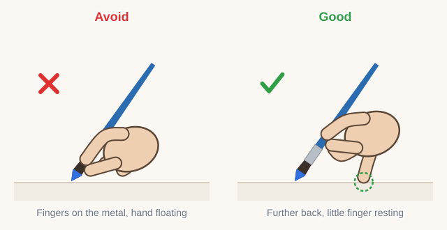
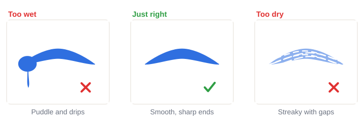
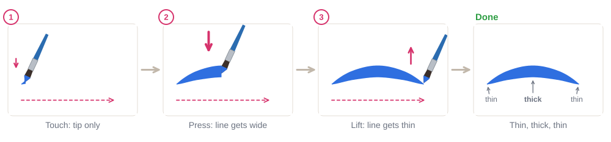
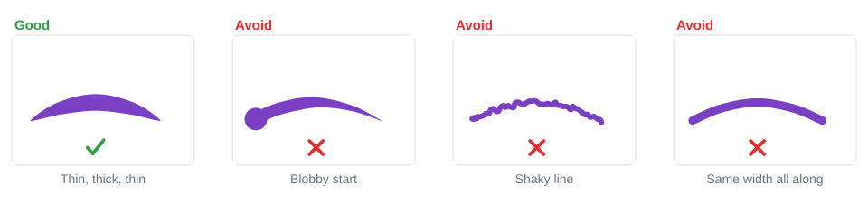

# 02.1 · Holding the brush and the pressure stroke

Beginner · 35 minutes. Almost every face painting design is built from one simple move: a stroke
that starts thin, gets thick and ends thin again. In this lesson you learn how to hold the brush,
load it with paint and paint that stroke on paper, row after row, until it feels easy.

## Materials

You work on paper only in this lesson, so nothing touches skin yet. Full details are in
[Materials and substitutes](../../references/materials.md).

| Item | What it does here | Ideal | Cheaper or easier to find | The substitute must… |
|---|---|---|---|---|
| Round brush | Paints the pressure stroke | Synthetic face-painting round brush, size 2-4 | Synthetic watercolor brush | Spring back to one sharp point when wet |
| Face paint | The color | Water-activated face paint, one dark color (blue, purple or black) | Any face paint from your kit | Be face paint, so you practice with the real thing |
| Two cups of water | Rinse and clean water | Two water pots | Two glasses or jars | Stand firmly |
| Palette | Shaping the brush tip, testing | White mixing palette | A white plate or plastic lid | Be white and smooth |
| Paper | Practice surface | The drill sheet `drill-1-pressure-strokes` from [labs/module-02](../../labs/module-02/) | Plain printer paper or the back of a cereal box | Be smooth, so the brush glides |
| Paper towel | Blotting extra water | Paper towel | A clean cotton cloth | Soak up water quickly |

No printer? Draw a few rows of curved lines with a pencil and paint over them, or draw the outline
freehand.

## How it works

A round brush has a sharp point and a fat belly. When only the **tip** touches, you get a thin line.
When you **press**, the belly spreads out on the paper and the line gets wide. When you **lift**, the
hairs close up again and the line gets thin. So you don't change brushes to change the line: you
change the **pressure**.

Two things make this work. First, the brush must be **loaded to the tip**: the paint sits on the
front half of the hairs, with a sharp point and no drips. Second, your hand must be **steady**: you
hold the brush a little further back than a pencil and rest your little finger on the paper (later,
on the skin). The resting finger is like a pivot, so the stroke comes from a smooth movement, not a
shaky hand in the air.

Move at a steady, quick-ish speed. Slow strokes wobble; confident strokes look smooth.

## Demonstration

Notice where the fingers are and that the little finger touches the paper in the good picture.

The paint stays on the front half of the hairs. If paint reaches the metal part, you loaded too much.

Always paint one test stroke on paper (or the palette) before you paint the real thing.

The brush never stops: touch, press and lift happen while the brush keeps moving in the direction of
the arrow.

Compare your strokes with these four. Most beginner strokes look like one of the three on the right.

## Step by step

1. **Hold the brush** like a pencil, but about a finger's width further back from the metal part.
   Rest your little finger (or the side of your hand) on the paper.
2. **Wet the cake.** Drip a few drops of clean water on the paint and wait about 20 seconds.
3. **Load the brush.** Roll the tip around in the wet paint until the front half of the hairs is full.
4. **Shape the point.** Roll the brush on the edge of the palette while pulling it toward you, until
   it comes to a sharp point. Blot on the paper towel if it drips.
5. **Test.** Paint one stroke on the palette or the edge of the paper. Puddle? Blot. Streaky? Add a
   drop of water to the cake and reload.
6. **Touch.** Put only the very tip on the paper and start moving at once.
7. **Press.** Push down gently as you keep pulling: the line gets wide.
8. **Lift.** Lift slowly while still pulling, so the line ends in a thin point.

## Practice exercise

Fill one drill sheet, or two pages of plain paper, with pressure strokes (20 minutes).

1. **Straight strokes:** a row of 10, pulling from left to right (left-handed: right to left).
2. **Curved strokes:** a row of 10 "eyebrow" curves, like the picture.
3. **Upright strokes:** a row of 10 pulling down toward you.
4. On the drill sheet, each block has three rows: **trace** the gray models, **copy** them next to the
   start dots, then paint them **on your own** in the empty row.

Reload after every two or three strokes. Turn the paper whenever a direction feels awkward; pulling
toward you is the easiest move.

Stop when 7 out of 10 strokes in a row have a thin start, a wide middle and a thin end.

Hint

If you keep getting a blob at the start, start moving **before** you touch the paper, like an
airplane landing on a runway, and touch down while moving.

## Mini-project

Paint a **stroke border**: a row of curved pressure strokes all around the edge of a sheet of paper,
like a picture frame, with each stroke overlapping the end of the one before.

You're done when:

- [ ] The border goes all the way around the page.
- [ ] Most strokes go thin, thick, thin, with no blob at the start.
- [ ] The strokes are about the same size and point the same way.
- [ ] You loaded the brush to the tip each time, with no drips or puddles.

## Common beginner mistakes

| What happens | Why | Fix |
|---|---|---|
| A round blob at the start of the stroke | You pressed down before the brush moved | Touch with the tip only and start moving at once |
| Shaky, wobbly lines | Painting slowly, hand floating in the air | Rest your little finger and paint a little faster |
| Every stroke is the same width | Same pressure all the way | Press in the middle, lift at the end |
| Puddles and drips | Too much water on the brush or cake | Blot the brush on a paper towel and test again |
| Pale, streaky strokes | Paint too dry or too little paint | Add a drop of water to the cake and load again |

## Optional challenge

Paint the same curved stroke in three sizes: as small as you can (a size 1 brush helps), medium, and
as big as your brush allows. Then paint a row that grows from small to big, like a wave getting
stronger.
