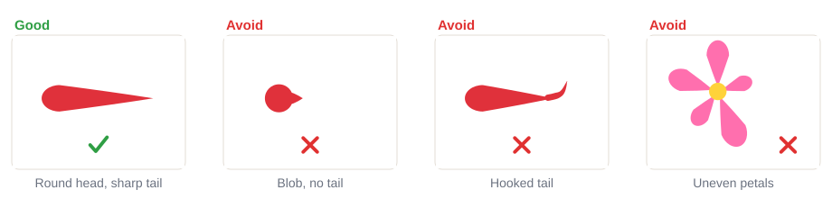
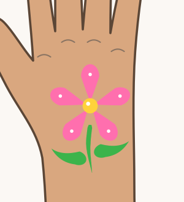

# 02.2 · Teardrops and petals

Beginner · 40 minutes. A teardrop is half of a pressure stroke: you start by pressing, then lift
away into a sharp tail. Teardrops are the petals of flowers, the leaves of vines, the drops of rain
and the wings of tiny birds. In this lesson you paint rows of teardrops, petals with two kinds of
brush, and a five-petal flower on paper and then on your hand.

## Materials

> [!WARNING]
> The mini-project goes on the back of your hand. Use only face paint you have already
> patch-tested ([lesson 01.3](../module-01/lesson-03.md)), and don't paint over cuts, sores or
> irritated skin.

| Item | What it does here | Ideal | Cheaper or easier to find | The substitute must… |
|---|---|---|---|---|
| Round brush | Teardrops and round-brush petals | Synthetic round, size 3-4 | Synthetic watercolor brush | Spring back to one sharp point |
| Flat brush | Flat-brush petals | Synthetic flat or filbert, about 1 cm | A small concealer makeup brush | Make a clean, straight edge |
| Face paint | Color | Two or three colors, for example pink, yellow, green, plus white | Any face paint from your kit | Be face paint |
| Water, palette, paper towel | Load and blot the brush | As in [lesson 02.1](lesson-01.md) | Glasses, a white plate | Clean water, white surface |
| Paper | Practice | `drill-2-teardrops-petals` from [labs/module-02](../../labs/module-02/) | Plain paper | Be smooth |
| Baby wipes | Fix mistakes on the hand | Fragrance-free baby wipes | A soft damp cloth | Be gentle and fragrance-free |

No printer? Draw five small circles around a center point with a pencil, or draw the outline
freehand. The full list is in [Materials and substitutes](../../references/materials.md).

## How it works

A teardrop is the pressure stroke from [lesson 02.1](lesson-01.md) without the thin start. You press
first, so the hairs spread into a **round head**. Then you **lift slowly while pulling away**, so the
hairs close up into a sharp **tail**. The longer and slower the lift, the longer the tail.

A **petal** is a teardrop with its head on the outside and its tail pointing to the flower's center.
Painting from the outside in hides the tails under the center dot, so the flower looks neat. A flat
brush makes a wider, softer petal: press the whole flat edge down, then lift as you pull toward the
center.

Even flowers come from **planning**, not luck: mark five points first, paint the top petal, then fill
in left and right.

## Demonstration

The head is made by pressing in one spot; the tail is made by moving. Curved tails come from pulling
along a curve.

Both petals point their thin end at the center dot.

The marks in picture 1 keep the petals evenly spaced. The yellow center covers all five tails.

Most bad teardrops come from stopping before you lift or from flicking the brush sideways.

## Step by step

1. **Load to the tip** and test on the palette ([lesson 02.1](lesson-01.md)).
2. **Touch** the tip where the round head will be. Rest your little finger.
3. **Press** down so the hairs spread into a round head. Don't move yet.
4. **Lift and pull** away in one smooth move, lifting a little more as you go, until only the tip
   touches and leaves the paper.
5. **Petal (round brush):** put the head on the outside and pull the tail toward the center.
6. **Petal (flat brush):** press the whole flat edge down on the outside, then lift as you pull toward
   the center.
7. **Flower:** mark the center and five points. Paint the top petal, then the two side petals, then
   the two bottom petals. Add a center dot and small white dots.

## Practice exercise

On the drill sheet or plain paper (20 minutes):

1. A row of 10 teardrops with the tail to the right, then 10 with the tail pointing down toward you.
2. A row of 10 curved teardrops ("commas"), pulling along a curve.
3. Five round-brush petals and five flat-brush petals around center dots.
4. Three five-petal flowers. Turn the paper as you go so you always pull toward yourself.

Stop when most teardrops have a round head and a sharp tail, and your third flower has petals of about
the same size.

Then paint five teardrops on the back of your hand (5 minutes), wipe them off with a baby wipe and
paint five more. Skin feels different from paper: slightly sticky and soft. Notice the difference.

Hint

Tail too short? Lift more slowly and keep pulling until the brush leaves the paper. Head too small?
Press a little longer before you move.

## Mini-project

Paint a **five-petal flower with two leaves on the back of your hand**: pink (or any color) petals, a
yellow center, white dots on the petal heads, a thin green stem and two green teardrop leaves.

You're done when:

- [ ] All five petals point their tails to the center.
- [ ] The petals are about the same size, with even gaps.
- [ ] The center dot covers the tails.
- [ ] The leaves are teardrops with sharp tails, not blobs.
- [ ] You took a photo, then washed it off with soap and water.

## Common beginner mistakes

| What happens | Why | Fix |
|---|---|---|
| Teardrop is a blob with no tail | The brush stopped, then lifted straight up | Keep pulling while you lift, until the brush leaves the surface |
| Tail hooks up at the end | Flicking the brush sideways | Lift straight along the line of the stroke |
| Petals are different sizes, with gaps | No plan for the spacing | Mark five points first; paint top, then sides, then bottom |
| Tails show at the center | Painting from the center outward | Head outside, tail toward the center, then cover with a center dot |
| Flat-brush petal has a square end | The edge was pressed but not lifted | Lift as you pull, so the petal narrows to a point |

## Optional challenge

Paint a **two-tone petal**: load the round brush with white, then dip only the very tip in pink. Press
and pull each petal: the head comes out pink and the tail fades to white. Make a whole flower this way.
