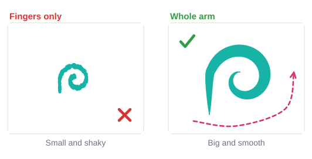
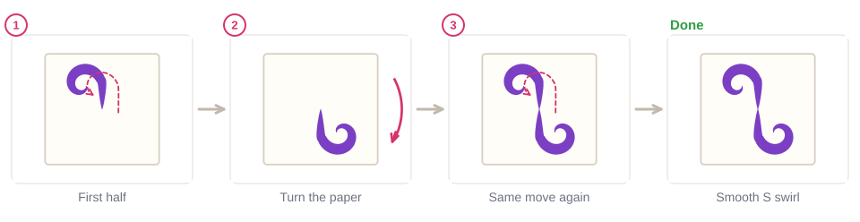
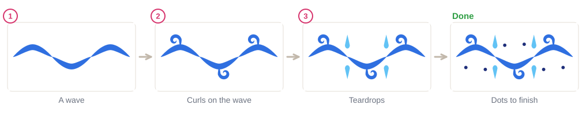
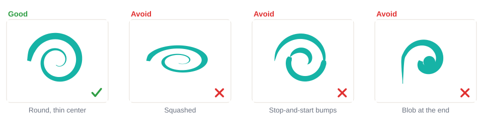
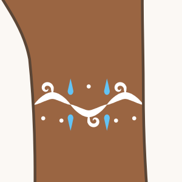

# 02.3 · Swirls, curls and spirals

Beginner · 40 minutes. Swirls make a design flow: they fill a cheek, frame an eye or wrap a wrist.
They look hard, but a curl is just a pressure stroke that keeps turning. In this lesson you paint
curls, spirals and S swirls on paper, then join them into a swirl border you can paint around your
wrist.

## Materials

> [!WARNING]
> The mini-project goes on your wrist. Use only face paint you have already patch-tested
> ([lesson 01.3](../module-01/lesson-03.md)), and don't paint over cuts, sores or irritated skin.

| Item | What it does here | Ideal | Cheaper or easier to find | The substitute must… |
|---|---|---|---|---|
| Round brush | Curls and spirals | Synthetic round, size 2-4 | Synthetic watercolor brush | Spring back to one sharp point |
| Face paint | Color | One dark color for drills, plus white and a light color for the border | Any face paint from your kit | Be face paint |
| Water, palette, paper towel | Load and blot the brush | As in [lesson 02.1](lesson-01.md) | Glasses, a white plate | Clean water, white surface |
| Paper | Practice | `drill-3-swirls-spirals` from [labs/module-02](../../labs/module-02/) | Plain paper | Be smooth and loose on the table, so you can turn it |
| Baby wipes | Fix mistakes on skin | Fragrance-free baby wipes | A soft damp cloth | Be gentle and fragrance-free |

No printer? Draw a few spirals lightly with a pencil and paint over them, or draw the outline
freehand. More in [Materials and substitutes](../../references/materials.md).

## How it works

Your fingers can only move a little, and small finger movements wobble. For a smooth curve, the
movement must come from your **elbow and shoulder**: your hand stays still around the brush and the
whole arm draws the curve, with your little finger gliding on the paper.

The second trick is to **turn the paper** (or, on a person, turn your body or ask them to turn their
head). Every brush has one or two directions that feel easy, usually pulling toward you. Instead of
twisting your wrist into an awkward angle, turn the surface so the next part of the swirl becomes an
easy move again.

A curl is a pressure stroke that keeps turning: **touch** and pull, **press** as the curve turns, then
**lift** slowly as you reach the center, so it ends in a thin point. An S swirl is two curls joined
in the middle, turning opposite ways.

## Demonstration

The big smooth swirl comes from a big, relaxed movement. Practice big first, then go smaller.

The line is widest where the curve turns and thinnest in the center.

Both halves of the S are the same move. Turning the paper means you only have to learn one.

The border is only strokes you already know: pressure strokes, curls, teardrops and dots.

Bumps come from stopping and starting. A blob at the end comes from pressing instead of lifting.

## Step by step

1. **Sit so your arm can move**: elbow off the table edge, paper loose in front of you.
2. **Load to the tip** and test on the palette.
3. **Touch** the tip down and start pulling along the curve at once.
4. **Press** a little as the curve turns, moving from the elbow, not the fingers.
5. **Lift** slowly as you reach the center, so the curl ends in a thin point.
6. **Turn the paper** whenever the next part feels awkward, then paint the same easy move again.
7. **For an S swirl**, paint one half, turn the paper half a turn, and paint the other half from the
   middle.

## Practice exercise

On the drill sheet or plain paper (20 minutes):

1. **Air practice:** before loading the brush, draw five big spirals in the air above the paper with
   your whole arm. Then do the same with the brush just above the paper.
2. A row of 10 curls turning right and 10 turning left.
3. Six spirals, starting big (as big as your palm) and getting smaller.
4. Six S swirls, turning the paper for the second half each time.

Stop when your spirals are round (not egg-shaped) and most curls end in a thin point without a blob.

Then paint three curls on your inner forearm (5 minutes). Rest your painting hand's little finger on
your arm, wipe off and repeat.

Hint

Spirals turning into eggs? Turn the paper a little after every half turn of the spiral, so you never
paint with your wrist bent.

## Mini-project

Paint a **swirl border** twice: first as a long border across the bottom of a sheet of paper, then as a
**bracelet across your wrist**: a white wave, small white curls, light blue teardrops and dots.

You're done when:

- [ ] The wave is smooth, with no bumps where the strokes meet.
- [ ] Every curl ends in a thin point.
- [ ] Curls on top and bottom are about the same size.
- [ ] Teardrops and dots fill the gaps evenly.
- [ ] You took a photo, then washed it off with soap and water.

## Common beginner mistakes

| What happens | Why | Fix |
|---|---|---|
| Small, shaky swirls | Moving only the fingers | Move from the elbow; practice big spirals in the air first |
| Spirals look squashed or egg-shaped | Wrist bent at an awkward angle | Turn the paper after each half turn |
| Bumps where a swirl was stopped and restarted | Painting in short pieces | Load enough paint for the whole curl and paint it in one move |
| Curl ends in a blob | Pressing at the end instead of lifting | Lift slowly as you reach the center |
| Both halves of an S look different | Painting the second half with the wrist twisted | Turn the paper and repeat the same move |

## Optional challenge

Paint a **double spiral**: one long stroke that curls in on itself at both ends, like a ram's horns,
with the widest part in the middle. Then paint a row of them that touch, to make a long scroll border.
