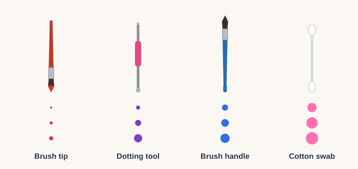
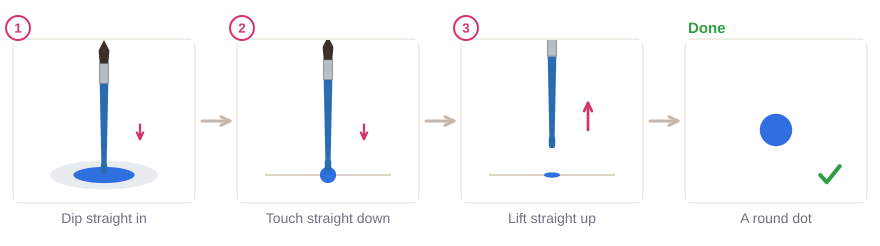
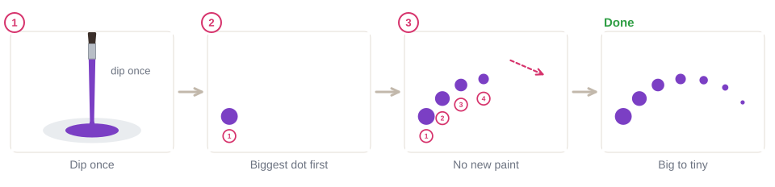
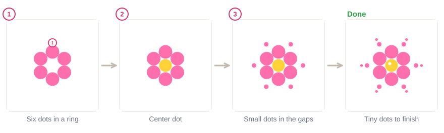
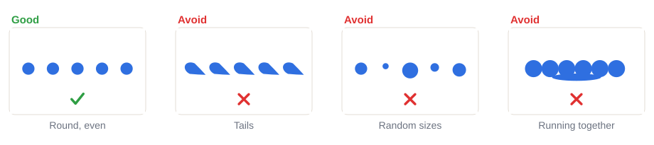
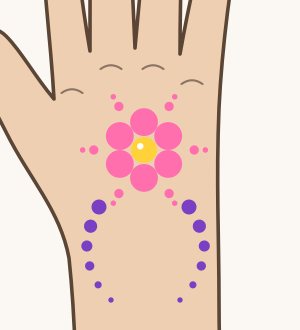

# 02.4 · Dots, dot trails and dot flowers

Beginner · 35 minutes. Dots are the fastest way to make a design look finished: a few white dots
make a flower sparkle, and a trail of dots getting smaller leads the eye across a cheek. In this
lesson you paint even dots with simple tools, dot trails from a single dip, and a dot flower on paper
and on your hand.

## Materials

> [!WARNING]
> The mini-project goes on the back of your hand. Use only face paint you have already
> patch-tested ([lesson 01.3](../module-01/lesson-03.md)). Clean every dotting tool with soap and
> water after use, and use a fresh cotton swab each time.

| Item | What it does here | Ideal | Cheaper or easier to find | The substitute must… |
|---|---|---|---|---|
| Dotting tool | Small and medium dots | A double-ended dotting tool (metal balls of two sizes) | A nail-art dotting tool, or the blunt end of a clean pencil-shaped makeup tool | Have a smooth, round end; be washable and used only for face paint |
| Brush handle | Medium dots | The round end of any brush handle | The end of your round brush | Be round and smooth at the end |
| Round brush | Tiny dots | Synthetic round, size 2-4 | Synthetic watercolor brush | Come to one sharp point |
| Cotton swab | Big, soft dots | Cotton swabs (cotton buds) | Not needed if you have a big handle end | Be new and used once |
| Face paint | Color | Two colors plus white, a little more liquid than for strokes | Any face paint from your kit | Be face paint |
| Palette | A small pool of wet paint to dip into | White palette | A white plate or plastic lid | Be white and smooth |
| Paper | Practice | `drill-4-dots` from [labs/module-02](../../labs/module-02/) | Plain paper | Be smooth |

No printer? Draw a few curved pencil lines for dot trails, or draw the outline freehand. More in
[Materials and substitutes](../../references/materials.md).

## How it works

A dot is made by a **straight touch**: the tool goes straight down into the paint, straight down onto
the paper and straight up again. Any sliding while it touches gives the dot a tail.

The **size** of a dot depends on the size of the tool's end and on how much paint is on it. A fresh
dip gives the biggest dot. Each time you dot again without dipping, less paint is left, so the dots
get smaller. That is all a **dot trail** is: one dip, many dots.

For even dots, dip again before **every** dot, the same depth each time. For a trail, dip **once**
and don't dip again until the trail is finished. Mixing the two is what gives random sizes.

The paint for dots should be a little more liquid than for strokes, like melted ice cream, so it
leaves the tool in a round puddle that dries flat.

## Demonstration

Pick the tool by the size of dot you want. You already own at least two of them.

Straight down, straight up. Nothing slides.

Keep the gaps the same while the dots shrink. The trail looks best along a curve.

The ring of six is easiest like a clock: 12 and 6 first, then 2 and 8, then 4 and 10.

Tails come from sliding, random sizes from uneven dipping, running dots from too much water.

## Step by step

1. **Wet the paint** a little more than for strokes and make a small pool on the palette.
2. **Dip** the tool straight down into the pool, about as deep as the ball or handle end.
3. **Rest your little finger** on the paper.
4. **Touch** straight down, wait a moment, and **lift** straight up.
5. **Even dots:** dip again before every dot, the same depth each time.
6. **Dot trail:** dip once, then dot, dot, dot along a curve without dipping, keeping the gaps even.
7. **Dot flower:** six dots in a ring (12 and 6, 2 and 8, 4 and 10), a center dot in a new color,
   then smaller dots in the gaps.

## Practice exercise

On the drill sheet or plain paper (20 minutes):

1. A row of 10 even dots with each tool (dip before every dot).
2. Five dot trails along curves, from one dip each. Count how many dots you get from one dip.
3. Three dot flowers in different colors.
4. A row of dots in three sizes, repeating: big, medium, small, big, medium, small.

Stop when your even rows have no tails and dots of the same size, and your trails shrink smoothly
without a sudden jump.

Then paint one dot trail on your inner forearm (5 minutes). Let it dry for a minute and check it with
a finger: dots that were too wet stay sticky.

Hint

Dots that peak in the middle or look like little volcanoes mean the paint is too thick. Add a drop of
water. Dots that spread into each other mean it is too thin or they are too close.

## Mini-project

Paint a **dot flower with two dot trails on the back of your hand**: a ring of pink dots, a yellow
center, small dots in the gaps, and two purple trails curving away from the flower, getting smaller.

You're done when:

- [ ] The six flower dots are about the same size and evenly spaced.
- [ ] No dot has a tail.
- [ ] Each trail gets smaller smoothly, from one dip.
- [ ] The two trails mirror each other roughly.
- [ ] You took a photo, then washed it off with soap and water.

## Common beginner mistakes

| What happens | Why | Fix |
|---|---|---|
| Dots have little tails | The tool slid while touching or lifting | Touch straight down and lift straight up |
| Dots are random sizes | Dipping sometimes and not other times, or at different depths | Even dots: dip every time, same depth. Trails: dip once |
| Dots run into each other | Paint too wet, dots too close | Use a little less water and leave a gap the size of a dot |
| Dots are lumpy or peaked | Paint too thick | Add a drop of water to the paint pool |
| A trail jumps from big to small | Dipping again in the middle of a trail | Finish the trail from one dip; start a new trail with a new dip |

## Optional challenge

Paint a **dot mandala** (a round pattern): a center dot, then rings of dots around it, each ring with
more dots and smaller dots than the one inside. Turn the paper after every few dots so you always dot
in front of you.
