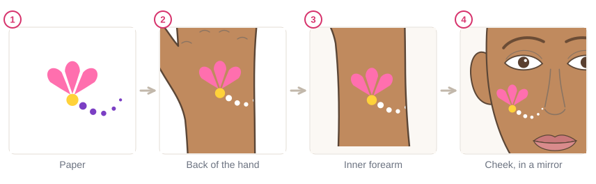
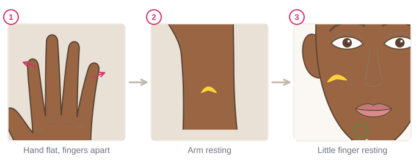
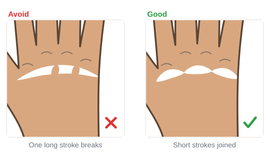
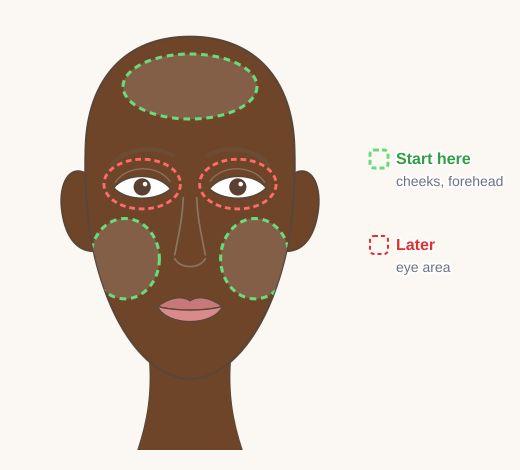

# 02.5 · Painting on skin: hand, arm, then face

Beginner+ · 50 minutes. Paper stays still and flat; skin stretches, curves and moves. In this lesson
you take the strokes you learned on paper to the back of your hand, your forearm and then your own
cheek, and you finish Module 2 with a stroke sampler on your hand that shows every stroke you can now
paint.

## Materials

> [!WARNING]
> Paint only skin that is healthy: no cuts, sores, sunburn, rashes or active eczema. Use only face
> paint you have patch-tested ([lesson 01.3](../module-01/lesson-03.md)). On the face, stay on the
> cheeks and forehead in this lesson and keep paint away from the eyes and mouth. If skin stings,
> itches or turns red, wash the paint off at once (see the [safety guide](../../references/safety.md)).

| Item | What it does here | Ideal | Cheaper or easier to find | The substitute must… |
|---|---|---|---|---|
| Round brush | Strokes, teardrops, curls | Synthetic round, size 2-4 | Synthetic watercolor brush | Spring back to one sharp point |
| Dotting tool | Dots and dot trails | Double-ended dotting tool | The round end of a brush handle | Be smooth, round and clean |
| Face paint | Color | White, yellow, light blue and pink (or any four colors that show on your skin) | Any face paint from your kit | Be face paint, patch-tested |
| Water, palette, paper towel | Load and blot | As in [lesson 02.1](lesson-01.md) | Glasses, a white plate | Clean water, white surface |
| Mirror | Painting your own face | A stand-up mirror at face height in good light | Any mirror propped on a table near a window | Let you see your whole cheek with both hands free |
| Wipes and soap | Fixing mistakes and removal | Fragrance-free baby wipes, mild soap, warm water | A soft damp cloth | Be gentle and fragrance-free |
| Sampler plan | A model to copy | `hand-sampler` from [labs/module-02](../../labs/module-02/), or `hand-arm` from [labs/common](../../labs/common/) | Trace around your own hand on paper | Show where each row goes |

Pick colors that **contrast** with your skin: on darker skin, white, yellow, light blue and pink show
best; on very light skin, darker colors like blue, purple and green show best. More in
[Materials and substitutes](../../references/materials.md).

## How it works

Three things change when you move from paper to skin.

**Skin moves.** It stretches and wrinkles under the brush. Keep it still and slightly tight: lay your
hand flat on the table with the fingers a little apart, rest your forearm on the table, and on the
face, rest your little finger on your jaw or chin while you paint the cheek. Never pull skin hard.

**Skin curves.** A long stroke that goes over a bump (a knuckle, a cheekbone, the wrist bone) skips
and breaks. Use **shorter strokes**, each on a flatter part, joined at their thin ends. Small
designs are easier than big ones.

**Skin is softer and a little oily.** Paint can slide or look streaky. Use a little less water than on
paper and let each part dry for a moment before painting next to it. If a stroke goes wrong, wipe
just that part with the corner of a damp baby wipe, let it dry, and paint it again.

On your own face in a mirror, your hand seems to move the "wrong" way at first. Go slowly, paint
small, and rest your little finger. The cheek and the forehead are the flattest, easiest places. The
eye area comes much later in the course and needs products whose label allows eye-area use.

## Demonstration

The design stays the same; only the surface changes. Each step is a little harder than the last.

Something always rests: the hand being painted on the table, and your painting hand on the skin.

Short strokes that join at thin ends look like one stroke, and none of them has to cross a bump.

Start on the cheeks and forehead. They are the flattest parts of the face.

This is the module's practical piece: one row for each lesson of Module 2.

## Step by step

1. **Wash and dry** the skin you will paint. Check it is healthy.
2. **Set up**: hand flat on the table, fingers a little apart; good light; mirror ready for the face.
3. **Test the paint** on the palette. Use a little less water than on paper.
4. **Rest your little finger** on the skin near where you paint.
5. **Paint small and short**: break long strokes into short ones that join at their thin ends.
6. **Let it dry** for a moment before painting right next to wet paint.
7. **Fix mistakes** with the corner of a damp wipe, let the skin dry, paint again.
8. **On the face**: cheek or forehead only, little finger resting on the jaw or chin, slow and small.
9. **Remove** everything with warm water and mild soap when you finish ([lesson 01.5](../module-01/lesson-05.md)).

## Practice exercise

Work through the four surfaces (25 minutes):

1. **Paper (5 min):** paint the small design from the first picture: three teardrops, a center dot,
   a dot trail.
2. **Back of the hand (8 min):** paint the same design twice. Wipe off the first and compare: is the
   second neater?
3. **Inner forearm (6 min):** paint it once, then paint three pressure strokes and three curls.
4. **Cheek, in a mirror (6 min):** paint the design once on your cheek. Rest your little finger on
   your jaw. Then wash it off.

Stop when the design on your hand looks almost as neat as on paper.

Hint

If you are right-handed, painting your left cheek is usually easier (and the other way round for
left-handers). Start on that side.

## Mini-project

**Module 2 practical: a stroke sampler on the back of your hand.** First paint it on paper or on the
`hand-sampler` sheet, then on your hand:

1. A row of three pressure strokes near the knuckles (white).
2. A row of four teardrops (yellow).
3. Two curls facing each other (light blue).
4. A dot trail getting smaller across the hand (pink).
5. A small dot flower between the two curls.

Take a photo in daylight. Then wash it off with warm water and mild soap.

You're done when:

- [ ] Every pressure stroke goes thin, thick, thin, with no blob at the start.
- [ ] The teardrops have round heads and sharp tails, all pointing the same way.
- [ ] Both curls end in a thin point at the center.
- [ ] The dot trail shrinks smoothly from one dip, and the flower dots are even.
- [ ] The skin is clean and calm after removal, with no redness.

## Common beginner mistakes

| What happens | Why | Fix |
|---|---|---|
| A long stroke skips and breaks on the hand | The stroke crosses a knuckle or bone | Use short strokes on flat parts, joined at thin ends |
| Lines wobble on skin, though they were fine on paper | The skin moves or the painting hand floats | Lay the hand flat, rest your little finger on the skin |
| Paint slides or looks streaky on skin | Too much water, or oily skin | Wash and dry the skin first; use a little less water |
| Smudging the design with your painting hand | Resting on wet paint | Paint from the top down (or away from your resting finger), let parts dry |
| Your hand moves the wrong way in the mirror | The mirror flips left and right | Paint small and slow; start on the easier cheek |

## Optional challenge

Paint the sampler on your inner forearm too, as a **long vertical strip** from the wrist toward the
elbow: one row of each stroke, then a swirl border at the top. Notice how the arm's curve changes the
strokes near the edges.
