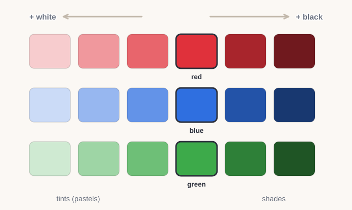

# 03.1 · Mixing many colors from a few

Beginner · 40 minutes. You don't need a big palette with every color. With red, yellow and blue plus
white and black you can mix orange, green, purple, pink, sky blue, brown and gray. In this lesson you
learn the few mixing rules that keep colors bright and clean, and you fill in your own mixing chart.

## Materials

> [!WARNING]
> Mix only face paints with face paints. Never add craft paint, food coloring, markers or anything
> else to "get" a missing color: one non-cosmetic ingredient makes the whole mix unsuitable for skin.
> Take paint out of each cake with a clean, wet brush, so one color never gets into another cake.

| Item | What it does here | Ideal | Cheaper or easier to find | It must… |
|---|---|---|---|---|
| Face paint | The colors to mix | Water-activated cakes: red, yellow, blue, white, black; a pink if you have one | A kids' face paint palette | Be sold as face paint |
| Round brush | Moving paint to the plate and mixing | Synthetic round, size 2-4 | Synthetic watercolor brush | Spring back to a point |
| White plate | Where you mix | Mixing palette | A white plate, saucer or plastic lid | Be white, so you see the true color |
| Two cups | Rinse water and clean water | Two water pots | Two glasses | Hold clean water |
| Paper towel | Wiping the brush between colors | Kitchen paper | A soft cloth | Soak up water fast |
| Mixing chart | Recording your mixes | `color-mixing-chart` from [labs/module-03](../../labs/module-03/) | Plain white paper with a grid drawn on it | Take paint without curling much |

No printer? Draw a grid of circles with a pencil, or draw the outline freehand. The full list is in
[Materials and substitutes](../../references/materials.md).

## How it works

Paint colors come in families. **Red, yellow and blue** are the three starting colors, called
**primary colors**: you can't mix them from others. Mix any two and you get a **secondary color**:
red and yellow make **orange**, yellow and blue make **green**, blue and red make **purple**. That's
the whole color wheel in one picture.

**White** and **black** change how light or dark a color is. Color plus white is a **tint**: softer
and lighter, like pink or baby blue. Color plus black is a **shade**: deeper and darker. Black is very
strong, so you only ever need a tiny touch.

Two habits keep mixes clean. First, **add the dark color to the light one**, a little at a time: a
dot of blue turns a pool of yellow green, but it takes a lot of yellow to change blue. Second,
**mix only two colors** (plus white or black if needed). Every extra color pulls the mix toward
brown: that dull, grayish look is called **muddy**. Muddy color also comes from dirty rinse water and
from mixing on the skin, where you can't see the true color and the rubbing makes patches. So always
**mix on the plate, test on paper, then paint**.

One more secret: not every red mixes the same. A red that leans orange (most "fire-engine" reds)
gives a dull, brownish purple with blue. A pink or cool red gives a bright purple. If your kit has a
pink or magenta, use it for purples.

## Demonstration

Every color between two big circles is a mix of those two. Colors next to each other on the wheel
mix cleanly.

Notice "a little" in almost every recipe: the light color is the big pool, the dark one goes in a
bit at a time. Compare the two purples.

Tints (with white) are great for soft fairy and flower designs; shades (with black) for shadows and
depth.

Keeping the pure colors separate at the side of the plate means you can still add more of either.

Two colors stay clean; three colors make mud. On the skin you can't fix a bad mix, on the plate you
can.

Want to try mixes before you wet any paint? The simulation below imitates how paints mix (it is a
model, so your real paints will look a little different).

[Simulation: Paint mixing plate](../../simulations/color-mixing/index.html)

## Step by step

1. **Set up.** Plate in front of you, clean water and rinse water, paper towel, and the chart.
2. **Wet the cakes** you need with a few drops of clean water and wait about 20 seconds
   ([lesson 01.4](../module-01/lesson-04.md)).
3. **Put the light color on the plate first.** Load the clean brush and paint a pool about the size
   of a coin.
4. **Rinse, wipe, then take the dark color.** Put a small dot of it beside the pool, not on top.
5. **Pull a little of the dark dot into the light pool** and stir until there are no streaks.
6. **Test on paper.** Paint a small swatch next to the pure colors. Too dark? Add more of the light
   color. Too pale? Pull in a little more of the dark one.
7. **Rinse and wipe the brush** before you touch another color or cake.

## Practice exercise

Mix the three secondary colors and two tints (15 minutes).

1. Mix **orange** (yellow + a little red), **green** (yellow + a little blue) and **purple** (pink or
   red + blue). Paint a swatch of each on paper.
2. Mix **pink** (white + a little red) and **sky blue** (white + a little blue).
3. Next to each swatch, write the recipe in drops or brush-loads, e.g. "yellow 3 : blue 1".

Stop when you have five clean swatches with no brown or gray look, each with its recipe.

Hint

Green looks too dark or blue-green? You started with too much blue. Make a new yellow pool and add
the blue one tiny touch at a time. Purple looks brownish? Your red leans orange: try pink instead, or
add a little white to brighten it.

## Mini-project

Fill in your **mixing chart** on the `color-mixing-chart` sheet (or a grid you draw): in each
circle, paint the mix of its row color and column color, half and half, and in the ladders paint each
color with more and more white on one side and a tiny touch of black on the other.

You're done when:

- [ ] Every circle of the grid has a mix, and the pure colors are on the diagonal.
- [ ] The red, yellow and blue ladders each go from a soft tint to a dark shade.
- [ ] Orange, green and purple look clean, not brown.
- [ ] You wrote down which purple came out brighter: from red or from pink.

## Common beginner mistakes

| What happens | Why | Fix |
|---|---|---|
| Mix turns brown or gray | Three or more colors mixed, or opposite colors mixed | Keep to two colors; start a fresh pool |
| Needs huge amounts to change the color | Light color added to the dark one | Start with the light color; add the dark one a little at a time |
| One drop of black ruins the mix | Black is much stronger than other colors | Use a tiny touch on the brush tip; for light shades add a darker color instead |
| Cakes get streaks of other colors | Dirty brush dipped into a clean cake | Rinse and wipe the brush before touching each cake |
| Purple looks dull and brownish | The red leans orange | Use pink or magenta with blue |

## Optional challenge

Mix three different greens from the same yellow and blue: a lime (lots of yellow), a grass green
(half and half) and a teal (lots of blue). Then make a fourth by adding white to the teal. Which one
would you use for leaves, and which for a mermaid tail?
