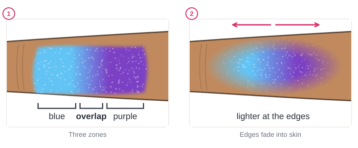

# 03.2 · Your first sponge gradient

Beginner · 40 minutes. A gradient is a soft change from one color to another, like a sunset or a
rainbow sky. It is the base of butterflies, masks and festival faces, and you make it with a simple
sponge. In this lesson you load two colors on one sponge, dab a smooth blend on paper, then paint one
on your own forearm.

## Materials

> [!WARNING]
> The mini-project goes on your inner forearm. Use only face paint you have patch-tested
> ([lesson 01.3](../module-01/lesson-03.md)), never paint over cuts, sunburn or irritated skin, and
> keep the sponges from this lesson for yourself only. Don't put a used sponge back into a cake
> someone else will use.

| Item | What it does here | Ideal | Cheaper or easier to find | It must… |
|---|---|---|---|---|
| Sponge | Carries the two colors and dabs them on | High-density face-painting sponge, round or half-round | A makeup wedge, or a beauty-blender style sponge cut in half for a flat side | Be soft, fine-pored and new |
| Face paint | The two colors | Two neighbor colors, e.g. yellow and pink, or blue and purple | Any face paint from your kit | Be face paint |
| Clean water | Dampening the sponge | Clean water cup | A glass of water | Be clean |
| Paper towel | Squeezing the sponge almost dry | Kitchen paper | A soft cloth | Soak up water fast |
| White plate | Dabbing off extra paint and pre-blending | Mixing palette | A white plate or lid | Be white and smooth |
| Paper | First tries | `gradient-practice` from [labs/module-03](../../labs/module-03/) | Plain thick paper | Not curl when damp |
| Baby wipes | Fixing mistakes on the arm | Fragrance-free baby wipes | A soft damp cloth | Be gentle and fragrance-free |

No printer? Draw a few rectangles about 10 x 5 cm on paper, or draw the outline freehand. The full
list is in [Materials and substitutes](../../references/materials.md).

## How it works

A sponge holds paint in thousands of tiny holes. When you **dab** (press and lift straight off), it
leaves a soft, even layer of tiny dots that melt together. When you **wipe**, it drags the paint
into streaks. So a gradient is always dabbed, never wiped. This up-and-down dabbing is also called
**stippling**.

To blend two colors you load them **side by side** on the same sponge: one color on the left half,
the other on the right. Where the two halves meet, the colors overlap a little. Dab the sponge in
place and then a little to the left and right, and that **overlap zone** becomes a soft mix. Choose
colors that are **neighbors on the color wheel** (yellow and orange, pink and purple, blue and
green): their middle is a clean color. Opposite colors, like yellow and purple, turn brown in the
middle ([lesson 03.1](lesson-01.md)).

A finished gradient has no hard border. At the outer edges you dab more **lightly, with less paint**,
so the color fades into the skin.

## Demonstration

The plate step (3) matters: it spreads the paint into the sponge and takes off the extra, so the
first dab on paper is already soft.

Look at the edges on the right: no line where the paint stops. That is what "fading into the skin"
means.

Each problem has a simple fix in the table under "Common beginner mistakes" below.

The **layer method**: if loading two colors at once is hard, put the light color down first and dab
the darker one over part of it. The result is the same.

## Step by step

1. **Dampen the sponge.** Wet it under the tap and squeeze it in a paper towel until it is only damp.
2. **Wake up both cakes** with a few drops of clean water.
3. **Load side by side.** Rub the left half of the sponge's flat side on the light color, the right
   half on the darker color. Keep the halves apart: don't rub the sponge back and forth across both.
4. **Dab on the plate** three or four times in the same place, so the colors meet softly in the middle.
5. **Dab on the paper.** Press and lift, press and lift, keeping the colors in the same direction.
6. **Blend the middle.** Dab a little left and right over the overlap zone, a few millimeters at a
   time, until you can't see where one color stops.
7. **Fade the edges.** With what is left on the sponge, dab more lightly around the outside.
8. **Let it dry.** If it looks thin or patchy, reload and dab a second thin layer over it.

## Practice exercise

Three gradients on paper (15 minutes), on the `gradient-practice` sheet or rectangles you draw.

1. Yellow to orange (neighbors, easiest).
2. Blue to purple, or pink to purple.
3. Any two colors, faded into the paper on every side, with no hard edge anywhere.

Stop when you can make a blend with no streaks and no visible line where the colors meet, twice in a
row.

Hint

Gradient too wet and runny? Squeeze the sponge drier and dab on the plate first. Overlap zone too
wide, so the whole thing looks like one mixed color? Load less paint toward the middle of the
sponge and blend only a few dabs left and right.

## Mini-project

Paint a **two-color gradient patch on your inner forearm**, about 8 x 4 cm, faded into the skin at
the edges. Take a photo in daylight, then remove it with soap and water
([lesson 01.5](../module-01/lesson-05.md)).

You're done when:

- [ ] The two colors change softly, with no line where they meet.
- [ ] There are no streaks from wiping and no white or skin-colored gaps in the middle.
- [ ] The middle is a clean mix, not brown or gray.
- [ ] The outer edges fade into the skin, with no hard border.

## Common beginner mistakes

| What happens | Why | Fix |
|---|---|---|
| Streaks or lines in the blend | Wiping or sliding the sponge | Dab straight down and lift; let it dry and dab a second layer |
| A sharp line between the two colors | The colors were not overlapped | Dab back and forth over the meeting point a few millimeters at a time |
| White or skin-colored gaps | Sponge too dry, or too few dabs | Reload, dab on the plate, then dab again with light overlapping presses |
| Muddy brown middle | Opposite colors, or the sponge rubbed across both cakes | Use neighbor colors; load each half separately |
| Hard border around the patch | Same pressure and paint all the way to the edge | Dab lighter and with less paint toward the edges |

## Optional challenge

Try a **three-color** gradient on paper: yellow, orange and pink, loaded in three stripes on one wide
sponge. Then try the same sunset on your forearm with the layer method. Which is easier for you?
