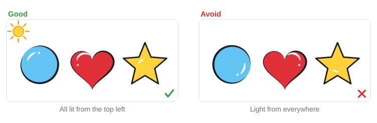

# 03.3 · Light and dark: white highlights and black outlines

Beginner · 40 minutes. The difference between a flat, "kid's drawing" shape and one that looks
finished is usually two small touches: a thin black outline and a few white highlights. In this
lesson you learn where to put them, and you make a plain shape pop on paper and on your hand.

## Materials

> [!WARNING]
> The mini-project goes on the back of your hand or your forearm. Use only face paint you have
> patch-tested ([lesson 01.3](../module-01/lesson-03.md)), and don't paint over cuts or irritated
> skin.

| Item | What it does here | Ideal | Cheaper or easier to find | It must… |
|---|---|---|---|---|
| Thin round brush | Outlines and highlights | Synthetic round or liner, size 1-2 | A small synthetic watercolor brush | Spring back to a fine, sharp point |
| Flat brush or sponge | Filling the base shapes | Synthetic flat, about 1 cm, or a sponge | Small concealer brush | Make an even fill |
| Black and white face paint | Outlines and highlights | Water-activated black and white cakes | The black and white in a kids' palette | Be face paint; give a solid line |
| Colors | The shapes | Any two or three colors | Any face paint from your kit | Be face paint |
| Water, plate, paper towel | Loading and blotting | As in [lesson 01.4](../module-01/lesson-04.md) | Glasses, a white plate | Clean water, white surface |
| Practice sheet | Shapes to finish | `pop-practice` from [labs/module-03](../../labs/module-03/) | Shapes drawn freehand on plain paper | Be smooth |
| Baby wipes, cotton bud | Fixing a wobbly line on skin | Fragrance-free wipes, cotton buds | A soft damp cloth | Be gentle and fragrance-free |

No printer? Draw a heart, a star and a circle about 4 cm wide on paper, or draw the outline freehand.
The full list is in [Materials and substitutes](../../references/materials.md).

## How it works

Your eye sees shapes by **contrast**: light next to dark. A pink heart on light skin, or a blue star
on deep skin, can look soft and a little lost. Black and white are the strongest light and dark you
have, so a touch of each makes any color stand out. That is what painters mean by **"pop"**.

**Highlights** are small white marks where light hits the shape. Pick **one light direction** for
the whole design, for example the top left, as if a lamp shines from there. Then every highlight goes
on the top-left side of its shape: a thin white curve that follows the edge, a dot, maybe a sparkle.
If the highlights point every which way, the shapes look flat and confused.

**Outlines** are thin black lines around the outside of a shape. Paint them as **pressure strokes**
([lesson 02.1](../module-02/lesson-01.md)): thin on the light side, a little thicker on the opposite,
**shadow side**. Outline only where it helps: around the outside, where a shape meets skin or a
similar color. A thick black line around every petal and dot swallows the color and looks heavy.

Order matters: **colors first, let them dry, then black, then white last**. Colors and white are
easy to cover; black is not, so black goes on once the shapes are right, and white sits on top of
everything.

## Demonstration

Notice that the outline is thin on the upper left (the light side) and thicker on the lower right
(the shadow side).

Before you paint any white, ask: where is my lamp? Then keep every highlight on that side.

Thin and only where needed. Pale colors need the outline most; bold colors often need very little.

On deep skin, black outlines give a clean edge and white highlights add sparkle; on light skin,
black outlines do most of the work.

## Step by step

1. **Paint the base shape** in color with the flat brush or sponge. Let it dry until it no longer
   looks shiny (about a minute).
2. **Decide the light direction.** Top left is the easiest to remember; use it for the whole design.
3. **Load the thin brush with black** to a sharp point ([lesson 01.4](../module-01/lesson-04.md)).
4. **Outline the light side thin.** Touch lightly with the tip and pull along the edge.
5. **Outline the shadow side thicker.** Press a little more as you go around the lower right, then
   lift to a point at the end.
6. **Rinse well**, then load the thin brush with **white**.
7. **Add one highlight per shape** on the light side: a short curve following the edge, then a dot.
8. **Finish with a few white dots or a sparkle** around the design, also on the light side. Stop
   before it gets busy.

## Practice exercise

Finish the shapes on the `pop-practice` sheet, or three shapes you draw (15 minutes).

1. Fill a heart, a star and a circle with color and let them dry.
2. Mark a small sun at the top left of the page to remind you of the light direction.
3. Outline each shape thin-thick, thicker on the lower right.
4. Add one white curve and one white dot on the upper left of each shape.

Stop when all three shapes have their highlights on the same side and none of the outlines is
thicker than the brush tip pressed halfway down.

Hint

Black line wobbly? Rest your little finger on the paper and pull the brush toward you instead of
pushing it. Line turning gray? The color underneath was still wet: wait until it is dry.

## Mini-project

Paint a **small shape that pops on the back of your hand**: a heart, star or leaf about 4 cm wide,
filled with color, outlined thin-thick in black and finished with white highlights. Take a photo
from arm's length.

You're done when:

- [ ] The shape is filled evenly and was dry before the black went on.
- [ ] The outline is thin on the light side and a little thicker on the shadow side.
- [ ] Every highlight is on the same side, the side you chose for the light.
- [ ] The shape is easy to see in the photo from arm's length.

## Common beginner mistakes

| What happens | Why | Fix |
|---|---|---|
| Black line turns gray or smudgy | Black painted over wet color | Let the color dry until it is no longer shiny, then outline |
| Outline looks heavy and cartoonish | Thick, even line around everything | Thin-thick lines, only around the outside; skip inner lines |
| Shapes look flat even with white | Highlights on different sides | Choose one light direction and keep every highlight on that side |
| White highlight looks pale and see-through | Too much water, or painted over wet paint | Use creamy white on a dry base; add a second touch once dry |
| Too many dots and sparkles | Wanting more "pop" | A few highlights, all on the light side; stop early |

## Optional challenge

Add a **shadow** as well: on the shadow side of your heart, sponge or brush a slightly darker shade of
the same color (the color plus a tiny touch of black, from [lesson 03.1](lesson-01.md)) before you
outline. Does the shape now look round, like a balloon?
