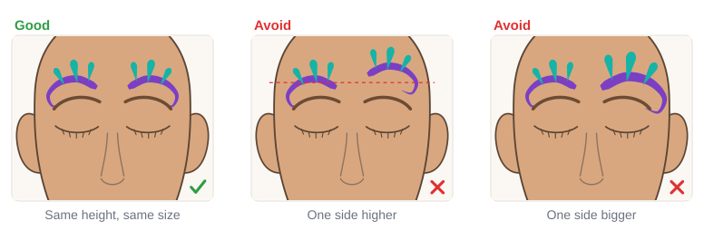

# 03.4 · Symmetry and the face map

Beginner+ · 45 minutes. Most face designs are symmetrical: the left side matches the right, like a
butterfly. Nobody is born able to paint that by eye, so painters use a simple map of the face and
a few tricks. In this lesson you learn the face map, plan a design by painting half and mirroring it,
and paint a matching design on a practice face.

## Materials

> [!WARNING]
> The design in this lesson sits on the brow bone, which counts as the eye area. If you paint it on
> your face, use only paint whose label allows eye-area use, keep paint off the eyelids and lash
> line, and use only patch-tested products ([lesson 01.3](../module-01/lesson-03.md)). If your paint
> doesn't allow eye-area use, move the design up onto the forehead and temples.

| Item | What it does here | Ideal | Cheaper or easier to find | It must… |
|---|---|---|---|---|
| Face map and half-face templates | Planning where everything goes | `face-map`, `half-face-left` and `half-face-right` from [labs/common](../../labs/common/) | An oval drawn on paper with a center line and an eye line | Show the center line and the eyes |
| Symmetry practice sheet | Mirroring drills | `symmetry-practice` from [labs/module-03](../../labs/module-03/) | A sheet of paper folded in half | Have a clear middle line |
| Round brush | Swirls, teardrops and dots | Synthetic round, size 2-4 | Synthetic watercolor brush | Spring back to a sharp point |
| Face paint | Three colors | For example purple, teal and pink, plus white | Any face paint from your kit | Be face paint; eye-safe if used near the eyes |
| Light sketching color | Marking landmarks on skin | A light face paint line or a white eye-safe cosmetic pencil | A tiny dot of light face paint | Be a cosmetic, never a pen or marker |
| Mirror and phone | Checking the two sides | A stand-up mirror at face height | Any mirror; your phone camera | Show your whole face |
| Sheet protector | Painting the same template again and again | A clear plastic sheet protector | A clear plastic folder | Be smooth and wipe clean |

No printer? Draw an oval face, a dashed line down the middle and a line across the eyes, or draw the
outline freehand. The full list is in [Materials and substitutes](../../references/materials.md).

## How it works

**Symmetry** means the two halves of a design match, as if one were a mirror image of the other. The
**face map** makes it easy. It has one line down the middle, the **center line** (through the middle of
the forehead, nose, lips and chin), and a few lines across: the **brow line**, the **eye line**, the
**under-nose line** and the **mouth line**. On each side there are **landmarks**: points you can always
find, like the end of the brow, the outer corner of the eye, the cheekbone and the corner of the
mouth.

To place something on the other side, don't guess: **measure from a landmark**. "The swirl starts
above the end of the brow and is one finger wide" works the same on both sides. Real faces are never
perfectly symmetrical, so measure from each side's own landmarks, not from the hairline.

On paper, plan the design by painting **one half and mirroring it** onto the other half. On a face,
don't paint a whole half and then try to copy it: paint **one element on one side, then the same
element on the other side straight away**, before you move on. Small steps are much easier to match
than a whole half. Then **check**: step back from the mirror, or take a photo, where uneven sides
are easy to spot.

## Demonstration

These lines and points are on the `face-map` template in [labs/common](../../labs/common/). Every
design in this course is placed with them.

Plan on paper first: it is quick to repaint, and you find out where each part goes before it touches
skin.

Notice the order: one element, both sides; next element, both sides. Things on the center line go
last, so you can see where the middle really is.

These two mistakes, one side higher or one side bigger, are the most common, and both are easy to see
from about a meter away.

## Step by step

1. **Find the center line.** On a template it is printed. On a face, look in the mirror and picture a
   line from the middle of the forehead down the nose to the chin.
2. **Mark the landmarks** you need with tiny dots of a light color: the brow ends, the outer eye
   corners, the cheekbones. Same points on both sides.
3. **Paint the first element on one side.** Start with the biggest one (here, the swirl). Use the
   side that is easier for your painting hand.
4. **Paint the same element on the other side straight away.** Start it at the same landmark, make it
   the same length and angle.
5. **Step back and compare** before the next element. Fix it now if one side is higher or bigger.
6. **Repeat for each element**: next biggest first, smallest details last.
7. **Add anything on the center line last** (a dot, a gem shape, a stripe).
8. **Check the whole design**: look in the mirror from about a meter away, or take a photo and cover
   one half with your hand, then the other.

## Practice exercise

Mirror drills on paper (15 minutes), on the `symmetry-practice` sheet or a folded sheet of paper.

1. On the sheet, each row has a shape on the left of the middle line: a teardrop, a swirl, a dot
   trail, a leaf. Paint its mirror image on the right side.
2. Paint the same four shapes yourself on the left, then mirror them on the right.
3. Hold the sheet up to a mirror or take a photo: compare the two sides.

Stop when your mirrored shapes start at the same height and point the same way (outward or inward)
as the originals, four shapes in a row.

Hint

Mirroring confusing? Say it out loud: "the tail points away from the middle" or "the curl opens
upward". Those words are true on both sides. Fold the paper on the middle line while the paint is wet
to see a perfect mirror print, then compare it with your own copy.

## Mini-project

Paint the **symmetrical brow design** from the demonstration (swirls, teardrops, cheekbone dots and a
center dot) on the `face-map` template. Plan it first by painting one half on `half-face-left` (or
`half-face-right`), then paint the full design element by element. If your paint is eye-safe, you can
then paint it on your own face in a mirror.

You're done when:

- [ ] Each element on the right sits at the same landmark as on the left.
- [ ] Both swirls are the same height, the same size and curl the same way (outward).
- [ ] The center dot sits on the center line.
- [ ] From about a meter away (or in a photo) the two sides look the same.

## Common beginner mistakes

| What happens | Why | Fix |
|---|---|---|
| One side ends up higher | Placed by eye, not from a landmark | Start each element at the same landmark on both sides |
| One side is bigger | A whole half painted first, then copied from memory | Paint one element, then the same element on the other side straight away |
| Shapes point the same way instead of mirroring | Copying the shape instead of its mirror image | Describe it from the middle: "tail points away from the middle" |
| Design drifts off center | Center line not marked; the nose used as a guide while turned | Mark the center line with a light dot at the forehead and chin; face the mirror straight on |
| Can't see the mistake up close | Too near the mirror | Step back about a meter or take a photo; cover one half, then the other |

## Optional challenge

Paint a design that is **not** symmetrical but still looks balanced: a big flower on one cheek and a
small trail of dots and leaves going up to the opposite temple. Check it the same way: does it feel
even from a meter away?
