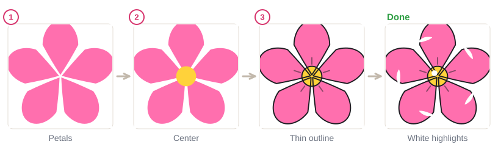
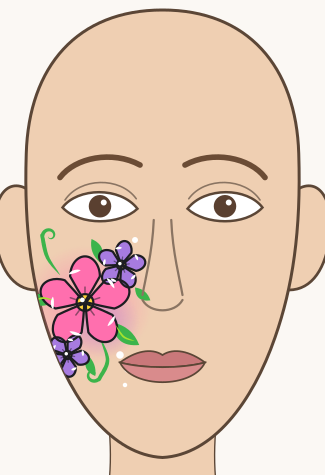
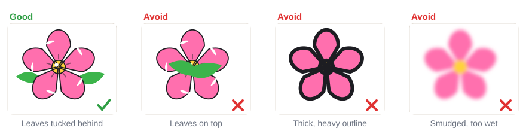

# 04.1 · Flowers and leaves

Beginner · 50 minutes. Flowers are the first design most face painters learn, because they use
only the strokes you already know: teardrops for petals, pressure strokes for leaves and curls for
vines. In this lesson you paint a finished-looking flower, leaves and vines, and then put three
flowers together into a cluster on your cheek.

## Materials

> [!WARNING]
> Use only face paint you have patch-tested ([lesson 01.3](../module-01/lesson-03.md)). Paint on
> healthy skin only, and keep this design on the cheekbone, below the eye.

| Item | What it does here | Ideal | Cheaper or easier to find | The substitute must… |
|---|---|---|---|---|
| Round brush, size 2-4 | Petals, leaves, vines | Synthetic face-painting round brush | Synthetic watercolor brush | Spring back to one sharp point |
| Thin round or liner, size 0-1 | Thin black outline, white highlights | Face-painting liner brush | The very tip of your size 2 round | Make a hair-thin line |
| Sponge | The soft glow behind the flowers | High-density face-painting sponge | A makeup wedge sponge, cut in half | Be soft, fine-pored and new |
| Face paint | Color | Pink, lilac or purple, yellow, green, black, white | Any face paint set with these colors | Be face paint, patch-tested |
| Water, palette, paper towel | Load and blot | As in [lesson 02.1](../module-02/lesson-01.md) | Two glasses, a white plate | Clean water, white surface |
| Practice sheet | A model to paint over | `design-1-flowers` from [labs/module-04](../../labs/module-04/) | The `face-front` sheet from [labs/common](../../labs/common/), or draw the outline freehand | Show where the cluster goes |
| Mirror, wipes | Painting your own cheek, fixing mistakes | Stand-up mirror, fragrance-free baby wipes | Any mirror near a window, a soft damp cloth | Leave both hands free; be gentle |

More about every item in [Materials and substitutes](../../references/materials.md).

## How it works

A pretty flower is only three ideas. **Shape**: five teardrop petals with their tails pointing to
the center ([lesson 02.2](../module-02/lesson-02.md)). **Contrast**: a center dot in a different
color, and later a thin black outline that makes the shape crisp
([lesson 03.3](../module-03/lesson-03.md)). **Light**: a thin white curve on each petal and a white
dot on the center make it look shiny and alive.

A **leaf** is one pressure stroke: touch with the tip, press in the middle, lift to a point. A
**vine** is a long, thin stroke that ends in a curl ([lesson 02.3](../module-02/lesson-03.md)).
Leaves and vines fill the gaps between flowers and lead the eye around the design.

A **cluster** looks best with one big flower and two small ones, never three of the same size. Put
the big one on the cheekbone and the small ones a little higher and lower, like a triangle. A soft
sponged glow behind them ([lesson 03.2](../module-03/lesson-02.md)) ties everything together.

## Demonstration

The leaf is widest in the middle, where you press hardest. The leaves on the vine all point the
same way, toward the curl.

The same flower looks flat in picture 1 and finished in the last picture: only the outline and the
white highlights changed.

Each step adds one thing. You can stop after step 3 and it already looks good.

The whole design sits below the eye and away from the nose and mouth.

## Step by step

1. **Glow (simplest version: skip it).** Dab a little pink with a sponge on the cheekbone, then a
   touch of lilac in the middle. Keep it soft and pale. Let it dry for a minute.
2. **Big flower.** Paint five pink teardrop petals in the middle of the glow, heads out, tails to the
   center. Mark five points first if it helps.
3. **Two small flowers.** One higher and closer to the nose, one lower and further out. Smaller
   petals, same method.
4. **Centers.** A yellow dot in the middle of each flower, covering the tails.
5. **Leaves.** Press-and-lift green leaves in the gaps between the flowers. Start each leaf at the
   edge of a petal, so it looks tucked behind.
6. **Vines.** One thin green stroke from a flower outward, ending in a small curl. Two vines are
   enough.
7. **Optional upgrade: outline.** With the liner and black paint that is almost dry, trace a thin
   line around the petals. Wait until the pink is dry first.
8. **Highlights.** A thin white curve near the edge of each petal, a white dot on each center, a
   light green line down the bigger leaves, and a few white dots along the vines.

## Practice exercise

On paper or the `design-1-flowers` sheet in a sheet protector (25 minutes):

1. Ten leaves in a row, five pointing right and five pointing left.
2. Two vines with three leaves each.
3. Three flowers in three sizes, each finished with a center, a thin outline and white highlights.

Stop when your leaves are pointed at both ends and your flower outline is thinner than the petals'
edges are wide. Then paint one small flower and two leaves on the back of your hand (5 minutes).

Hint

If the black outline drags the pink with it, the pink is still wet. Wait, or blow on it gently. If
the black comes out gray and streaky, your black is too watery: blot the brush on the paper towel.

## Mini-project

Paint the **cheek flower cluster** from the demonstration: first on the `design-1-flowers` sheet,
then on your own cheek in a mirror. Use any colors you like; pink and lilac on fair skin, or yellow,
orange and pink on darker skin, show well.

You're done when:

- [ ] The cluster has one big flower and two smaller ones, arranged like a triangle.
- [ ] All petals point their tails to a center dot that hides them.
- [ ] The leaves look tucked behind the flowers, and the vines end in a curl.
- [ ] The whole design sits on the cheekbone, below the eye and away from the nose and mouth.
- [ ] You took a photo, then washed it off with warm water and soap.

## Common beginner mistakes

| What happens | Why | Fix |
|---|---|---|
| Leaves cover the petals | Leaves painted across the flower | Start each leaf at a petal's edge, in the gap |
| The outline is thick and heavy | Pressing with a big brush, or too much black | Use the very tip of a thin brush, and only outline the outer edges |
| Black smudges into pink | The pink was still wet | Wait until each layer is dry to the touch |
| The cluster looks flat and boring | Three flowers of the same size | One big flower and two small ones, at different heights |
| The design creeps toward the eye | Starting too high | Start the big flower on the cheekbone and build outward and down |

## Optional challenge

Paint a **two-tone petal flower**: load the round brush with white, then dip just the tip in pink.
Each petal comes out pink at the edge and pale toward the center. Add a vine that wraps from the
cluster up to the temple, with three tiny flowers along it.
