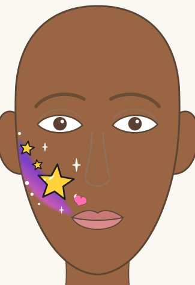
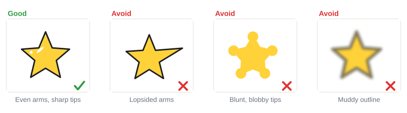

# 04.2 · Stars, hearts and sparkles

Beginner · 45 minutes. Stars, hearts and sparkles are small, quick and fit anywhere: on a cheek,
next to a bigger design, or as the whole design for a small child. In this lesson you learn two ways
to paint a star, a heart made of two teardrops, and a four-point sparkle, and you combine them with a
sponged swoosh into a cheek design.

## Materials

> [!WARNING]
> Use only face paint you have patch-tested ([lesson 01.3](../module-01/lesson-03.md)). The swoosh
> in this lesson stays on the cheek, well below the eye. Leave the eye area for later lessons.

| Item | What it does here | Ideal | Cheaper or easier to find | The substitute must… |
|---|---|---|---|---|
| Round brush, size 2-4 | Star arms, hearts, sparkles | Synthetic face-painting round brush | Synthetic watercolor brush | Spring back to one sharp point |
| Flat brush, about 1 cm | Filling a star outline | Synthetic flat or filbert | A small concealer makeup brush | Make a clean, straight edge |
| Thin round or liner | Outlines, shine lines | Face-painting liner, size 0-1 | The tip of your size 2 round | Make a hair-thin line |
| Sponge | The swoosh | Face-painting sponge | A makeup wedge sponge | Be soft, fine-pored and new |
| Face paint | Color | Yellow, pink, purple, blue, black, white | Any face paint set | Be face paint, patch-tested |
| Water, palette, paper towel, wipes | Load, blot, fix | As in [lesson 02.1](../module-02/lesson-01.md) | Glasses, a white plate, a damp cloth | Clean water, white surface |
| Practice sheet | A model to paint over | `design-2-rainbow-stars` from [labs/module-04](../../labs/module-04/) | `face-front` from [labs/common](../../labs/common/), or draw the outline freehand | Show the swoosh and stars |

The full list is in [Materials and substitutes](../../references/materials.md).

## How it works

A star is hard freehand because five arms must be the same length. Two tricks fix that.
**Outline and fill:** mark the five tips with tiny dots first, join them into the star outline, then
fill it in. **Five teardrops:** press near the center and pull out toward each tip, lifting to a
point ([lesson 02.2](../module-02/lesson-02.md)); a dot fills the middle. The first way gives
straighter edges; the second is faster once your teardrops are good.

A **heart** is two teardrops that mirror each other: start each one round at the top and pull it
down to meet the other at a point. A **sparkle** is a long up-down pressure stroke crossed by a
shorter side-to-side one ([lesson 02.1](../module-02/lesson-01.md)).

Small shapes only "pop" with **contrast** ([lesson 03.3](../module-03/lesson-03.md)): a thin black
outline around a yellow star, and a short white shine line inside it, make it look bright and round.

## Demonstration

The dots in the top row are your map. In the bottom row every arm is the same teardrop, turned.

The outlined star looks finished because of the thin black edge and the white shine.

## Step by step

1. **Swoosh.** Load the corner of a sponge with pink and dab a curved band from the cheek, near the
   corner of the mouth, up toward the ear. Add purple on the middle and blue at the top end, dabbing
   where the colors meet ([lesson 03.2](../module-03/lesson-02.md)). Keep it below the eye.
2. **Big star.** Paint it on the middle of the swoosh. Simplest: five tiny yellow dots for the tips,
   join them, fill with the flat brush. Faster: five teardrops from the center out.
3. **Small stars and a heart.** Two small stars along the swoosh, one pink heart near the bottom.
4. **Let it dry.** Yellow needs a minute.
5. **Outline.** With the liner and black paint that is not too wet, trace the stars and the heart.
6. **Shine.** A short white curve inside the big star, near one tip, and a tiny white dot.
7. **Sparkles and dots.** Two or three white sparkles around the stars, and a few white dots along
   the swoosh.

## Practice exercise

On paper (20 minutes):

1. Three stars by outline and fill, three by five teardrops. Which way do you prefer?
2. Five hearts. Paint the left teardrop of each, then all the right ones.
3. A row of sparkles in three sizes.
4. One big star with a black outline, a white shine and a sparkle cluster around it.

Stop when your stars have five arms of about the same length. Then paint one star and two sparkles on
the back of your hand (5 minutes).

Hint

Lopsided stars? Paint the top arm first, then the two bottom arms, then the two side arms. The
bottom arms set the width; the side arms only fill the gaps.

## Mini-project

Paint the **star-and-sparkle cheek design**: first on the right cheek of the `design-2-rainbow-stars`
sheet, then on your own cheek in a mirror. On very light skin, choose a deeper swoosh (purple and
blue); on dark skin, bright yellow stars and white sparkles show best.

You're done when:

- [ ] The swoosh blends softly from one color to the next with no hard stripes.
- [ ] The big star has five arms of similar length and sharp tips.
- [ ] Stars and heart have thin, clean black outlines, painted after the color dried.
- [ ] There is a white shine on the big star and a few sparkles around it.
- [ ] Everything sits below the eye; you took a photo and washed it off.

## Common beginner mistakes

| What happens | Why | Fix |
|---|---|---|
| Star looks lopsided | Freehand arms of different lengths | Mark five tip dots first; paint top, bottom, then sides |
| Blunt, round star tips | Pressing at the tip instead of lifting | Start or end each arm with only the brush point touching |
| Gray, muddy outline | Black painted on wet yellow, or watery black | Let yellow dry; blot the black brush before outlining |
| Heart has a lumpy top or a blunt point | The two teardrops don't mirror each other | Start both at the same height and pull both to one shared point |
| Sparkles look like crosses | Both strokes the same length and width | Make the up-down stroke longer and thicker than the side stroke |

## Optional challenge

Paint a **shooting star**: a big outlined star with three curved tails behind it, each one a long
teardrop in a different color (yellow, pink, blue), pulled from the star outward. Finish with a dot
trail along each tail.
