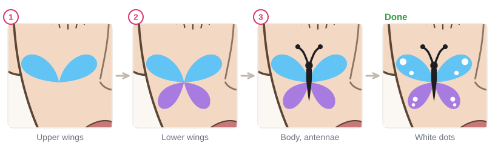
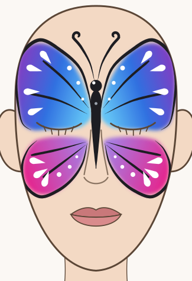
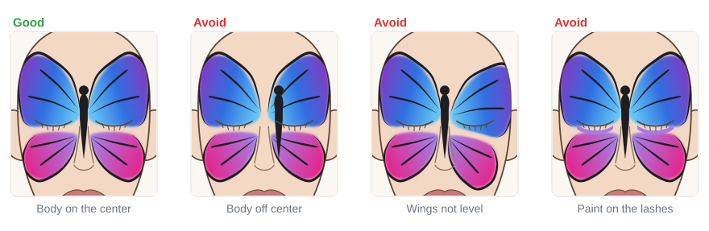

# 04.3 · The butterfly

Beginner+ · 65 minutes. The butterfly is the classic face-painting design: big, colorful and
symmetrical. In this lesson you start with an easy butterfly on the cheek, then paint the full-face
butterfly with sponged wings over the brows and cheeks, a body down the nose and white details that
make it shine.

## Materials

> [!CAUTION]
> The upper wings of the full-face butterfly go over the **eyelids**. Use only face paint whose
> label allows use around the eyes (a color allowed on the cheek may not be allowed on the eyelid;
> see [lesson 01.2](../module-01/lesson-02.md)). Paint the lids only with the **eyes closed**, keep
> paint off the lash line, and use no glitter or gems near the eyes. No neon or glow paint near the
> eyes. If you are not sure your paint is eye-safe, paint the cheek butterfly instead.

| Item | What it does here | Ideal | Cheaper or easier to find | The substitute must… |
|---|---|---|---|---|
| Sponges, two or three | The wing colors | Face-painting sponges | Makeup wedge sponges, cut in pieces | Be soft and new; one piece per color |
| Round brush, size 2-4 | Body, cheek-butterfly wings, white teardrops | Synthetic face-painting round brush | Synthetic watercolor brush | Spring back to one sharp point |
| Thin round or liner | Outlines, veins, antennae | Face-painting liner, size 0-1 | The tip of your size 2 round | Make a hair-thin line |
| Face paint | Color | Light blue, blue, purple, lilac, pink, black, white; **eye-safe** for the lids | A face paint set whose label allows the eye area | Be face paint, patch-tested, eye-safe for the lids |
| Water, palette, paper towel, wipes | Load, blot, fix | As in [lesson 02.1](../module-02/lesson-01.md) | Glasses, a white plate, a damp cloth | Clean water; gentle, fragrance-free wipes |
| Practice sheet | Wing shapes to paint over | `design-3-butterfly` from [labs/module-04](../../labs/module-04/) | `face-map` from [labs/common](../../labs/common/), or draw the outline freehand | Show the center line |
| Mirror | Checking that both sides match | Stand-up mirror | Phone front camera | Show the whole face |

The full list is in [Materials and substitutes](../../references/materials.md).

## How it works

A butterfly works because it is **symmetrical**: the left half is a mirror of the right half
([lesson 03.4](../module-03/lesson-04.md)). The body sits on the **center line**, down the nose
bridge. If the body is in the middle and both wing tips are at the same height, small differences in
the wings don't show.

The **upper wings** cover the brows and the closed eyelids and reach out to the temples. The
**lower wings** sit on the cheeks and start just below the lower lashes, never on them. A sponge
gradient in each wing ([lesson 03.2](../module-03/lesson-02.md)) does most of the work; the black
outline and the white teardrops ([lesson 03.3](../module-03/lesson-03.md)) make it look finished.

The **small cheek butterfly** is the same idea in miniature: two big teardrops for the upper wings,
two small ones for the lower wings, a thin body and antennae. It needs no eye-area paint, so it is
the version to master first.

## Demonstration

All four wings meet in one point: the middle of the body. The body hides where they meet.

Plan with the face map first. A dashed line across the wing tips shows that both sides are level.

Steps 1 and 2 are only sponging. The design already reads as a butterfly after step 3.

## Step by step

### Easy version: cheek butterfly

1. **Upper wings.** Two big rounded teardrops, heads out and up, tails meeting at one point.
2. **Lower wings.** Two smaller teardrops below, tails meeting at the same point.
3. **Body and antennae.** A thin black pressure stroke down the middle, a dot for the head, two thin
   curved lines with dots for the antennae.
4. **Details.** White dots on the wings.

### Full-face butterfly

1. **Plan.** With light paint and a fine brush, put a small dot between the brows (the head), and one
   dot at each upper-wing tip on the forehead. Check in the mirror that the tips are level.
2. **Upper wings, eyes closed.** Sponge eye-safe light blue from the side of the nose bridge up over
   the brow and lid. Add blue in the middle and purple at the temple, dabbing where they meet. Paint
   the lid gently and stop above the lash line.
3. **Lower wings.** Eyes open, looking up. Sponge lilac near the nose and pink at the outer cheek,
   starting a few millimeters below the lower lashes.
4. **Body.** A black pressure stroke from between the brows down the nose bridge, thick at the top,
   thin at the end. A round head at the top.
5. **Antennae.** Two thin lines from the head up onto the forehead, ending in a small curl.
6. **Outline and veins.** With black and the liner, trace the outer edges of the wings. Add two or
   three vein strokes in each wing, from the body outward, thin at the end.
7. **White details.** White teardrops along the outer edge of each wing, pointing inward, and white
   dots. Paint the left side, then copy it on the right.
8. **Check.** Look in the mirror (or take a photo) and fix any part that is higher or bigger on one
   side.

## Practice exercise

On paper and the template (30 minutes):

1. Three cheek butterflies on paper: one in blues, one in pinks, one in yellow and orange.
2. On the `design-3-butterfly` sheet in a sheet protector: sponge both upper wings, then both lower
   wings, then the body. Check the wing tips are level with a ruler or a piece of paper.
3. Outline and add white details to one half, then the other.

Then paint one cheek butterfly on the back of your hand (5 minutes). Stop when the wings on both
sides of your template butterfly are the same size and height.

Hint

To keep both sides the same, work in pairs: one wing left, the same wing right, then the next detail
left and right. Don't finish one side completely before starting the other.

## Mini-project

Paint a **butterfly on your own face**: the cheek butterfly if you are new to this or your paint is
not labeled eye-safe, or the full-face butterfly if you have eye-safe paint. Paint it on the template
first. For the full face, close each eye while you paint its lid, and keep the lower wings below the
lashes.

You're done when:

- [ ] The body is on the center line (the nose bridge, or the middle of the cheek butterfly).
- [ ] The wings on both sides are about the same size, and the wing tips are level.
- [ ] Every wing has a clean outer outline and white details.
- [ ] No paint is on the lash line or inside the eye, and only eye-safe paint is on the lids.
- [ ] You took a photo, then removed it gently, wiping away from the eyes ([lesson 01.5](../module-01/lesson-05.md)).

## Common beginner mistakes

| What happens | Why | Fix |
|---|---|---|
| The butterfly looks crooked | The body is off the center line | Mark the head between the brows first and paint the body straight down the nose |
| One wing is higher | Each side painted from memory | Dot both wing tips first; work one wing pair at a time |
| Wings look flat | One color only, or no white | Sponge two or three colors per wing, then add white teardrops |
| Paint on the lashes, stinging eyes | Painting too close, eyes open on the lid | Eyes closed for the lid; start lower wings a few millimeters below the lashes |
| Black outline wobbles around the whole wing | Outlining every edge in one go | Outline only the outer edges, in short strokes joined end to end |

## Optional challenge

Make the wings two-tone with **teardrop "windows"**: paint a big white teardrop inside each upper
wing before outlining, then outline it in black. Or paint a second, smaller butterfly flying on the
other cheek.
