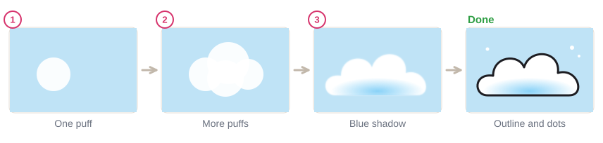
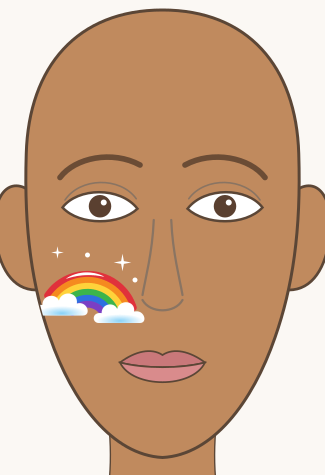
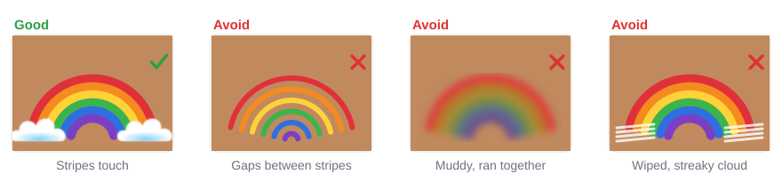

# 04.4 · Rainbows and clouds

Beginner · 45 minutes. A rainbow is six curved stripes and two clouds, and it is one of the most
cheerful designs you can paint in ten minutes. In this lesson you paint rainbow stripes that stay
clean and bright, sponge fluffy clouds that hide the messy ends, and put them together on your cheek.

## Materials

> [!WARNING]
> Use only face paint you have patch-tested ([lesson 01.3](../module-01/lesson-03.md)). Keep the
> rainbow on the cheekbone, below the eye. Rainbow "split cakes" sold for face painting are fine;
> never load a brush from craft paint or poster paint, even for a quick rainbow.

| Item | What it does here | Ideal | Cheaper or easier to find | The substitute must… |
|---|---|---|---|---|
| Round brush, size 3-4 | One stripe at a time | Synthetic face-painting round brush | Synthetic watercolor brush | Make an even, curved line |
| Flat brush (optional upgrade) | The one-stroke rainbow | 1.5-2.5 cm flat face-painting brush and a rainbow split cake | Skip it; use the stripe method | Have a straight, flat edge |
| Sponge | Clouds | Face-painting sponge | A makeup wedge, torn to a rough edge | Be soft and new |
| Face paint | Color | Red, orange, yellow, green, blue, purple, white, light blue, black | Red, yellow, blue and white, mixed ([lesson 03.1](../module-03/lesson-01.md)) | Be face paint, patch-tested |
| Water, palette, paper towel, wipes | Load, blot, fix | As in [lesson 02.1](../module-02/lesson-01.md) | Glasses, a white plate, a damp cloth | Clean water |
| Practice sheet | Stripe lines to follow | `design-2-rainbow-stars` from [labs/module-04](../../labs/module-04/) | `face-front` from [labs/common](../../labs/common/), or draw the outline freehand | Show the arcs |

No orange, green or purple? Mix them on the palette from red, yellow and blue. The full list is in
[Materials and substitutes](../../references/materials.md).

## How it works

The rainbow order is always **red, orange, yellow, green, blue, purple**, from the outside in. Each
color sits next to a color it is related to, so where two stripes touch they stay clean. Put purple
next to yellow and the edge turns brown ([lesson 03.1](../module-03/lesson-01.md)).

Stripes must **touch** but not **mix**. Let each stripe dry for a few seconds before painting the
next one right against it. Gaps of bare skin look messy; wet edges run together into mud.

A **cloud** is not painted, it is dabbed: press the sponge straight down and lift, in overlapping
round puffs, with a flatter bottom. Dabbing leaves a soft, fluffy edge; wiping leaves streaks. Clouds
go on **last**, over both ends of the rainbow, so you never have to paint neat stripe ends.

## Demonstration

The stripe method is the one to learn first. The one-stroke method needs a rainbow split cake and a
wide flat brush.

## Step by step

1. **Red arc.** Load the round brush with red and paint one smooth arc over the cheekbone, from near
   the nose side of the cheek out toward the ear. Pull it in one or two strokes.
2. **Orange, then yellow.** Rinse, load orange and paint an arc right inside the red, touching it.
   Then yellow inside the orange. Wait a few seconds between colors.
3. **Green, blue, purple.** Same way. The stripes get shorter as they get smaller; the ends don't need
   to be neat.
4. **Clouds.** Dab white with the sponge in three or four overlapping puffs over each end of the
   rainbow. Two thin layers cover better than one wet one.
5. **Shadow (optional).** Dab a little light blue along the bottom of each cloud.
6. **Details.** A thin white curve along the top of the red arc, a few white sparkles and dots above
   the rainbow. Optional upgrade: a thin black outline around the clouds.

## Practice exercise

On paper or the `design-2-rainbow-stars` sheet (20 minutes):

1. Three rainbows with the stripe method: one big, one small, one tilted.
2. Six clouds: three on light blue paper (or any colored paper) and three over the ends of your
   rainbows.
3. One rainbow on the back of your hand or your forearm, with clouds (5 minutes).

Stop when your stripes touch all along with no gaps and no muddy edges.

Hint

Gaps between stripes? Paint each new stripe so it just overlaps the edge of the dry one before it.
Muddy edges? You were too fast: wait until the previous stripe looks matte, not shiny.

## Mini-project

Paint a **rainbow cheek**: first on the template, then on your own cheek in a mirror. This is also
the start of [Project 1 · Rainbow cheek](../../projects/p01-rainbow-cheek.md).

You're done when:

- [ ] Six stripes in the order red, orange, yellow, green, blue, purple, from the outside in.
- [ ] The stripes touch with no gaps and no muddy edges.
- [ ] Each end is hidden under a fluffy, dabbed white cloud.
- [ ] The rainbow sits on the cheekbone, below the eye and away from the nose.
- [ ] You took a photo, then washed it off with warm water and soap.

## Common beginner mistakes

| What happens | Why | Fix |
|---|---|---|
| Bare skin shows between stripes | Stripes painted apart | Paint each stripe touching the edge of the last one |
| Stripes run together into brown | Painting next to a wet stripe, or wrong order | Wait a few seconds per stripe; keep the rainbow order |
| Cloud looks streaky and flat | Wiping the sponge across the skin | Press straight down and lift, puff by puff |
| White cloud is see-through | One thin, wet layer | Let it dry and dab a second thin layer |
| Rainbow ends look messy | Trying to paint neat ends | Let clouds cover both ends |

## Optional challenge

Paint the **one-stroke rainbow** with a wide flat brush and a rainbow split cake: rub the flat brush
back and forth on the cake in one direction so each color sits on its own part of the brush, then
paint the whole rainbow in one curved stroke. Turn your wrist, not your arm, so the brush stays flat.
