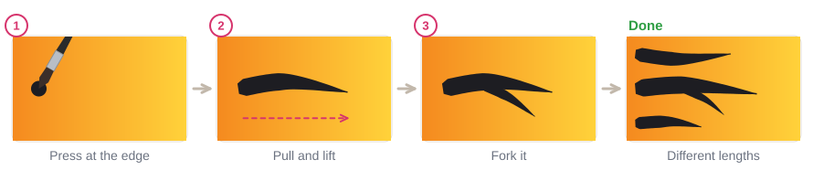
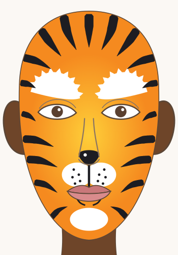
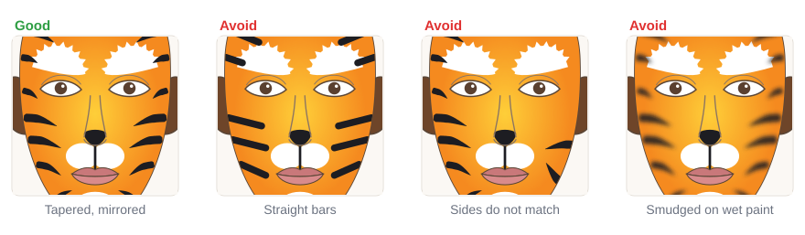

# 04.5 · Simple animals: cat and tiger

Beginner+ · 60 minutes. Animal faces are made of three parts: a muzzle and nose in the middle, a
color base, and markings like whiskers or stripes. In this lesson you paint a five-minute cat on your
own face, then a full tiger, the most requested animal at any face-painting stand.

## Materials

> [!WARNING]
> Use only face paint you have patch-tested ([lesson 01.3](../module-01/lesson-03.md)). The tiger
> base covers most of the face: sponge around the eyes, not on the eyelids or the lash line, and
> keep paint out of the nostrils and off the inside of the lips. Never paint over broken or
> irritated skin.

| Item | What it does here | Ideal | Cheaper or easier to find | The substitute must… |
|---|---|---|---|---|
| Sponges, two or three | Orange and yellow base, white areas | Face-painting sponges | Makeup wedge sponges | Be soft and new; one per color |
| Round brush, size 3-4 | Stripes, nose | Synthetic face-painting round brush with a good point | Synthetic watercolor brush | Make a wide stroke that lifts to a sharp point |
| Thin round or liner | Whiskers, mouth line | Face-painting liner, size 0-1 | The tip of your size 2 round | Make a hair-thin line |
| Face paint | Color | Orange, yellow, white, black, a little pink | Red plus yellow for orange ([lesson 03.1](../module-03/lesson-01.md)) | Be face paint, patch-tested |
| Water, palette, paper towel, wipes | Load, blot, fix | As in [lesson 02.1](../module-02/lesson-01.md) | Glasses, a white plate, a damp cloth | Clean water |
| Practice sheet | Stripe and white-area outlines | `design-4-tiger` from [labs/module-04](../../labs/module-04/) | `face-front` from [labs/common](../../labs/common/), or draw the outline freehand | Show the center line |

The full list is in [Materials and substitutes](../../references/materials.md).

## How it works

Every animal face is built **from the middle out**. The **muzzle** (white puffs on the upper lip) and
the **nose** (black on the tip of the nose) make the face read as an animal at once, even with no
other paint. Then come the **base** and the **markings**.

**Whiskers and stripes are pressure strokes** ([lesson 02.1](../module-02/lesson-01.md)). A whisker
starts on the muzzle and flicks outward to a thin point. A tiger stripe does the opposite: it starts
**wide at the edge of the face**, where you press, and lifts to a point toward the middle. That taper
is what makes a stripe look like fur instead of a painted bar.

Stripes are **mirrored** ([lesson 03.4](../module-03/lesson-04.md)): paint one stripe on the left,
then the same one on the right, before moving to the next. They should not all be the same length.
Paint black only on a **dry** base, or it smudges ([lesson 03.3](../module-03/lesson-03.md)).

## Demonstration

The cat is complete after step 3. The last step just adds charm.

## Step by step

### Cat (5-10 minutes)

1. **Muzzle.** Dab two white puffs on the upper lip, one each side of the center, with a sponge
   corner or a round brush.
2. **Nose.** Paint the tip of the nose black in a soft rounded triangle. Pull a thin black line from
   the nose down the middle to the lip.
3. **Whiskers.** Three or four small black dots on each puff. Then three whiskers each side: touch on
   the puff, press a little, flick outward to a thin point.
4. **Extras.** A few short fur flicks above the brows, a white dot on the nose, a little pink on the
   cheeks.

### Tiger (25-30 minutes)

1. **Base.** Sponge orange over the face, around the eyes but not on them. Dab yellow over the middle:
   around the nose, between the eyes and on the cheeks. Let it dry.
2. **White.** Sponge white over each brow and flick the top edge up into fur with the brush. Dab a
   white muzzle on the upper lip and a white patch on the chin.
3. **Nose.** A black nose on the tip, a line to the lip, and short black lines at the mouth corners.
4. **Stripes.** Start at the top of the forehead: a center stripe, then one each side. Then temples,
   cheeks and jaw. Each stripe: press at the edge of the face, pull inward and lift to a point.
   Paint left, then the same stripe right.
5. **Details.** Whisker dots on the muzzle and a white shine dot on the nose.

## Practice exercise

On paper and the template (30 minutes):

1. On orange or yellow paper (or paper you sponged orange): 20 stripes, 10 pointing left and 10
   pointing right, then five forked stripes.
2. Whiskers: three rows of flicks on paper.
3. The full tiger on the `design-4-tiger` sheet in a sheet protector.

Then paint three stripes and a cat nose on your forearm (5 minutes). Stop when your stripes are wide
at one end and sharp at the other, every time.

Hint

Stripes too fat? Use less paint and lift sooner. Turn the paper (or tilt your head toward the
mirror) so you always pull toward the middle of the face.

## Mini-project

Paint a **cat face on your own face** in a mirror, then a **full tiger on the template**. If you
want to paint the tiger on a face, follow [Project 4 · Tiger face](../../projects/p04-tiger-face.md).

You're done when:

- [ ] The cat has a white muzzle, a black nose and line to the lip, and tapered whiskers.
- [ ] The tiger base is orange at the edges and yellow in the middle, with no paint on the eyelids.
- [ ] Every stripe starts wide at the edge of the face and ends in a sharp point.
- [ ] The stripes on the left and right mirror each other.
- [ ] You took a photo, then washed the cat off with warm water and soap.

## Common beginner mistakes

| What happens | Why | Fix |
|---|---|---|
| Stripes look like straight bars | Same pressure all along | Press at the edge, lift as you pull toward the middle |
| Stripes smudge and turn brown | Black painted on a wet base | Let the orange dry to the touch first |
| The face looks lopsided | One side's stripes painted first, from memory | Paint each stripe left, then right, before the next |
| Whiskers look blunt and heavy | Pressing all the way to the end | Flick: touch, press a little, lift off to a point |
| Orange base is streaky | Wiping the sponge | Dab, and use two thin layers |

## Optional challenge

Paint a **white tiger**: a white and light gray base, blue around the eyes on the brow bone, black
stripes and a pink nose. Or turn the cat into a **leopard**: add small open "C" shapes in black
around the cheeks and forehead, each filled with a dab of orange.
