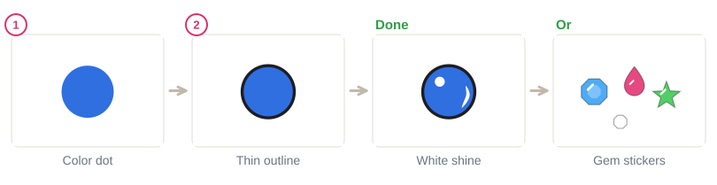
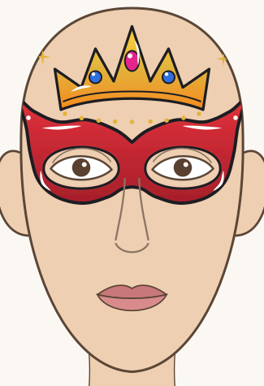
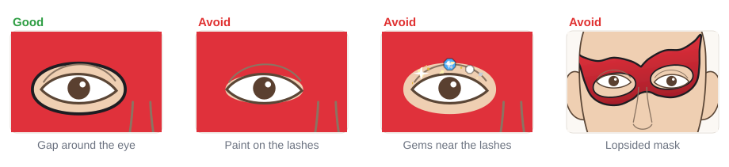

# 04.6 · Hero masks and fantasy crowns

Beginner+ · 60 minutes. A painted eye mask turns anyone into a superhero, and a crown on the
forehead turns them into royalty. In this lesson you paint both: a hero mask that frames the open
eyes safely, and a gold crown with painted jewels or gem stickers. Then you finish the module with one
of the five Module 4 projects.

## Materials

> [!CAUTION]
> A mask goes **around the eyes**. Use only face paint whose label allows use around the eyes, and
> believe a "not for use near the eyes" label even if the box photo shows otherwise (FDA). Leave a
> clear gap of bare skin between the paint and the lashes, and never paint the waterline. No neon,
> UV or glow paint near the eyes, and no glitter or gems near the lash line: flakes and stones can
> get into the eye and scratch it (American Academy of Ophthalmology). Don't share eye-area sponges
> or brushes between people without washing them.

| Item | What it does here | Ideal | Cheaper or easier to find | The substitute must… |
|---|---|---|---|---|
| Sponge | Filling the mask and crown | Face-painting sponge | A makeup wedge sponge | Be soft, new and used for one person |
| Round brush, size 2-4 | Mask edges, crown points, jewels | Synthetic face-painting round brush | Synthetic watercolor brush | Make a clean edge and a sharp point |
| Thin round or liner | Outlines, shine lines | Face-painting liner, size 0-1 | The tip of your size 2 round | Make a hair-thin line |
| Face paint | Color | **Eye-safe** red or blue for the mask; yellow, gold or orange for the crown; black and white | A face paint set labeled for use around the eyes | Be face paint, patch-tested, eye-safe for the mask |
| Face gems (optional) | Jewels on the crown | Self-adhesive face gems made for skin | Painted jewels (free) | Be sold for skin; flat back; forehead only |
| Water, palette, paper towel, wipes | Load, blot, fix | As in [lesson 02.1](../module-02/lesson-01.md) | Glasses, a white plate, a damp cloth | Gentle and fragrance-free |
| Practice sheet | Mask and crown outlines | `design-5-hero` from [labs/module-04](../../labs/module-04/) | `face-front-open-eyes` from [labs/common](../../labs/common/), or draw the outline freehand | Show open eyes |

Never use craft rhinestones with school glue or superglue on skin; self-adhesive gems made for skin
need no glue. The full list is in [Materials and substitutes](../../references/materials.md).

## How it works

A **hero mask** is one symmetrical shape ([lesson 03.4](../module-03/lesson-04.md)): it dips between
the brows, covers the brows and the area around the eyes, flares up to a point at each temple and
curves under the eyes onto the top of the cheeks. The eye holes are big ovals that leave **a clear
ring of bare skin around each eye**. That gap keeps paint out of the eye and also makes the mask
look neater.

A **crown** sits on the forehead above the brows: a gently curved band with five points, the middle
one highest. Gold comes from yellow sponged with a little orange at the bottom
([lesson 03.2](../module-03/lesson-02.md)). A thin black outline and white shine lines
([lesson 03.3](../module-03/lesson-03.md)) make it look like metal. **Jewels** are colored dots with
an outline and a white shine dot, or self-adhesive face gems, on the forehead only.

## Demonstration

The sketch in picture 1 is the most important step: the eye holes are planned big from the start.

## Step by step

### Hero mask

1. **Check the label.** Only eye-safe paint for the mask. Patch-tested, too.
2. **Plan.** With a thin, light line of the mask color, put a dot at each outer tip (level on both
   sides) and one between the brows. Sketch the outline and the big eye ovals.
3. **Fill.** Sponge the color inside the sketch, with the eyes closed for the part over the lids and
   looking up for the part under the eyes. Darken the bottom edge a little. Stay outside the ovals.
4. **Outline.** With black and the liner, trace the outer edge, then the eye holes, in short strokes.
   Keep the hole outline on the mask, not on the bare skin near the lashes.
5. **Shine and emblem.** A white shine line along the top of the mask, a small curve under each eye
   hole, and an emblem on the forehead: a star, a bolt or a heart ([lesson 04.2](lesson-02.md)).

### Crown

1. **Plan.** A light gold curve on the forehead above the brows; five dots for the tips.
2. **Fill.** Paint or sponge yellow up to the tips, then dab gold and a little orange along the band.
3. **Outline.** A thin black outline and a line along the band.
4. **Jewels.** Painted: a dot of color, a thin outline, a white shine dot. Or press on self-adhesive
   face gems with a clean finger, on the forehead only.
5. **Finish.** White shine lines, a row of gold dots under the band, a sparkle at each end.

## Practice exercise

On the `design-5-hero` sheet in a sheet protector, or `face-front-open-eyes` (25 minutes):

1. Paint the mask twice: once in red, once in blue. Check that both outer tips are level.
2. Paint the crown with painted jewels.
3. Wipe the sheet and paint a mask with a different shape: rounder, or with pointed "cat" tips.

Then paint a small crown on the back of your hand (5 minutes). Stop when your mask is the same height
on both sides and the eye holes leave a clear gap around the eyes.

Hint

Hold a ruler or a pencil across the face (on the sheet) or check in your phone's front camera: the
two outer tips and the tops of the eye holes should line up.

## Mini-project

**Module 4 practical:** paint one of the five Module 4 projects on your own face, in a mirror,
after painting it once on its printed template:

- [Project 1 · Rainbow cheek](../../projects/p01-rainbow-cheek.md) (Beginner)
- [Project 2 · Butterfly face](../../projects/p02-butterfly-face.md) (Beginner+)
- [Project 3 · Flower crown and vine](../../projects/p03-flower-crown.md) (Beginner+)
- [Project 4 · Tiger face](../../projects/p04-tiger-face.md) (Beginner+)
- [Project 5 · Starry hero mask](../../projects/p05-starry-hero.md) (Beginner+), which uses this lesson

You're done when:

- [ ] You painted the project on its template first, then on your face.
- [ ] Any paint near the eyes is eye-safe, with a clear gap from the lashes.
- [ ] The design is symmetrical where it should be (masks, butterflies, tigers, crowns).
- [ ] It has clean outlines and white highlights where the project shows them.
- [ ] You took a photo and removed it gently, wiping away from the eyes ([lesson 01.5](../module-01/lesson-05.md)).

## Common beginner mistakes

| What happens | Why | Fix |
|---|---|---|
| Paint creeps onto the lashes | Eye holes sketched too small | Sketch big ovals first and fill only outside them |
| Eyes sting or water | Paint, glitter or a gem too close to the eye | Remove it gently, rinse with water; keep a clear gap next time |
| Mask looks crooked | Tips not planned | Dot both tips at the same height before you fill |
| Crown looks flat yellow | One color, no outline | Add orange at the bottom, a thin black outline and white shine |
| Gems fall off or irritate | Craft gems, glue, or oily skin | Self-adhesive face gems on clean, dry skin; forehead only |

## Optional challenge

Design your **own hero emblem**: a symbol from your initial, a favorite animal or a shape, painted
on the forehead above the mask, outlined in black with a white shine. Or paint a fantasy tiara that
curls down the temples into swirls ([lesson 02.3](../module-02/lesson-03.md)).
