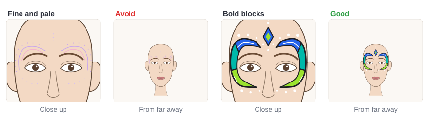

# 05.1 · Bold color for festivals

Beginner+ · 50 minutes. Festival faces are seen in sunshine, in crowds and from across a field, so
they need stronger color than a small cheek flower. In this lesson you build bold palettes, paint
clean color blocks, and use black and white linework to make the colors look brighter, almost
neon, with ordinary face paint. You finish with a bold color-block design that reads from a distance
on any skin tone.

## Materials

> [!WARNING]
> Use only patch-tested face paint ([lesson 01.3](../module-01/lesson-03.md)). This lesson gets a
> "neon look" from ordinary face paint on purpose: real fluorescent (UV, "neon") paints are **never
> allowed near the eyes** (US FDA), and you will learn where they may go in Module 6. The design here
> sits above the brows, on the temples and on the cheekbones. If any part comes close to the eyes,
> use only paint whose label allows eye-area use.

| Item | What it does here | Ideal | Cheaper or easier to find | It must… |
|---|---|---|---|---|
| Face paint | The bold colors | Strong, saturated cakes: magenta, orange, yellow, blue, teal, lime, purple, plus white and black | A kids' face paint palette with the brightest colors you can find | Be face paint |
| White face paint | A base under bright colors on deep skin | A creamy white cake | Any white face paint | Cover in one or two thin layers |
| Round brush | Black lines and dots | Synthetic round, size 2-4 | Synthetic watercolor brush | Spring back to a sharp point |
| Flat brush | Filling the color blocks | Synthetic flat, about 1 cm | A small concealer brush | Make a clean, straight edge |
| Palette cards | Planning palettes | `bold-palette-cards` from [labs/module-05](../../labs/module-05/) | Index cards or paper squares | Take paint without curling much |
| Practice face | The mini-project | `face-front` or `face-front-2up` from [labs/common](../../labs/common/) | An oval drawn on paper | Show the brows and eyes |
| Sheet protector | Painting the same template again and again | A clear plastic sheet protector | A clear plastic folder | Be smooth and wipe clean |

No printer? Draw three palette boxes on paper, and an oval face with brows and eyes, or draw the
outline freehand. The full list is in [Materials and substitutes](../../references/materials.md).

## How it works

**Saturated** colors are the pure, strong versions of a color: hot pink, not baby pink; bright
blue, not gray-blue. A festival palette is two or three saturated colors plus black and white. Use
the palette types from [lesson 03.5](../module-03/lesson-05.md): **neighbors** (sunset magenta,
orange and yellow) or **opposites** (purple with a yellow pop). A small amount of the opposite color
next to a big area of the main color is called a **complementary pop**: it makes both look stronger.

**Color blocking** means painting flat areas of solid color side by side, each with a clean edge,
instead of blending them. Blocks read from far away because the eye sees big, simple shapes first.
Then comes the secret of festival makeup: **black linework**. A thin black line between two colors
and around the outside keeps each color pure and makes it look brighter. White dots and a thin white
line on top add sparkle. Bright colors next to black and white look almost glowing, a **neon look**,
without any UV paint.

Two checks keep a bold design readable. First, **distance**: thin, pale lines vanish from a few
meters away; big shapes with strong contrast don't. Second, **skin tone**: on deep skin, bright and
light colors like yellow, orange and lime look thin. Paint a thin layer of **white underneath**
first and let it dry, then the color ([lesson 03.5](../module-03/lesson-05.md)). On light skin, pale
colors need a black outline to stand out. Saturated colors with black lines work on every skin tone.

## Demonstration

Each palette is only three colors plus black and white. Notice the black line between every two
colors.

![A color-block festival design on deep skin in five pictures. 1: a light sketch of a crescent from above the inner brow, round the temple, to the cheekbone, on both sides. 2: the crescents filled with white and left to dry. 3: three blocks of color on top: magenta at the forehead end, orange at the temple, yellow on the cheekbone. 4: black lines between the blocks and around the outside. Done: white dots along the outside, a white line in the top block, and a magenta and yellow diamond on the forehead center.](../../assets/m05-l01-blocking.svg)

White first, color second, black third, white details last. Each layer dries before the next.

Same paint, same shapes: the black and white details make the difference.

Squint at your design or look at it from across the room: what you can still see is what people at
a festival will see.

## Step by step

1. **Choose a palette**: two or three saturated colors (neighbors or opposites) plus black and
   white. Write it on a palette card.
2. **Sketch the shape lightly** with a thin line of a light color: here, a crescent from above the
   inner brow, round the temple, to the cheekbone.
3. **Deep skin or yellow, orange, lime?** Fill the shape with a thin layer of white first and let it
   dry until it is no longer shiny.
4. **Paint the color blocks** with the flat brush, one color per block, edges touching. Paint the
   lightest color first. Let them dry.
5. **Add black linework** with the round brush: a thin line between every two blocks, then the
   outline, a little thicker on the outer edge.
6. **Add white details last**: a few dots along the outside, one thin white line inside a block.
7. **Check from a distance**: step back two or three meters from the mirror, or take a photo and
   look at it small. Can you still see every block?

## Practice exercise

Make **three bold palette cards** (15 minutes) on the `bold-palette-cards` sheet or three paper
squares.

1. Card 1, neighbors: three saturated neighbors, e.g. magenta, orange and yellow.
2. Card 2, opposites: one main color and a small pop of its opposite, e.g. purple with yellow.
3. Card 3, neon look: the three brightest colors in your kit.
4. On each card, paint the swatches, then fill the test tile: three diagonal blocks, a black line
   between them, a few white dots.
5. Prop the cards up and look at them from three meters away.

Stop when each card has three clean blocks with black lines between them, and you can name every
color from three meters away.

Hint

Black line looks gray and smudgy? The color under it was still wet. Wait until the blocks are no
longer shiny, load the brush with creamy black (not watery) and pull the line in one stroke.

## Mini-project

Paint the **color-block crescents** from the demonstration on the `face-front` template, using
your favorite palette card. Then paint one crescent on your forearm, or both on your face in a
mirror, mirrored on each side ([lesson 03.4](../module-03/lesson-04.md)).

You're done when:

- [ ] The design uses only your three palette colors plus black and white.
- [ ] Every block has a clean edge and a thin black line between it and the next block.
- [ ] Light or bright colors on deep skin went over a dry white base and look solid, not thin.
- [ ] White dots and one white line are added last, on dry paint.
- [ ] From two or three meters away (or in a small photo) you can still see every block.

## Common beginner mistakes

| What happens | Why | Fix |
|---|---|---|
| Design looks messy from far away | Too many colors or too many small details | Two or three colors plus black and white; fewer, bigger shapes |
| Colors melt into each other at the edges | Blocks painted wet against wet | Let one block dry before painting the next, or separate them with a black line |
| Yellow, orange or lime look thin on deep skin | Light colors are see-through over dark skin | A thin layer of white underneath first, dry, then the color |
| Black lines look gray and blurry | Black painted over wet color, or too watery | Wait until the color is dry; use creamy black |
| Design looks dull despite bright paint | No contrast next to the colors | Add black linework and a few white dots and lines |

## Optional challenge

Paint the same crescent twice on the `face-front-2up` sheet: once in a neighbors palette and once
with only one color plus a tiny complementary pop (for example all purple blocks and one yellow
block). Which one draws the eye from farther away?
