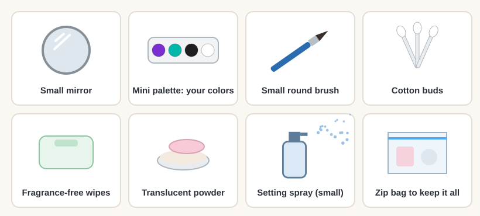

# 05.2 · Paint plus makeup: skin prep and setting

Beginner+ · 55 minutes. A festival look has to survive a long, hot day: sun, sweat, hugs and
dancing. Most of that comes down to what happens before and after you paint. In this lesson you
learn to prepare the skin, add regular makeup in the right order, set the design so it lasts, test
it with a rub test, pack a touch-up kit and take everything off gently at night.

## Materials

> [!WARNING]
> Every product here must be made for skin, and patch-tested if it is new to you
> ([lesson 01.3](../module-01/lesson-03.md)). Eye makeup (liner, mascara) must be your own and
> labeled for the eyes: never share it. Close your eyes and mouth and hold your breath when you
> spray or powder your face. Never paint over sunburned, broken or irritated skin.

| Item | What it does here | Ideal | Cheaper or easier to find | It must… |
|---|---|---|---|---|
| Gentle cleanser | Removes oil and old makeup before painting | A mild face wash | Mild soap and water | Rinse off fully, no scrub grains |
| Light moisturizer | Keeps skin comfortable under paint | A light, oil-free lotion or gel | Plain fragrance-free lotion, a thin layer | Soak in within a few minutes |
| Primer (optional) | A smooth base that helps paint last | A makeup primer, or a pre-makeup spray made for paint | Skip it: clean, moisturized-then-dry skin works | Be a skin product, used thin |
| Face paint | The design | Your 05.1 palette | Kids' face paint | Be face paint |
| Eye makeup and lipstick | Finishing the look | Eye-safe liner, mascara, lipstick you already use | Skip them: the paint alone is a full look | Be your own, labeled for that area, in date |
| Setting spray | Locks the design so it rubs off less | A setting spray made for face paint or makeup | Translucent powder (below) | Be sold for the face |
| Translucent powder and puff | Sets paint and soaks up shine | Loose translucent setting powder | Any colorless face powder | Be a cosmetic powder, not talc for the body |
| Tissues | The rub test | Plain white tissues | Toilet paper or a paper towel | Be white, so color shows |
| Test log | Recording the rub tests | `prep-and-set-test` from [labs/module-05](../../labs/module-05/) | A notebook page | Have room for six patches |
| Remover | Taking it all off at night | Mild soap and water, micellar water, an eye-safe remover | Fragrance-free baby wipes, a gentle oil cleanser | Be gentle; never alcohol or acetone |

The full list is in [Materials and substitutes](../../references/materials.md).

## How it works

Water-based face paint needs **clean, moisturized-then-dry skin**. Oil and water don't mix: on oily
skin, or over a heavy cream that hasn't soaked in, the paint slides, goes on patchy or pulls into
little **beads** with bare skin between them. So wash, put on a thin layer of light moisturizer (and
sunscreen if you are going outside), and wait until the skin feels dry, not shiny or slippery. A
primer is an optional extra, never a must.

Then the **order**: skincare first, then **face paint**, then **regular makeup** for the eyes and
lips, then **setting**. Paint goes on bare, prepped skin, because cream foundation, cream highlighter
or balm under water-based paint makes it bead. Liner and mascara go on after the paint, so you don't
smudge them while you paint. **What mixes:** powder products (powder eyeshadow, blush, setting powder)
dusted lightly over dry paint; eye-safe liner and mascara next to the design. **What doesn't:**
oily creams and balms under water-based paint, and rubbing anything over wet paint.

**Setting** makes the design last. A **setting spray** misted over the finished face forms a thin,
flexible layer that helps the paint resist rubbing and sweat (some, like Mehron's Barrier Spray, can
also be misted on clean, dry skin before you paint). **Translucent powder**, pressed on with a puff,
soaks up shine and sweat. Water-based paint still softens with heavy sweat or water, so test it:
the **rub test** shows you on your arm, before the festival, whether your prep and setting work.

## Demonstration

Skincare, paint, makeup, set: always in that order.

If paint beads up, don't keep painting over it: wipe it off, let the skin dry, and start again.

Test the exact paint, prep and setting product you plan to wear, on your own skin.

Everything fits in a zip bag. Keep it in the shade: FDA advises not storing cosmetics above 85 °F
(about 29 °C).

## Step by step

1. **Clean** the face with a mild cleanser, rinse and pat dry.
2. **Moisturize lightly** with a thin layer of light moisturizer (and sunscreen, if you're going
   outside). Wait 5-10 minutes, until the skin feels dry and not slippery.
3. **Optional: primer or pre-paint spray**, thin, and let it dry.
4. **Paint the design** with face paint ([lesson 05.1](lesson-01.md)). Let it dry fully.
5. **Add regular makeup** for the eyes and lips: eye-safe liner, mascara, lipstick. Your own, never
   shared.
6. **Set it.** Close your eyes and mouth and hold your breath. Mist setting spray from about an
   arm's length, as the label says, or press translucent powder on with a puff. Let it dry.
7. **During the day:** blot sweat by pressing a tissue, don't wipe. Fix chips with your touch-up kit.
8. **At night, take it all off** before you sleep: soap and water or micellar water for the paint,
   an eye-safe remover for the eyes ([lesson 01.5](../module-01/lesson-05.md)).

## Practice exercise

The **rub test** (40 minutes, most of it waiting), on the `prep-and-set-test` sheet.

1. Mark up to six small patches on the inside of your forearms, A to F.
2. Prep each one as the sheet says: nothing; clean and moisturized-then-dry; the same plus powder;
   the same plus setting spray; cream that is still wet.
3. Paint the same small stripe on each patch with the same paint. Let them dry, then set the ones
   that need it, and wait 10 minutes.
4. Press a clean tissue on each patch, then rub it gently five times with a fingertip.
5. Write down what you see: how much color is on the tissue, and are the edges sharp or smudged?

Stop when you know which prep and which setting work best for your paint and your skin.

Hint

All the patches came off easily? Check the paint was fully dry before you set it, and that the
moisturizer had really soaked in. Some cheap kids' paints never get very rub-proof; powder helps
them most.

## Mini-project

Do a **full prep-paint-makeup-set run** on yourself: prep your face, paint a small version of your
05.1 design on one temple and cheekbone (or on your forearm if you prefer), add your usual eye-safe
liner or mascara if you wear them, and set it. Wear it for two hours, then do the rub test on the
edge of the design. Pack your touch-up kit while you wait. At the end, remove everything gently.

You're done when:

- [ ] The paint went on smooth, with no beading or sliding.
- [ ] You followed the order: skincare, paint, makeup, set.
- [ ] After two hours and the rub test, the design is still clear with sharp edges.
- [ ] Your touch-up kit is packed in a zip bag.
- [ ] Everything came off with gentle products and your skin feels calm.

## Common beginner mistakes

| What happens | Why | Fix |
|---|---|---|
| Paint pulls into little beads | Oily skin, or cream that hadn't soaked in | Clean the skin, use a light moisturizer, wait until dry |
| Paint slides or smears under the design | Cream foundation or balm under water-based paint | Paint on bare, prepped skin; add makeup after |
| Mascara or liner smudged while painting | Eye makeup put on first | Paint first, eye makeup after |
| Color comes off on clothes and hugs | Design not set | Setting spray or translucent powder, then the rub test |
| Sweat runs through the paint | Wiping sweat instead of blotting; no setting | Press a tissue to blot; set the design; touch up from your kit |

## Optional challenge

Add a seventh patch to your test: setting spray misted **before** painting as well as after (if
your spray's label says it can be used that way). Does the double layer change the rub test
result? Write down which combination you will use for a real festival day.
