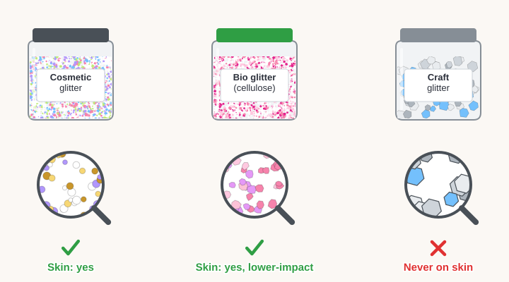
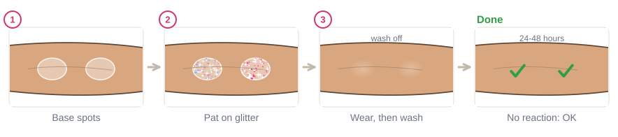

# 06.1 · Cosmetic glitter, craft glitter and bio glitter

Beginner+ · 30 minutes. Glitter is the fastest way to make a design look like a festival, but not
every glitter belongs on skin. In this lesson you learn to tell cosmetic, plant-based and craft
glitter apart by reading the label, what the EU rules on plastic glitter really say, and you choose
and patch-test one safe glitter for the rest of the module.

## Materials

> [!WARNING]
> **Craft glitter never goes on skin**, however fine or cheap it looks. It is not made or checked as
> a cosmetic, so nobody has confirmed that its colors and materials are allowed on skin (in the US,
> every color in a cosmetic must be approved for that use, FDA). Glitter flakes that fall into the
> eye get into the tear film and irritate it, and bigger flakes can scratch the eye like sand,
> especially for people who wear contact lenses (American Academy of Ophthalmology). Keep every
> glitter off the eyelids and lash line in this course, and keep loose glitter jars away from small
> children.

| Item | What it does here | Ideal | Cheaper or easier to find | The substitute must… |
|---|---|---|---|---|
| Glitter you own or want to buy | Things to sort | Any glitters in the house, plus the one you plan to buy | Even one jar, or a shop's product page | Have a label or a seller page you can read |
| Cosmetic glitter | The glitter you will use in Module 6 | Cosmetic glitter, plant-cellulose ("bio") glitter sold as a cosmetic, or a ready-made cosmetic glitter gel | A small jar of cosmetic glitter from a pharmacy or beauty shop | Say "cosmetic" or "face and body", with an ingredient list |
| Glitter base | Makes glitter stick (and goes into the patch test) | Cosmetic glitter gel or glitter glue | Plain, fragrance-free aloe vera gel | Be a skin product that washes off with soap and water |
| Label check sheet | Your record | `glitter-label-check` from [labs/module-06](../../labs/module-06/) | Paper with seven columns, as on the sheet | Have one row per product |
| Phone camera | Read tiny print, look up ingredients | Phone zoom and a browser | A magnifying glass and a library computer | Make small text readable |
| Cotton bud, soap, water | Patch test | As in [lesson 01.3](../module-01/lesson-03.md) | A clean fingertip | Clean, used once |

Full details: [Materials and substitutes](../../references/materials.md).

## How it works

There are three kinds of glitter in shops:

- **Cosmetic glitter** is sold for face and body. It has an ingredient list, and its colors are ones
  allowed on skin. Most of it is still plastic: a thin plastic film with a shiny coating, cut into
  tiny flakes. A plastic glitter often lists **polyethylene terephthalate** (PET) or another plastic
  first in its ingredients.
- **Plant-cellulose glitter**, often called **bio glitter**, is made from a film of plant cellulose
  (for example from eucalyptus) instead of plastic. When it is **sold as a cosmetic**, it is fine for
  skin. Call it **lower-impact**, not "eco-safe": it can carry coatings, and early research found that
  cellulose and mica glitter can still harm tiny water plants (National Geographic, 2024).
- **Craft glitter** is sold for cards, slime and decorations. There is no ingredient list and no
  promise that anything in it is allowed on skin. The flakes are often bigger and harder, with sharp
  edges. It stays in the craft box.

### The EU rules on plastic glitter

The EU restricts microplastics added on purpose to products (Regulation (EU) 2023/2055):

- **Since 17 October 2023**, loose plastic glitter for crafts, toys and similar uses may no longer be
  sold in the EU. Shops did not have to remove stock that was already on sale that day.
- **Cosmetics with plastic glitter get more time.** Which date applies depends on the product type:
  rinse-off products can be sold until **16 October 2027**, leave-on products until **16 October
  2029**, and make-up, lip and nail products until **16 October 2035**. From **17 October 2031**
  those make-up, lip and nail products must be labeled as containing microplastics.
- **Not covered:** glitter that is biodegradable, water-soluble, natural, or inorganic, such as
  glass, metal or mica.

So in the EU you can still buy plastic cosmetic glitter for now, and a "plastic-free" jar is more
likely to be cellulose or mica. The ban is about the environment; it does not make craft glitter any
safer for skin. Rules in the UK and elsewhere may differ, so check your own country's.

## Demonstration

The magnifier shows the difference you can't always see in the jar: craft flakes are bigger, harder
and sharp-edged.

The four checks, in order. This label passes all four, and its warning tells you where it may go.

The craft ban came first; cosmetics have later dates that depend on the type of product.

Test the glitter and the base together, because the base touches your skin the most.

## Step by step

1. **Read the front.** "Cosmetic glitter", "face and body", "makeup": go on. "Craft", "for
   decoration", "for slime", or nothing: **not for skin**. Stop here.
2. **Find the ingredient list.** On the pack, the lid, or the seller's page. No list: not for skin.
3. **Read the first ingredients.** Cellulose: plant-based. Polyethylene terephthalate, polyester or
   another plastic: plastic glitter. Mica: a mineral. Write it in the "Flakes" column.
4. **Read every warning.** "Avoid the eye area", "not for use near the eyes", "keep away from
   children". Write them down. Beginners keep all glitter off the eyelids and lash line anyway.
5. **Look up anything you don't know.** Type a strange ingredient or a CI number into CosIng (link in
   the sources), as in [lesson 01.2](../module-01/lesson-02.md).
6. **Patch-test your choice.** A coin-sized spot of the base on your inner forearm, glitter patted on
   top, worn as long as a design, washed off, then watched for 24-48 hours
   ([lesson 01.3](../module-01/lesson-03.md)).

## Practice exercise

Sort your glitters (15 minutes).

1. Collect every glitter in the house: craft jars, glitter glue, nail glitter, makeup with sparkle,
   glitter gel.
2. Fill one row of the `glitter-label-check` sheet for each (steps 1-4).
3. Make two piles: **Skin** (passed checks 1-2) and **Not for skin** (everything else, and anything
   you are unsure about).

Stop when every glitter has a row and a pile. Nail glitter goes in "Not for skin" unless its label says
it is for skin; a color allowed on nails may not be allowed on skin (FDA).

Hint

No glitter at home? Do the exercise with three product pages from an online shop: one cosmetic
glitter, one bio glitter, one craft glitter. The craft listing usually has no ingredient list at all.

## Mini-project

Set up **your glitter kit** for Module 6: one cosmetic glitter (bio glitter if you can find it), one
glitter base, and a small bag or box to keep them in, away from small children. Move all craft
glitter to the craft drawer. Patch-test the glitter and base together today, so you are ready for
[lesson 06.2](../module-06/lesson-02.md) in two days.

You're done when:

- [ ] Every glitter you own has a row on the label check sheet.
- [ ] Your kit holds only glitter sold for skin, with an ingredient list.
- [ ] You know whether your glitter is plastic, plant-based or mineral.
- [ ] Your patch test is on your arm, with the date written down.

## Common beginner mistakes

| What happens | Why | Fix |
|---|---|---|
| Using craft glitter because it looks the same | The flakes look fine and it is cheap | No ingredient list, no skin; buy a small jar of cosmetic glitter |
| Calling bio glitter "harmless to nature" | The pack says "eco" | Say "lower-impact"; it still needs careful clean-up |
| Thinking the EU ban made all plastic glitter illegal | Headlines said "glitter ban" | Craft glitter came first; cosmetics have later dates by product type |
| Skipping the patch test for the base | Aloe or gel "is gentle" | Test the base and glitter together; the base touches the most skin |

## Optional challenge

Find out what your country says about plastic glitter. If you live in the EU, find one glitter whose
label already says it is plastic-free, and check what it is made of instead: cellulose, mica, glass or
something else.
