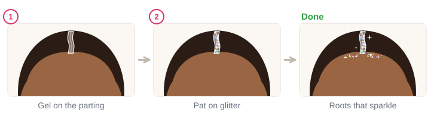

# 06.2 · Applying glitter that stays put

Intermediate · 45 minutes. Glitter that falls all over the face looks messy and ends up in the eyes.
In this lesson you learn the two secrets of glitter that stays put, a thin base and patting instead of
rubbing, where glitter looks best on a face, and how to take it all off again cleanly.

## Materials

> [!CAUTION]
> Glitter stays **off the eyelids, the lash line and the skin just under the eyes**. Flakes that fall
> into the eye irritate it and can scratch it, and glitter eye makeup is a common cause of eye
> irritation or infection, especially for contact lens wearers (American Academy of Ophthalmology).
> Close your eyes while you tap off loose glitter and while you remove it. If a flake gets into an
> eye, don't rub: blink and rinse with clean water, and get medical help if it still hurts, waters a
> lot or vision changes. Use only glitter and bases you patch-tested in [lesson 06.1](lesson-01.md).

| Item | What it does here | Ideal | Cheaper or easier to find | The substitute must… |
|---|---|---|---|---|
| Cosmetic glitter | The sparkle | Cosmetic or bio glitter from your kit ([lesson 06.1](../module-06/lesson-01.md)) | A ready-made cosmetic glitter gel (base and glitter in one) | Be sold for skin, patch-tested |
| Glitter base | Holds the glitter | Cosmetic glitter gel or glitter glue | Plain, fragrance-free aloe vera gel; on the body, a very thin layer of petroleum jelly | Be a skin product that washes off; never school glue or craft glue |
| Small flat or synthetic brush | Spreads base, presses glitter | A small flat synthetic brush | A clean fingertip | Be clean and used only for cosmetics |
| Fluffy brush | Taps off loose flakes | A clean, soft powder brush | A clean, dry makeup sponge | Be soft and clean |
| Sticky tape | Lifts glitter off | Wide, gentle tape (masking or paper tape) | Any clear tape, sticky side touched to your clothes once to soften it | Never strong packing tape on the face |
| Oil cleanser, cotton pads | Removal | A gentle oil-based cleanser | A little plain vegetable or baby oil on a cotton pad | Be gentle and fragrance-free |
| Practice sheet | Plan where glitter goes | `glitter-map` from [labs/module-06](../../labs/module-06/) | `face-map` from [labs/common](../../labs/common/), or draw the outline freehand | Show the eyes clearly |

Full details: [Materials and substitutes](../../references/materials.md).

## How it works

Glitter is light and slippery. On bare skin it slides off; with a base it sticks. A **base** is a thin,
slightly sticky layer: cosmetic glitter gel, aloe vera gel, or, on the body, a very thin layer of
petroleum jelly. Glitter also sticks to face paint while the paint is still slightly damp (Mehron's
glitter directions say the same), so you can glitter the edge of a painted design.

**Pat, don't rub.** Press the glitter into the base with a fingertip or a flat brush and lift straight
up. Rubbing smears the base thin and drags flakes across the face. Paint the base exactly where you
want glitter: the base is the shape, the glitter just follows it.

**Where it looks best:** on the high points that catch light. Along the top of the **cheekbones** up to
the **temples** (like a highlighter), along the **hairline** and the parting of the hair ("glitter
roots"), a small spot in the **center of the forehead**, and on the **collarbones** and shoulders.
These are all well away from the eyes.

**Taking it off:** glitter comes off in two rounds. First lift most flakes with sticky tape. Then
press an oil cleanser on a cotton pad over the rest, wait a few seconds, and wipe outward, away from
the eyes. Finish with warm water and mild soap ([lesson 01.5](../module-01/lesson-05.md)). Take it off
before you sleep.

## Demonstration

Notice that the cheekbone crescent curves around the outside of the eye area and never enters it.

The base in step 1 already has the final shape. Everything after that is pressing.

## Step by step

### Cheekbone glitter

1. **Clean and dry the skin.** No moisturizer right where the glitter goes.
2. **Paint the base.** With a small flat brush or a fingertip, paint a thin crescent of base from the
   temple down along the top of the cheekbone. Stay outside the eye area: the crescent curves around
   it, not into it.
3. **Pat on the glitter.** Pick up a little glitter on a fingertip or a flat brush and press it onto
   the base. Lift straight up. Repeat until the base is covered.
4. **Tap off the loose flakes.** Close your eyes. Tap the side of a clean fluffy brush over the
   glitter, brushing outward toward the ear.
5. **Add accents.** Press a few bigger flakes, or a second color, along the outer edge.
6. **Check.** Eyes open, look in the mirror: any flakes on the cheek or lid? Lift them with the
   sticky side of a piece of tape.

### Glitter roots

1. **Part the hair** where you want the line.
2. **Gel along the parting.** A thin line of glitter gel on the roots, not spread onto the forehead.
3. **Pat glitter on**, then let it dry before you touch your hair.

### Removal and clean-up

1. **Eyes closed.** Press sticky tape onto the glitter and lift. Repeat with fresh tape.
2. **Oil on a pad.** Press it on the rest of the glitter for a few seconds.
3. **Wipe outward**, away from the eye, toward the ear.
4. **Wash** with warm water and mild soap, then dry.
5. **Clean up the table** with tape or a damp cloth and put it in the bin. Less glitter down the sink
   means less in the water, even for bio glitter.

## Practice exercise

First on paper, then on your arm (25 minutes).

1. On the `glitter-map` sheet, color in the zones you plan to use with a pencil. Check that nothing
   touches the red hatched zones.
2. On your inner forearm, paint three small shapes with base: a crescent, a line, a dot. Pat glitter on
   one, **rub** it on the second, and put glitter on bare skin for the third (no base).
3. Wave your arm and pat it with your hand. Compare which shape stays crisp.
4. Take it all off: tape first, then oil, then soap and water.

Stop when your patted crescent keeps a sharp edge and the tape-and-oil removal leaves no flakes.

Hint

Too much base makes a lumpy, wet look and glitter slides in it. You want a layer so thin that it only
looks shiny, not thick.

## Mini-project

Glitter one cheekbone and temple on your own face, in a mirror, with the five cheekbone steps. Wear it
for an hour, then remove it with the removal steps.

You're done when:

- [ ] The glitter is a clean crescent from the temple along the cheekbone, with a crisp edge.
- [ ] Nothing is on the eyelid, the lash line or under the eye.
- [ ] After an hour, there is still glitter in the crescent and very little on the rest of the face.
- [ ] You removed it with tape and oil, wiping away from the eye, and cleaned the table.

## Common beginner mistakes

| What happens | Why | Fix |
|---|---|---|
| Glitter falls off within minutes | No base, or the base dried before the glitter went on | Paint a small area of base at a time and glitter it straight away |
| Glitter spreads all over the cheek | Rubbing instead of patting | Press and lift; tap off loose flakes with a clean fluffy brush |
| Glitter looks lumpy and wet | Too much base | Use a layer so thin it only looks shiny |
| Flakes end up near the eye | Base painted too close, or tapping off with eyes open | Keep the crescent outside the eye area; close your eyes when tapping |
| Glitter left after washing | Water only | Tape first, then an oil cleanser, then soap and water |

## Optional challenge

Make a **glitter fade**: dense glitter at the temple that thins out along the cheekbone. Pat glitter
thickly at the top, then only lightly lower down, so the base shows more and more.
