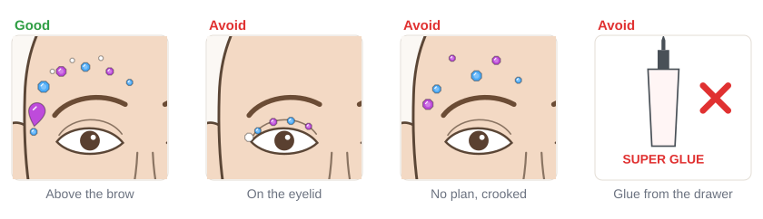

# 06.3 · Face gems and skin-safe adhesives

Intermediate · 45 minutes. A line of small gems above the brow turns a simple look into a festival
look in five minutes. In this lesson you learn which gems need no glue, which glues are made for
skin and which never are, how to plan a gem line that sits outside the eye area, and how to take gems
off without pulling the skin.

## Materials

> [!CAUTION]
> **Never use superglue, nail glue, craft glue or school glue on skin.** If superglue ever gets on
> skin, don't pull the skin apart: soak it in warm water, and use a little oil or petroleum jelly on
> tender skin; if it gets in an eye and the lids are not stuck, rinse with lukewarm water; if the lids
> are stuck, put a warm compress on, use no alcohol or acetone, and call a poison center (Ontario
> Poison Centre). Keep gems **off the eyelids and lash line**: a gem that falls off near the eye can
> get into it. **Spirit gum and its remover are flammable** and not for use near the eyes. Some lash
> glues contain **latex**: ask about latex allergy and buy latex-free. Patch-test every adhesive
> ([lesson 01.3](../module-01/lesson-03.md)). Gems are small enough to swallow: keep them away from
> small children.

| Item | What it does here | Ideal | Cheaper or easier to find | The substitute must… |
|---|---|---|---|---|
| Face gems | The sparkle | Self-adhesive face gems on a sticker sheet, in a few sizes | Loose flat-backed acrylic rhinestones plus latex-free lash glue | Be sold for skin, flat-backed, smooth-edged, small and light |
| Small-gem glue | Holds loose gems | Latex-free eyelash glue | Any latex-free lash glue from a pharmacy | Be sold for skin, latex-free, patch-tested |
| Big-piece adhesive (optional) | Holds bigger or heavier pieces on the face or body | Spirit gum with its own remover, or a prosthetic adhesive such as Pros-Aide | Skip it: use smaller, self-adhesive gems | Be sold for skin, patch-tested, never near the eyes |
| Tweezers or an orange stick | Pick up and place gems | Clean, blunt-tipped tweezers | A clean fingertip | Have no sharp point |
| Eye-safe pencil or face paint | Dot the plan | A white or light brown eye-safe cosmetic pencil | A thin line of light face paint | Be a cosmetic, never a pen |
| Oil cleanser, cotton pads | Removal | Gentle oil-based cleanser | A little plain vegetable or baby oil | Be gentle and fragrance-free |
| Practice sheet | Plan the lines | `gem-map` from [labs/module-06](../../labs/module-06/), in a sheet protector | `face-front-open-eyes` from [labs/common](../../labs/common/), or draw the outline freehand | Show the eyes clearly |

Full details: [Materials and substitutes](../../references/materials.md).

## How it works

### Which glue for which gem

- **Self-adhesive face gems** already have skin-safe glue on the back. Peel, press, done. This is the
  easiest and best choice for beginners.
- **Loose small gems** need a tiny dot of **latex-free eyelash glue** on the back of the gem.
- **Bigger or heavier pieces** (large jewels, chains, face lace) need **spirit gum** or a
  **prosthetic adhesive** such as Pros-Aide. These are for the forehead, temples, cheeks and body,
  never near the eyes. Spirit gum can irritate skin, is flammable until dry, and needs its own remover,
  which is also flammable and not for use near the eyes.
- **Superglue, nail glue, craft glue and school glue** are never used on skin. They are not made for
  skin and some bond skin strongly.

### Where gems go

Gems look best on lines that follow the bones of the face:

1. **Above the brows**, along the **brow bone** (the bony ridge under the brow hair), curving out to
   the **temple**.
2. In the **center of the forehead**, as one jewel or a small cluster.
3. Along the **top of the cheekbone**, below the eye area.

A gem line looks finished when it is **graded**: the biggest gem at the center or outer end, then
smaller and smaller gems toward the edges. Plan the line with dots first, just as you plan a layout in
[lesson 05.3](../module-05/lesson-03.md).

## Demonstration

The guide lines stay outside the hatched eye zones everywhere.

## Step by step

1. **Check your glue and gems.** Self-adhesive gems sold for skin, or latex-free lash glue that you
   patch-tested.
2. **Clean, dry skin.** Gems don't hold on oily skin or over thick cream. Wipe the area with water and
   let it dry.
3. **Dot the line.** With an eye-safe pencil or a little light face paint, put small dots above the
   brow along the brow bone and out to the temple. Check both sides in the mirror or on your phone
   camera before you continue.
4. **Biggest gem first.** Place it at the outer end (the temple) or the center. Press with a clean
   fingertip for about 10 seconds.
5. **Grade the line.** Add gems along the dots, each one a little smaller toward the inner brow.
6. **Fillers.** Tiny clear gems between the colored ones, never below the brow onto the lid.
7. **Loose gems:** a tiny dot of glue on the gem's back, not on the face. Wait until it turns tacky,
   then press and hold.
8. **Removal:** hold the skin next to the gem, put a little oil on the edge, wait, then lift the gem
   from the edge. Never pull hard; if it holds, add more oil and wait. Wash the area afterwards.

## Practice exercise

Template first, then your hand (25 minutes).

1. Slide the `gem-map` sheet into a sheet protector. Stick self-adhesive gems on the plastic along
   guide line 1 on both sides, biggest first. Check that both arches match.
2. Peel them off and try line 2 (forehead) and line 3 (cheekbone).
3. On the back of your hand, place a graded line of five gems: one with lash glue, the rest
   self-adhesive. Wait 10 minutes, wash your hands carefully, and see which ones held.
4. Remove the gems with oil, lifting from the edge.

Stop when your template arches match left and right and the gems on your hand came off without
pulling.

Hint

Gems that won't stick are often on skin that still has cream or face paint dust on it. Wipe with a
little water, dry, and try again. On the sheet protector, gems hold well enough to practise.

## Mini-project

Place a graded gem line above one brow on your own face, from the inner brow out to the temple, with a
big gem at the temple. Then do the other side to match.

You're done when:

- [ ] The gems follow the brow bone above the brow and end at the temple.
- [ ] They get smaller toward the inner brow, and both sides match.
- [ ] No gem is on the eyelid, the lash line or under the eye.
- [ ] You used only self-adhesive gems or patch-tested, latex-free lash glue.
- [ ] You removed them with oil, from the edge, without pulling.

## Common beginner mistakes

| What happens | Why | Fix |
|---|---|---|
| Gems fall off quickly | Oily skin, cream, or too much glue | Clean, dry skin; a tiny dot of glue, tacky before pressing |
| A gem slips onto the eyelid | Line placed too low | Plan the dots above the brow; nothing below the brow line |
| The line looks crooked | Gems placed one by one without a plan | Dot the whole line first and check both sides |
| Skin is red where the gem was | Pulled off, or glue not patch-tested | Soften with oil and lift from the edge; patch-test every glue |
| Reaching for superglue "just for one gem" | It holds well | Never on skin; self-adhesive gems or lash glue only |

## Optional challenge

Make a **gem cluster** in the center of the forehead: one drop gem pointing down, three small round
gems around its top, and tiny clear gems in a fan above them. Keep it symmetrical on the center line.
