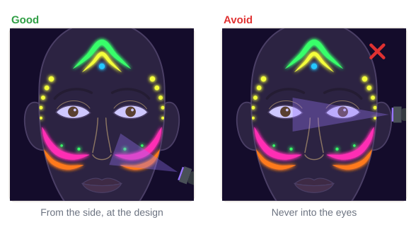

# 06.4 · Neon and UV: what's allowed where

Intermediate · 55 minutes. Neon paint glows like magic under a black light, which is why it is
everywhere at night festivals. It also has the strictest rules of any face paint. In this lesson you
learn to read neon labels, keep neon out of the eye area, and paint a neon design that glows on the
cheeks, forehead and temples while the eye area stays safe.

## Materials

> [!CAUTION]
> **No fluorescent (neon), UV or glow-in-the-dark paint anywhere in the eye area**: the brows, the
> eyelids and the skin under the eyes. In the US, a few fluorescent colors are approved for cosmetics,
> but **none of them may be used near the eyes** (FDA). Believe a "not for use near the eyes" label
> even if the photo shows neon eyes. **Glow-in-the-dark** face paint is only for occasional use, such
> as Halloween, and never near the eyes. Craft or "Special FX" UV paint that is not sold as a cosmetic
> never goes on skin. **Never shine a UV torch into anyone's eyes**, including your own in a mirror.

| Item | What it does here | Ideal | Cheaper or easier to find | The substitute must… |
|---|---|---|---|---|
| Neon / UV face paint | The glowing design | UV-reactive face and body paint (a cosmetic) in 2-4 colors, label checked | A small neon face paint palette sold as a cosmetic | Be sold as face or body paint, list ingredients, and say where it may go |
| Ordinary eye-safe paint | Color near the eyes | A face paint or eyeshadow whose label allows the eye area, **not** fluorescent | Your eye-safe colors from [lesson 05.4](../module-05/lesson-04.md) | Be labeled for the eye area, and not neon |
| Brushes and sponge | Lines, swooshes, dots | Round brush size 2-4, a liner, a sponge | As in [lesson 02.1](../module-02/lesson-01.md) | Clean, used for one person |
| UV torch (optional) | Shows the glow | A small 365 nm UV ("black light") torch | Any black light; or skip it and check in daylight only | Be pointed only at the design, never at eyes |
| Practice sheets | Plan the zones and the design | `neon-map` and `design-p07-neon` from [labs/module-06](../../labs/module-06/) | `face-map` from [labs/common](../../labs/common/), or draw the outline freehand | Show the eye area clearly |

Full details: [Materials and substitutes](../../references/materials.md).

## How it works

**Fluorescent** (neon, UV-reactive) colors take invisible ultraviolet light and give it back as bright
visible color, so they glow under a black light. That is a different thing from **glow-in-the-dark**,
which stores light and glows after the lights go out.

### Read three things on every neon label

1. **Is it a cosmetic?** "Face and body paint" or "cosmetic", with an ingredient list. Many neon
   paints are sold as **Special FX** for paper, fabric or props and are not cosmetics at all: those
   never go on skin.
2. **Face or body only?** If a label says "for body use only" or "not for the face", the paint stays
   off the face.
3. **Where not?** Neon face paints say something like "do not use in the eye area". Believe it.

For **glow-in-the-dark**: in the US the only approved glow color is luminescent zinc sulfide. It may
be used only in face makeup (up to 10%) and nail polish, only on "limited, infrequent occasions", for
example Halloween, and the label must say "Do not use in the area of the eye".

### Plan the design around the eye area

The **eye area** in this lesson is bigger than for glitter: it includes the brows, the lids and the
skin under the eyes. Neon goes on the **forehead** above the brows, the **temples** outside the eye
area, the **cheeks** below it, the **jaw** and the body. If you want color near the eyes, use
**ordinary eye-safe colors** that are not fluorescent. Under the black light those parts simply go
dark, and the glowing frame around them does the work.

### Daylight and black light

In daylight, bright neon paint looks bright and a little "electric"; some UV colors (often blue,
violet and white) look pale or dull and only come alive under the black light. Under the black light
the skin and ordinary paint go dark and only the fluorescent parts glow. So test your design both
ways.

## Demonstration

The neon eye area (brows included) is larger than the glitter no-go zone in [lesson 06.2](../module-06/lesson-02.md).

Look at the eye area in the right picture: it is dark, and the design still looks complete.

## Step by step

1. **Check every label** with the three questions. Cosmetic, face allowed, eye warning noted. Anything
   else goes back in the box.
2. **Plan on the `neon-map` sheet.** Shade the eye area. Sketch your design only in the green zones.
3. **Cheek swooshes.** With a round brush, press-and-lift a neon pink swoosh on each cheek, starting
   below the eye area and curving up toward the ear. Add a thinner orange swoosh under it
   ([lesson 05.1](../module-05/lesson-01.md) for bold color).
4. **Forehead.** Paint a neon chevron (an upside-down V) above the brows, centered on the center line.
5. **Dots.** Neon dot trails down the temples, outside the eye area, and a few on the cheeks.
6. **Near the eyes:** only ordinary eye-safe colors. A soft eye-safe shadow on the lid is enough.
7. **Check symmetry** in your phone camera ([lesson 05.3](../module-05/lesson-03.md)).
8. **Check under UV**, if you have a torch: dim the lights, hold the torch to the side, and point it at
   the cheek or forehead, never at the eyes. Or take a photo while a friend holds the torch.

## Practice exercise

Template, then your arm (30 minutes).

1. On the `neon-map` sheet, trace the hatched eye area with a pencil so you can feel how big it is.
2. On the `design-p07-neon` sheet in a sheet protector, paint the neon ribbons, the burst and the dots
   with your neon face paint. Check that nothing enters the eye area.
3. On your inner forearm, paint a neon swoosh, a row of dots and one stripe of ordinary paint next to
   them. Look at them in daylight, then under the UV torch (pointed at your arm, away from your face).

Stop when you can say which of your paints glow and which go dark, and your template design keeps the
eye area empty.

Hint

No UV torch? Skip the glow check. Plan as if every neon color glows, keep it all out of the eye area,
and enjoy the design in daylight. The safety rules are the same either way.

## Mini-project

**Module 6 practical:** paint one of the two Module 6 projects on your own face, in a mirror, after
practising it once on its design sheet:

- [Project 7 · Neon glow design](../../projects/p07-neon-glow.md) (Intermediate), which uses this lesson
- [Project 8 · Glitter and gems](../../projects/p08-glitter-gems.md) (Intermediate), which uses
  lessons 06.2 and 06.3

You're done when:

- [ ] Every product you used passed its label check and patch test.
- [ ] No neon, UV, glow, glitter or gems are in the eye area; only eye-safe, non-fluorescent color is
      near the eyes.
- [ ] The design is symmetrical and the colors are bright and clean.
- [ ] You took a photo (and, for neon, checked it under UV without pointing the torch at the eyes).
- [ ] You removed everything gently, wiping away from the eyes ([lesson 01.5](../module-01/lesson-05.md)).

## Common beginner mistakes

| What happens | Why | Fix |
|---|---|---|
| Neon painted around the eyes | The pack photo shows neon eyes | Believe the label; neon only on forehead, temples, cheeks, jaw, body |
| A UV color looks dull in daylight | Some UV colors only glow under black light | Normal; check it under the UV torch, or choose a brighter neon |
| The design glows patchy | Thin, streaky neon layer | Let the first layer dry and add a second thin layer |
| Using a "Special FX" neon paint on skin | It glows best and is cheap | Not a cosmetic, never on skin; use neon face paint |
| Shining the UV torch at the face to check | Wanting to see the whole look | Point it from the side at the cheek or forehead, never at eyes |

## Optional challenge

Paint a **hidden message**: a small word or symbol on the forehead in a UV color that looks pale in
daylight and glows under the black light. Keep it well above the brows.
