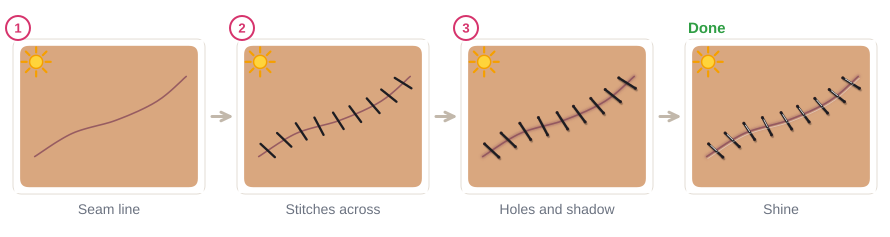

# 08.4 · Simple illusions

Advanced · 70 minutes. An illusion is a painting that tricks the eye: skin that seems to crack like
porcelain, a zipper that opens onto a galaxy, a stitched seam, a patch of skin peeled back to show
dragon scales. They are all made with the same tools as before (a base, clean lines, and light and
shadow in the right places) and they are some of the most fun designs to wear. In this lesson you
paint four of them and finish the module with one complete illusion of your own.

## Materials

> [!WARNING]
> This module uses **face paint and ordinary makeup tools only**: no liquid latex, no spirit gum,
> no glued-on zippers or other special-effects (SFX) products. Keep every illusion outside the eye
> area: never on the eyelids or between the brow and the lash line. Use only patch-tested face paint
> ([lesson 01.3](../module-01/lesson-03.md)), and keep the look tasteful: no fake blood, no wounds.
> If you paint a child, choose the friendly versions (galaxy zipper, rag-doll stitches, scales).

| Item | What it does here | Ideal | Cheaper or easier to find | It must… |
|---|---|---|---|---|
| Liner brush, size 0-1 | Cracks, stitches, zipper teeth | Synthetic face-painting liner | The smallest synthetic round you have | Make a thin, steady line |
| Round brush, size 2-4 | Filling, shadows, highlights | Synthetic face-painting round | Synthetic watercolor brush | Hold a point |
| Sponge | Porcelain base, soft shadows | Face-painting sponge | A makeup wedge | Be soft and new |
| Face paint | Base and details | White, black, a skin-tone or light beige, a gray, and the colors for what is "underneath" (navy and purple for a galaxy, greens for scales) | Mix gray from white and a little black; mix a light skin tone from white with a touch of brown, or use a cream foundation close to your skin ([lesson 05.2](../module-05/lesson-02.md)) | Be face paint or makeup made for skin |
| Light sketching color | Planning the shape | A light face-paint line or a light cosmetic pencil | A very watery light color | Be a cosmetic, never a pen or marker |
| Water, plate, paper towel, wipes | Loading and fixing | As in [lesson 01.4](../module-01/lesson-04.md) | Glasses, a white plate, a damp cloth | Clean water |
| Practice sheet | Illusion outlines on the face | `illusion-outlines` from [labs/module-08](../../labs/module-08/) | `face-front` from [labs/common](../../labs/common/), or draw the outline freehand | Be smooth |

The full list is in [Materials and substitutes](../../references/materials.md).

## How it works

Every illusion here uses one rule from [lesson 08.2](lesson-02.md): **light from one direction**.
Choose the top left. Now look at any opening, crack or hole:

- A **hole** (something that sinks in) has its shadow **inside, along the edge nearest the light**,
  because that edge blocks the light. The far edge inside catches the light, so it gets a thin light
  line.
- A **bump** (something that sticks out) is the opposite: light on the side facing the light and a
  shadow on the skin outside it, away from the light.

Put the shadow on the wrong side and the hole becomes a bump. Leave it out and the hole looks like a
flat sticker.

So a **crack** is a thin dark line with a soft shadow on its top-left side and a thin white line on
its bottom-right side. A **zipper** is an opening (shadow inside the top-left edge) with small teeth
along both edges, each with a white shine. **Stitches** are short dark lines across a seam with a
dark dot where each one enters the skin and a soft shadow below. A **peel** is an opening plus a flap
of "skin" curled back over one edge, which casts its own shadow.

Placement matters as much as painting. Use the face map ([lesson 03.4](../module-03/lesson-04.md)):
cracks run from the forehead over the temple, zippers and peels sit on the cheek, stitches cross the
forehead or follow the jaw. Big, simple shapes read from across a room; tiny details are only seen up
close.

## Demonstration

This is the most important picture in the lesson. Check every illusion you paint against it.

Real cracks change direction often and split into thinner branches. Avoid smooth curves and even
zigzags.

## Step by step

### Porcelain crack

1. **Base:** sponge a pale, smooth layer (white with a touch of your skin tone) over the area and fade
   the edges. Let it dry.
2. **Sketch** the main crack lightly: a start point, then a path that changes direction every 1-2 cm.
3. **Crack lines:** with the liner and black (or dark gray for softer cracks), press at the start and
   lift as you go, so each line thins to a point. Add 3-5 thinner branches.
4. **Shadow:** a soft gray line along the **top-left** side of each crack.
5. **Shine:** a thin white line along the **bottom-right** side.
6. **Chip (optional):** a small shape where two cracks meet, filled with light gray, darker at its
   top-left edge and white along its bottom-right edge.

### Galaxy zipper

1. **Sketch** a long lens shape (the opening) and a short line below it (the closed part).
2. **Inside:** fill the opening with navy, sponge purple and a little pink into the middle, then flick
   tiny white dots for stars ([lesson 02.4](../module-02/lesson-04.md)).
3. **Teeth:** small gray rectangles along both edges, pointing into the opening, the right side offset
   half a tooth from the left. Down the closed part, the teeth alternate left and right.
4. **Shadow:** a soft dark band just inside the top-left edge of the opening.
5. **Slider and pull:** a gray trapezoid where the zipper starts to open and a rounded tab hanging
   below it, each with a white shine and a small cast shadow on the bottom right.

### Stitched seam

1. **Seam:** a thin, soft dusky-pink or brown line (a darker shade of the skin, not red).
2. **Stitches:** short black lines across it at even spaces, all at the same angle.
3. **Holes and shadow:** a dark dot at each end of each stitch and a soft shadow just below each stitch.
4. **Shine:** a tiny white line on the top half of each stitch.

### Peeled skin

1. **Sketch** a ragged torn shape.
2. **Underneath:** paint what is revealed (scales from [lesson 08.3](lesson-03.md), a galaxy, a
   pattern) and let it dry.
3. **Flap:** paint a curled piece of "skin" folding back over one edge, using a skin-tone face paint or
   cream foundation a little lighter than your skin.
4. **Shadows:** a shadow inside the hole along the edges nearest the light, and a cast shadow on the
   skin under the flap.
5. **Light edges:** a light line along the fold of the flap and along the torn edge farthest from the
   light.

## Practice exercise

On the `illusion-outlines` sheet or paper (30 minutes):

1. Paint three small circles as "holes" and three as "bumps", light from the top left, using only
   gray, white and one color. Ask someone (or check in a photo) which ones look sunken.
2. Paint one crack and one row of stitches on paper.
3. Paint one zipper or one peel on paper.

Stop when your holes look sunken and your bumps look raised without labels, and every shadow in the
other pieces is on the side away from your sun mark.

Hint

Illusion looks flat? Darken the shadow inside the edge nearest the light and add a thin light line on
the opposite inner edge. Looks too harsh? Soften the shadow with a barely damp sponge corner and use
dark gray instead of black.

## Mini-project

**Module 8 practical: one finished illusion.** Choose one illusion (crack, zipper, stitches or peel)
and plan it with everything from this module:

1. **Plan:** sketch it on the `illusion-outlines` sheet or `face-map` from
   [labs/common](../../labs/common/). Mark your light direction and check the placement keeps it
   outside the eye area.
2. **Color:** use a smooth two- or three-color blend somewhere, for example the galaxy or the base
   ([lesson 08.1](lesson-01.md)).
3. **Depth:** shade every part with the same light direction: highlight, midtone, shadow and cast
   shadow ([lesson 08.2](lesson-02.md)).
4. **Pattern (optional):** use scales or lace inside or around it ([lesson 08.3](lesson-03.md)).
5. **Paint it** on the template first, then on your face in a mirror or on your forearm. Photograph
   it from arm's length and from about two meters away, then remove it gently.

You're done when:

- [ ] Every shadow sits on the side away from the light, and openings have their shadow inside the
      edge nearest the light.
- [ ] Lines are clean and thin where they should be: cracks thin to points, stitches evenly spaced.
- [ ] The illusion reads clearly in the photo from two meters away.
- [ ] Nothing is painted on the eyelids or near the lash line, and only face paint and makeup were
      used: no latex, no adhesives.

## Common beginner mistakes

| What happens | Why | Fix |
|---|---|---|
| The opening looks like a flat sticker | No shadow inside the edge | Add a dark band inside the edge nearest the light and a thin light line on the far inner edge |
| The hole looks like a bump | Shadow on the wrong side | Shadow inside the edge nearest the light, not the far one |
| Cracks look like a road map or a zigzag | Smooth curves or regular zigzags, all the same thickness | Change direction often, taper each line to a point, add thinner branches |
| Zipper teeth look messy | Teeth of different sizes and angles | Same size, same spacing, pointing into the opening; offset the two sides by half a tooth |
| The look feels gory or scary | Red "blood" colors and wounds | Use a dusky skin shade for seams and show something magical underneath: a galaxy, scales, a pattern |

## Optional challenge

Combine two illusions into one story: a porcelain crack on the forehead that turns into a peeled
patch on the temple, with a galaxy showing through. Keep one light direction for both.
