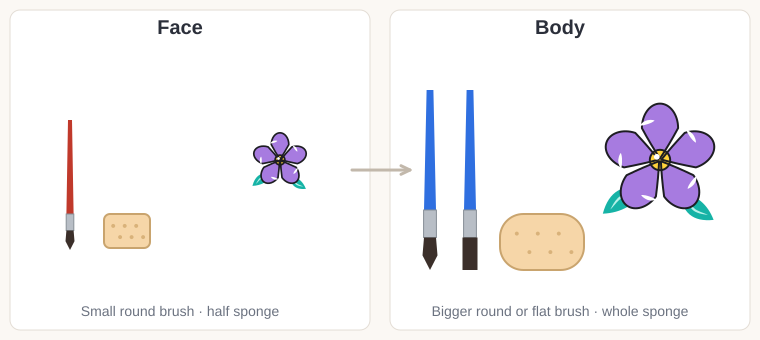

# 10.1 · From face to body

Intermediate · 45 minutes. This optional lesson opens Module 10, an extra for anyone who wants to
paint arms and shoulders; the core course is complete without it. You will learn how the skills you
already have change on the body, and you will re-plan one of your own face designs for the arm and
the shoulder.

## Materials

> [!WARNING]
> Body art uses the **same products as the face**: face and body paint, cosmetic glitter and skin-safe
> adhesives only, never craft paint, acrylics, markers or craft glitter. Patch-test any new product on
> your inner arm first ([lesson 01.3](../module-01/lesson-03.md)) and never paint over cuts, sores,
> rashes or sunburn. The glitter and gem rules from Module 6 stay the same on the body
> ([lesson 06.2](../module-06/lesson-02.md)).

| Item | What it does here | Ideal | Cheaper or easier to find | The substitute must… |
|---|---|---|---|---|
| Face paint | Color | Your face and body paints (the same cakes) | Kids' face paint | Be sold for face and body, patch-tested |
| Bigger round brush | Vines, leaves and petals at body size | Synthetic round, size 6-8 | A size 4-6 synthetic watercolor brush | Hold a lot of paint and still come to a point |
| Flat brush | Wide strokes and bands | Synthetic flat, 2-2.5 cm | A clean flat makeup or concealer brush | Have soft synthetic hair and a straight edge |
| Whole sponge | Base color and glows | A full round or petal sponge | A makeup wedge, uncut | Be fine-pored and used only for paint |
| Small round brush | Details, as on the face | Synthetic round, size 2-4 | Your usual liner | Come to a sharp point |
| Plan sheet | Re-planning a design | `face-to-body-plan` from [labs/module-10](../../labs/module-10/) | Draw a face, a hand and a shoulder on paper, or draw the outline freehand | Show the face, the arm and the shoulder side by side |
| Templates | Painting the plan | `hand-arm` and `upper-body` from [labs/common](../../labs/common/) | Trace around your own hand and arm | Show the wrist and the collarbones |
| Mirror, wipes, soap | Checking, fixing, removing | As in [lesson 02.5](../module-02/lesson-05.md) | A phone camera to check | Be gentle and fragrance-free |

Everything else is in [Materials and substitutes](../../references/materials.md).

## How it works

You already have every stroke you need. What changes on the body is **size, direction and skin**.

**Scale up.** A design the size of a coin looks great on a cheek and gets lost on an arm. Use a bigger
round brush or a flat brush for vines and petals, a whole sponge instead of half, and make every
motif about twice as big. Keep the small brush for details only.

**Flow with the body.** The arm is a long, round shape, and the shoulder is a curve. Designs look
best when they follow those lines: vines that **spiral around** the forearm, a band that goes **all
the way round** the wrist, a necklace that follows the **collarbones**. Straight bars and boxes across
the arm fight its round shape.

**Place beside joints, not across them.** Paint cracks and smears where the skin bends: the inside of
the elbow, the wrist crease, the knuckles. Use joints and bones as **landmarks** instead: a bracelet
just above the wrist bone, a flower on the round **shoulder cap**, a pendant on the **center line**.

**Make it read on a moving body.** People see body art from further away and while you move. Use
fewer, bigger shapes, strong contrast with the skin, and clear outlines; skip tiny details that only
work up close.

**Skin is different on the body.** Forearms and shoulders can be **hairier** (paint skips over
hair; brush in the direction the hair grows and use two thin layers), **drier** (elbows and hands
drink water from the paint; a thin layer of light, fragrance-free moisturizer an hour before, wiped
dry, helps), and **sweatier** (armpits and under straps; leave them out). Don't shave just to paint;
if you do shave, do it the day before, because shaving can irritate the skin
([American Academy of Dermatology](https://www.aad.org/public/everyday-care/skin-care-basics/hair/how-to-shave)).
Clothes **rub**, and bright face paint can stain fabric (Snazaroo says some colors may stain), so
keep designs off the places where straps, sleeves and bags touch.

## Demonstration

The motifs stay the same: one flower, one vine, leaves and dots. Only the **flow line** changes: on
the face it curls round the eye, on the arm it wraps round, on the shoulder it follows the bone.

Same strokes, bigger tools, bigger shapes.

The good design leaves one edge of the arm and comes back on the other: that tells the eye it goes
all the way round.

Plan in the green places; let the design stop before the orange ones.

## Step by step

1. **Pick a face design** you already like (a flower cluster, stars, a swirl) and write down its
   **motifs**: the shapes you will keep.
2. **Find its flow line**: the curve that carries the design on the face (around the eye, along the
   cheekbone).
3. **Choose a new flow line** for the body: a spiral down the forearm, a band round the wrist, a curve
   along the collarbone, a cap over the shoulder.
4. **Place the big motif on a landmark**: the back of the hand, the shoulder cap or the center line,
   never across a bend.
5. **Scale up**: draw the motifs about twice the face size; plan the bigger brush and a whole sponge.
6. **Check the skin**: hair, dry patches, sweat zones, where clothes and bags will touch. Move the
   design away from them.
7. **Pick 3-4 colors** that contrast with the skin ([lesson 03.5](../module-03/lesson-05.md)).
8. **Test a small piece** on your forearm, then take it off with warm water and soap.

## Practice exercise

**Re-plan and test** (25 minutes), on the `face-to-body-plan` sheet or three quick sketches on paper.

1. Draw your face design small on the face outline (5 minutes).
2. Draw the same motifs on the hand-and-forearm outline, following a spiral or a wrist band
   (8 minutes).
3. Draw them on the shoulder outline, using the shoulder cap and the collarbone (7 minutes).
4. Paint one leaf and one petal on your forearm with the small brush, then again with the bigger
   brush at double size. Look at both from two meters away (5 minutes).

Stop when your arm and shoulder plans each have one clear flow line and nothing crosses a bend.

Hint

Not sure where the flow line goes? Lay a piece of string or a phone cable on your arm the way you
would like the vine to run. If it lies naturally, the line will look natural too.

## Mini-project

**Your face design, re-planned for the body.** Finish the plan sheet: the face version, the arm
version and the shoulder version, with colors and notes. Then paint the arm version small on your own
forearm or the back of your hand, take a photo, and wash it off.

You're done when:

- [ ] The arm and shoulder versions use the same motifs as the face design.
- [ ] Each body version has one flow line that follows the arm or the collarbone.
- [ ] The big motif sits on a landmark, and nothing crosses the inside of the elbow or the wrist crease.
- [ ] The motifs are at least twice the face size and read from two meters away.
- [ ] You used only patch-tested face and body paint and the skin is calm after removal.

## Common beginner mistakes

| What happens | Why | Fix |
|---|---|---|
| The design looks tiny and lost on the arm | Face-size motifs and a face-size brush | Double the motif size; use a size 6-8 round or a flat brush |
| The design looks stiff and stuck on | Straight bars or boxes across a round arm | Follow the arm: spirals, bands that go all the way round, curves along bones |
| Paint cracks at the elbow or wrist | Thick paint across a bend | Keep designs beside joints; use thin layers |
| Paint skips and looks patchy on the forearm | Hair, or dry skin | Brush with the hair, two thin layers; light moisturizer an hour before, wiped dry |
| Color on your sleeve or bag strap | The design was where clothes rub | Plan around clothing; let paint dry fully before dressing |

## Optional challenge

Re-plan a **symmetrical** face design, such as your festival look from
[lesson 07.4](../module-07/lesson-04.md), for **both** shoulders and collarbones: the center of the
face becomes the center line of the chest, and each half goes over one shoulder cap.
