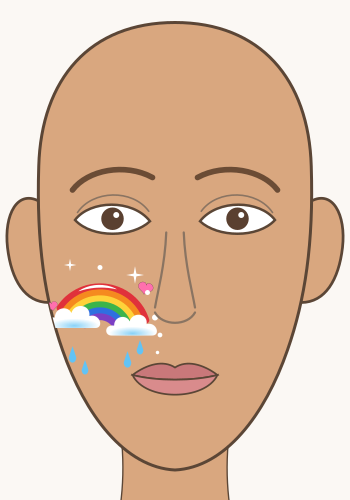

# Project 1 · Rainbow cheek

Beginner · 45 minutes. A bright rainbow over one cheekbone with fluffy clouds, raindrops, little
hearts and sparkles. It is the friendliest first full design: no eye area, no symmetry, and every
step uses something you already know from Modules 2 to 4.

## Finished look

What makes it work: the six stripes touch with no gaps and no mud, the clouds hide the stripe ends,
and small white details (a shine line, sparkles, dots) make it sparkle. The whole design sits on the
cheekbone, below the eye.

## Materials

> [!WARNING]
> Use only face paint you have patch-tested ([lesson 01.3](../lessons/module-01/lesson-03.md)),
> on healthy skin. Keep the design below the eye.

- Round brush, size 3-4, and a thin liner (or the tip of a size 2 round).
- One sponge for the clouds.
- Face paint: red, orange, yellow, green, blue, purple, white, light blue, pink. No orange, green or
  purple? Mix them from red, yellow and blue ([lesson 03.1](../lessons/module-03/lesson-01.md)).
- Water, a white plate or palette, paper towel, fragrance-free wipes, a mirror.
- The `design-2-rainbow-stars` sheet from [labs/module-04](../labs/module-04/).

Substitutes for everything are in [Materials and substitutes](../references/materials.md).

## Step by step

1. **Warm arcs.** Red over the cheekbone from the nose side toward the ear, then orange and yellow
   just inside, each touching the last once it is dry ([lesson 04.4](../lessons/module-04/lesson-04.md)).
2. **Cool arcs.** Green, blue and purple the same way.
3. **Clouds.** Dab white puffs over both ends; let dry and dab a second thin layer. A little light
   blue along the bottom.
4. **Rain and hearts.** Two or three light blue teardrops under each cloud, round end down, tail up
   ([lesson 02.2](../lessons/module-02/lesson-02.md)). Two small pink hearts above the rainbow
   ([lesson 04.2](../lessons/module-04/lesson-02.md)).
5. **Sparkles.** A thin black outline on the hearts, a white curve along the top of the red arc,
   white sparkles and dots ([lesson 03.3](../lessons/module-03/lesson-03.md)).

## Practice version

Paint it first on the left cheek of the `design-2-rainbow-stars` sheet in a clear sheet protector:
the gray lines show where each stripe and cloud goes. Then paint it on the back of your hand or
forearm, then on your own cheek in a mirror.

## Variations

- **Pastel rainbow:** mix each color with white for a soft, sweet version.
- **Night rainbow:** sponge a soft dark blue patch first, then paint the rainbow and white stars on
  it.
- **Both cheeks:** a small rainbow on each cheek, mirrored, for a party look.

## You're done when

- [ ] Six stripes in the order red, orange, yellow, green, blue, purple, from the outside in.
- [ ] The stripes touch with no bare skin and no muddy edges.
- [ ] Both ends are hidden under fluffy, dabbed clouds.
- [ ] Raindrops, hearts and white sparkles are small and neat.
- [ ] The design sits below the eye; you took a photo and washed it off with soap and water.
