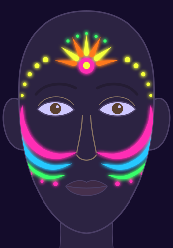

# Project 7 · Neon glow design

Intermediate · 60 minutes. A festival face that glows under a black light: neon ribbons that sweep
from the cheeks up toward the ears, a neon sun-burst on the forehead and glowing dot trails at the
temples, with ordinary eye-safe color near the eyes. It combines the neon rules from lesson 06.4 with
the bold color and layouts of Module 5.

## Finished look

What makes it work: every neon part sits outside the eye area, so the glowing shapes **frame** the
eyes instead of covering them. Three ribbons in three colors give movement, the sun-burst gives a
center point on the center line, and the dot trails tie the forehead to the cheeks.

## Materials

> [!CAUTION]
> Neon, UV and glow-in-the-dark paint never go in the eye area (brows, eyelids, under the eyes): no
> fluorescent colors are allowed near the eyes (FDA). Use only neon paint **sold as face and body
> paint** (never Special FX or craft UV paint), patch-tested. Never shine the UV torch into anyone's
> eyes ([lesson 06.4](../lessons/module-06/lesson-04.md)).

- Neon face and body paint: pink, blue, green, yellow, orange (any 3-5 neon colors work).
- Ordinary eye-safe face paint or eyeshadow (not fluorescent) in purple or another soft color for the lids.
- A round brush size 2-4, a liner brush, a small sponge, water, a palette, paper towel, a mirror.
- Optional: a 365 nm UV torch to check the glow.
- The `design-p07-neon` and `neon-map` sheets from [labs/module-06](../labs/module-06/).

Substitutes for everything are in [Materials and substitutes](../references/materials.md).

## Step by step

1. **Check and plan.** Labels checked ([lesson 06.4](../lessons/module-06/lesson-04.md)), patch test
   done. Look at the `neon-map` sheet: the whole eye area stays free.
2. **Ribbons.** With a round brush, paint a thick neon pink pressure stroke on each cheek, from beside
   the nose up toward the ear, below the eye area. Add a blue ribbon under it and a thinner green one
   under that ([lesson 05.1](../lessons/module-05/lesson-01.md)). Mirror both sides
   ([lesson 05.3](../lessons/module-05/lesson-03.md)).
3. **Sun-burst.** A pink dot on the center line of the forehead, a small yellow dot inside it, then
   seven teardrop rays fanning upward, yellow and orange in turn
   ([lesson 02.2](../lessons/module-02/lesson-02.md)).
4. **Dot trails.** Neon yellow dots from the temple up toward the forehead, getting bigger as they go
   up, outside the eye area ([lesson 02.4](../lessons/module-02/lesson-04.md)). Green dots above the
   burst, two or three pink dots on the cheeks.
5. **Eye area.** If you want color there, a soft ordinary eye-safe shadow on the lids, nothing neon.
6. **Glow check.** Dim the lights and point the UV torch from the side at a cheek, never at the eyes.
   Take a photo.

## Practice version

Slide the `design-p07-neon` sheet into a sheet protector and paint the whole design on the plastic,
twice: once in your planned colors, once in a different color order. Check that the ribbons on both
sides start and end at the same height. Then paint one ribbon and a dot trail on your forearm and try
the UV torch on it. Then paint the look on your face in a mirror.

## Variations

- **Cool glow:** blue, green and white UV colors only, with a white dot trail across the forehead.
- **Sunset glow:** orange, pink and yellow ribbons and an orange burst.
- **Glow plus glitter:** add a cosmetic glitter crescent above the ribbons, as in
  [Project 8](p08-glitter-gems.md); it sparkles in daylight while the neon glows in the dark.

## You're done when

- [ ] Every neon paint is sold as face and body paint, label checked and patch-tested.
- [ ] Nothing neon is on the brows, the eyelids or under the eyes.
- [ ] The ribbons are mirrored and sweep from the cheeks toward the ears.
- [ ] The burst is centered on the center line, and the dot trails grow evenly.
- [ ] You checked the glow without pointing the torch at the eyes, and removed everything gently,
      wiping away from the eyes.
